## PROCESO.MD 
### BITACORA GENERAL DE LA CONSTRUCCION DEL BACKEND NESTJS DE NORTE CREATIVO - SOLO BUSINESS
### ESTUDIANTE: CARLOS H. ZARATE
### HERRAMIENTAS: Claude Code
---


## FASE 0 - REQUISITOS PREVIOS Y PREPARACION

Empezamos verificando las versiones de nodejs y npm que tenemos instaladas en el wsl / linux, el manual pide node v20 o superior, en este proyecto ya no se usa nest cli porque el backend ahora es express con typescript, typescript, ts-node y nodemon se instalan como dependencias locales del proyecto en el ISS-01.

Tambien verificamos que el motor de base de datos este accesible, el ISS-00 del manual lo exige, usamos el contenedor de mysql de databases_engines, y dejamos creada la base norte_creativo_express, separada de las bases de los backends de nestjs para no mezclar tablas.

Tambien organizamos los ISS de esta ocasion, son 7 igual que en nestjs pero repartidos distinto, porque la semana 7 solo pide 3 entidades (cliente, campania y hito) y el manual de express trae cosas que nestjs no tenia: crud completo (put, patch, borrado fisico y logico), seeders con faker y swagger. Quedan asi: ISS-01 esqueleto, ISS-02 base de datos, ISS-03 cliente crud, ISS-04 seeders, ISS-05 swagger, ISS-06 campania, ISS-07 hito. Tarea, entregable, version y aprobacion no entran en esta semana.

Tambien configuramos claude code via CLI, no usamos ninguna skill y mantendremos el uso del modelo Sonnet 5.5 con esfuerzo alto, en dado caso sea requerido usaremos el modelo Opus 5.

Para la fase de auth con rbac se usa la ruta express 2026 del docente, la fase II del manual, que corre sobre el mismo backend_Express, con el mismo puerto 3012 y la misma base norte_creativo_express. 

Los ISS nuevos van del 12 al 21: el ISS-12 y el ISS-13 son el refactor de la fase I a capas (controller, service, repository, model, con dto y shared), que se hace segun lo que confirme el docente, y del ISS-14 al ISS-21 se construye la seguridad. Se agregan 6 tablas, users, roles, resources, role_users, resource_roles y refresh_tokens, que ya estaban modeladas en el sdd, y no existe una entidad permission porque el permiso es la fila que une un rol con un recurso. Las rutas tienen tres modalidades, abiertas (login, refresh, logout y swagger), solo jwt (perfil, permisos y sesiones propias) y jwt mas rbac (todo el negocio y la administracion), y el acceso es deny by default, sin concesion se responde 403 y la matriz se consulta en cada peticion. El access token es corto, firmado con hs256 con iss, aud, exp y jti, y el refresh token es opaco, se guarda hasheado, rota en cada uso y se puede revocar. Se instalan jsonwebtoken y bcryptjs, el secreto jwt va solo en el .env y el .env.example queda sin valores. Los 5 roles son admin, cuentas, creativo, cliente_aprobador y finanzas, con un usuario sembrado por cada uno para poder probar los 403 rol por rol, y la matriz de concesiones sale de los actores del sdd. Con esto la rn-05 se cumple de verdad, solo cliente_aprobador aprueba y el aprobador_id sale del token, no del body. Quedan fuera el ownership, que el aprobador vea solo sus campañas, y asignaciontarea, porque el rbac del docente es por endpoint, y se documenta como limitacion. Seguimos con claude code via cli, sin skills, con sonnet 5 en esfuerzo alto, y los commits los hago yo despues de verificar cada ac.


Comandos:
```bash
node -v && npm -v
docker ps --filter name=nc-mysql
docker exec -it nc-mysql mysql -u root -p -e "CREATE DATABASE IF NOT EXISTS norte_creativo_express CHARACTER SET utf8mb4 COLLATE utf8mb4_unicode_ci; SHOW DATABASES;"
```

Salida: 
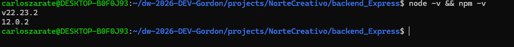
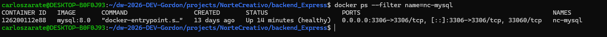
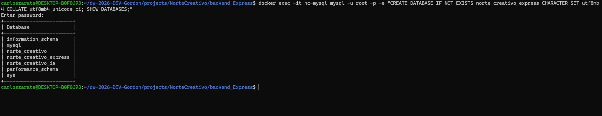


## FASE 1 - Bussines


## ISS - 01 

### OBJ

**OBJ:** Al finalizar, existirá un proyecto Express 5 + TypeScript arrancable en `backend_express/`, organizado por features, sobre el cual se construyen Cliente, Campania e Hito.

### AC

**AC:**
- [x] **AC-1** Dado el workspace con `docs/`; cuando la IA termina; entonces existen `package.json` (`type: commonjs`, scripts `build` y `dev`) y `docs/` sigue intacto.
- [x] **AC-2** Dado el proyecto; cuando se ejecuta `npx tsc --noEmit`; entonces no hay errores.
- [x] **AC-3** Dado el proyecto; cuando **el desarrollador** ejecuta `npm run dev`; entonces el log muestra `Servidor ejecutándose en puerto 3012`.
- [x] **AC-4** Dado la app arriba; cuando `GET http://localhost:3012/api/health`; entonces responde `200` con `{ "status": "ok" }`.
- [x] **AC-5** Dado `src/`; cuando se lista; entonces existen `config/`, `database/seeders/`, `routes/`, `features/business/cliente/` y no existe carpeta de auth.

### Procedimiento

1. pegamos el prompt 

``` text
Naturaleza: PRACTICO. Eres asistente SOLO de ISS-01, no del backend entero.

Implementa los AC de docs/trazabilidad_NC/ISS-01.md siguiendo docs/manual.md seccion 2 (ISS-01), adaptado al proyecto Norte Creativo.

Contexto: estas en projects/NorteCreativo/backend_express. Ya existe docs/. NO la borres ni la modifiques.
Ejecuta npm init -y aqui. package.json: "type": "commonjs", name "norte-creativo-backend-express",
scripts build = "tsc" y dev = "nodemon --watch src --ext ts --exec ts-node -- src/server.ts".
Instala exactamente las dependencias del manual seccion 2.3 (express 5, cors, dotenv, morgan; dev: typescript ~5.9, ts-node, nodemon, @types/node, @types/express, @types/cors, @types/morgan).
tsconfig.json igual al manual seccion 2.4.
Crea src/config, src/database/seeders, src/routes, src/features/business/cliente.
src/server.ts y src/config/index.ts con la clase App del manual seccion 2.5 (settings, middlewares, routes, dbConnection, listen),
con puerto por defecto process.env.PORT || 3012.
Agrega GET /api/health que responda 200 { "status": "ok" } (adaptacion del proyecto para verificar arranque).
.gitignore con node_modules/, dist/, .env.

Prohibido: Sequelize, base de datos, modelos. NO adelantes ISS-02. Prohibido: autenticacion, JWT, bcrypt, passwords, guards, RBAC, NestJS. NO toques docs/. NO commitees .env.

Al final entrega tres listas: archivos tocados; como verifico cada AC (comandos exactos); que quedo fuera de alcance.
```


Salida:

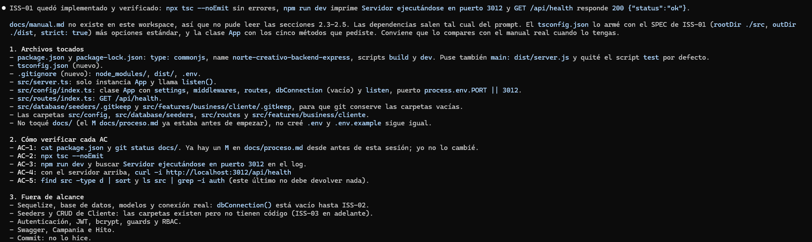

Verificamos docs este intacta

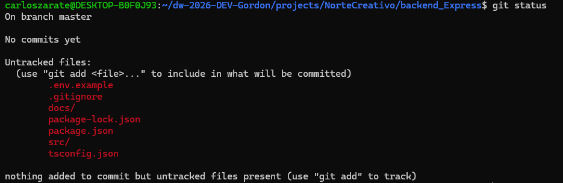

Verificamos que compile sin errores

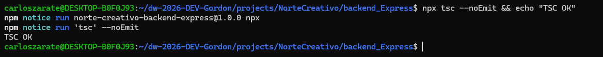

Verificamos que arranca en peurto 3012

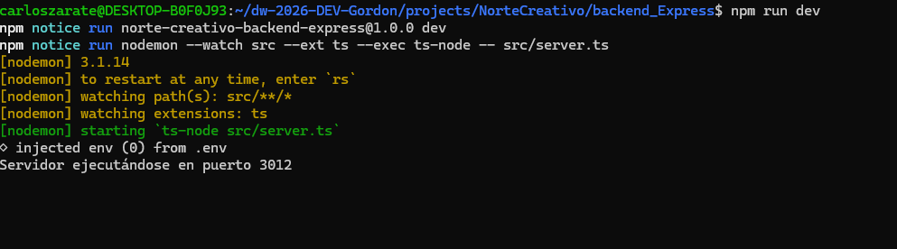

verificamos el healt

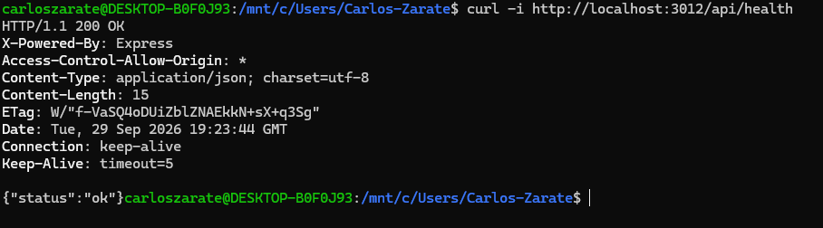

arranca y seguimos al iss 02

## ISS - 02

### OBJ

**OBJ:** Al finalizar, la app se conectará a la base `norte_creativo_express` del motor indicado por `DB_ENGINE`, fallando con un mensaje claro si el motor no está soportado.

### AC

**AC:**
- [x] **AC-1** Dado `.env.example`; cuando se revisa; entonces tiene `PORT=3012`, `DB_ENGINE` y los cuatro bloques sin contraseñas, y `.env` no aparece en `git status`.
- [x] **AC-2** Dado el proyecto; cuando `npx tsc --noEmit`; entonces no hay errores.
- [x] **AC-3** Dado MySQL arriba y la base creada; cuando `npm run dev`; entonces el log muestra `Conexión exitosa a MYSQL` y el servidor queda en 3012.
- [x] **AC-4** Dado `DB_ENGINE=foo` en una copia del `.env`; cuando se arranca; entonces falla con `Motor de base de datos no soportado: foo`; al restaurar vuelve a conectar.
- [x] **AC-5** Dado `src/database/seeders/`; cuando se lista; entonces existe y no contiene `*.seeder.ts` ni runner.

### Procedimiento

1. pegamos el prompt 

``` text
Naturaleza: PRACTICO. Eres asistente SOLO de ISS-02, no del backend entero.

Implementa los AC de docs/trazabilidad_NC/ISS-02.md siguiendo docs/manual.md seccion 3 (ISS-02), adaptado a Norte Creativo.

Instala los drivers del manual seccion 3.1 (sequelize, mysql2, pg, pg-hstore, tedious, oracledb).
Crea .env.example (versionado, SIN contraseñas) y actualiza .env local con:
PORT=3012, DB_ENGINE=mysql,
MYSQL_HOST=localhost MYSQL_USER=root MYSQL_PASSWORD= MYSQL_NAME=norte_creativo_express MYSQL_PORT=3306,
POSTGRES_HOST=localhost POSTGRES_USER=nc_admin POSTGRES_PASSWORD= POSTGRES_NAME=norte_creativo_express POSTGRES_PORT=5433,
MSSQL_HOST=localhost MSSQL_USER=sa MSSQL_PASSWORD= MSSQL_NAME=norte_creativo_express MSSQL_PORT=1433,
ORACLE_HOST=localhost ORACLE_USER=system ORACLE_PASSWORD= ORACLE_NAME=XEPDB1 ORACLE_PORT=1521.
En .env (no en .env.example) deja las contraseñas vacias para que yo las llene; no inventes contraseñas.
Crea src/database/db.ts como el manual seccion 3.2 (exporta sequelize, getDatabaseInfo, testConnection) pero con los
CUATRO motores en dbConfigurations (mysql, postgres, mssql, oracle). Si DB_ENGINE no esta soportado, lanza
"Motor de base de datos no soportado: <valor>".
En src/config/index.ts, dbConnection() debe llamar testConnection(). Todavia NO hay modelos ni sync.
Deja src/database/seeders/ con un .gitkeep.

Prohibido: modelos de negocio, sync, force, alter. NO adelantes ISS-03. Prohibido: autenticacion, JWT, bcrypt, passwords, guards, RBAC, NestJS. NO toques docs/. NO commitees .env.

Al final entrega tres listas: archivos tocados; como verifico cada AC (comandos exactos); que quedo fuera de alcance.
```

Salida:

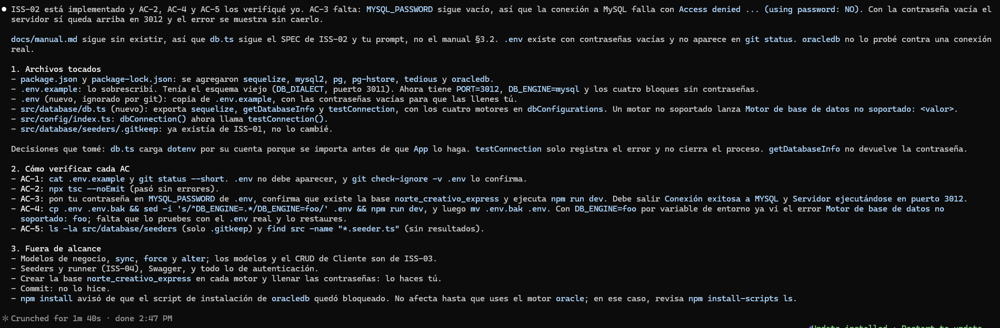

verificamos env.example y .env fuera de git
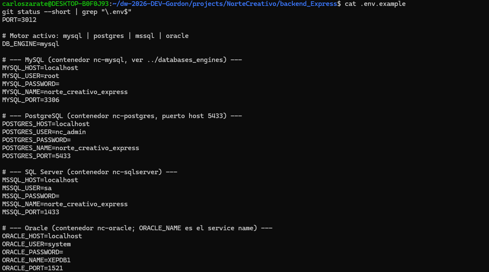

vemos si compila
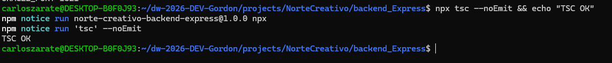

probamos la conexion

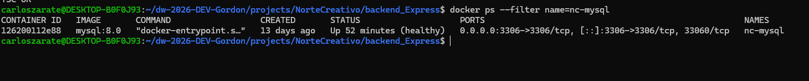

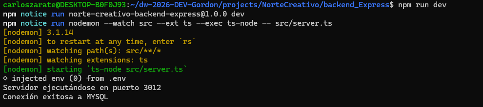

Detenemos el servidor y probamos si falla poniendole db=foo

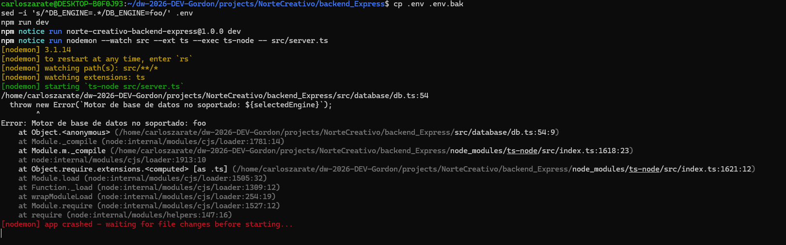

vemos si el ac5 se cumple

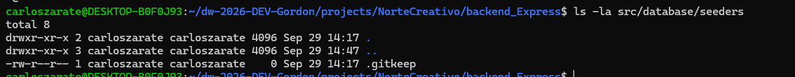

## ISS - 03

### OBJ

**OBJ:** Al finalizar, se podrán crear, consultar, actualizar (PUT/PATCH) y eliminar (física y lógicamente) clientes persistidos en `norte_creativo_express`, con las reglas de negocio del SDD.

### AC

**AC:**
- [x] **AC-1** Dado la app arrancada; cuando termina `sync`; entonces existe la tabla `clientes` en `norte_creativo_express`.
- [x] **AC-2** Dado un payload válido; cuando `POST /api/clientes`; entonces `201` con el cliente creado y `status: active`.
- [x] **AC-3** Dado un `numero_documento` ya registrado; cuando `POST /api/clientes`; entonces `409` y no se crea fila.
- [x] **AC-4** Dado un payload sin `nombre` o con email inválido; cuando `POST /api/clientes`; entonces `400`.
- [x] **AC-5** Dado un cliente existente; cuando `PUT` y luego `PATCH` sobre `/api/clientes/:id`; entonces `200` con los cambios persistidos.
- [x] **AC-6** Dado un cliente; cuando `PATCH /api/clientes/:id/deactivate`; entonces queda `inactive` y ya no aparece en `GET /api/clientes`; con `DELETE /api/clientes/:id` desaparece de la tabla.
- [x] **AC-7** Dado un `id` inexistente; cuando `GET /api/clientes/999999`; entonces `404`.

### Procedimiento

1. pegamos el prompt 

``` text
Naturaleza: PRACTICO. Eres asistente SOLO de ISS-03, no del backend entero.

Implementa los AC de docs/trazabilidad_NC/ISS-03.md siguiendo docs/manual.md secciones 4 a 8 (ISS-03-A a ISS-03-E, feature Client),
adaptado a la entidad Cliente de Norte Creativo.

Feature src/features/business/cliente: cliente.model.ts, cliente.controller.ts, cliente.routes.ts y carpeta http/.
Modelo Cliente (tabla clientes, timestamps true): tipo_documento ENUM(CC,NIT,CE,TI,PASAPORTE) requerido,
numero_documento STRING unico requerido, nombre STRING requerido (notEmpty), telefono STRING opcional,
email STRING opcional con isEmail, status ENUM(active,inactive) default active.
IMPORTANTE: el Cliente de Norte Creativo NO tiene password ni bcrypt (no es usuario del sistema).
Controller ClienteController con getAll (solo status active), getOne, create, updatePut, updatePatch,
deletePhysical y deleteLogical (status = inactive), mismo estilo del manual (respuestas { cliente } / { clientes }).
Errores: validacion de Sequelize -> 400, no encontrado -> 404, numero_documento duplicado (UniqueConstraintError) -> 409.
Rutas SIN AUTH: GET/POST /api/clientes, GET/PUT/PATCH/DELETE /api/clientes/:id, PATCH /api/clientes/:id/deactivate.
src/routes/index.ts como agregador; en src/config/index.ts cablea routes() y en dbConnection() haz testConnection + sequelize.sync() sin force ni alter.
Crea http/clientes.get.http, clientes.create.http, clientes.update.http, clientes.delete.http con leyenda SIN AUTH, apuntando a localhost:3012.

Prohibido: seeder, Swagger, Campania, Hito, force, alter. NO adelantes ISS-04. Prohibido: autenticacion, JWT, bcrypt, passwords, guards, RBAC, NestJS. NO toques docs/. NO commitees .env.

Al final entrega tres listas: archivos tocados; como verifico cada AC (comandos exactos); que quedo fuera de alcance.
```

Salida:

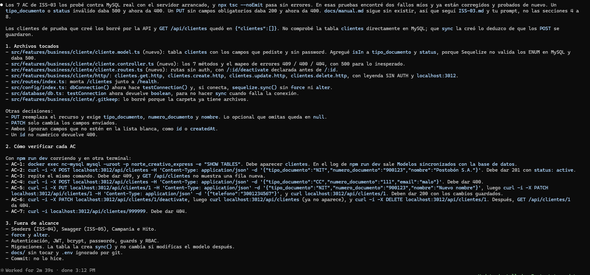

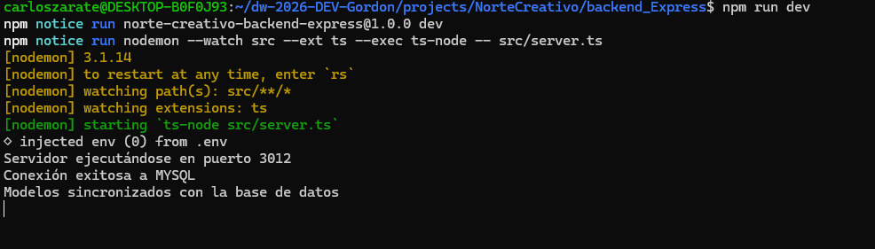
probamos el aac 1 de crear una tabla

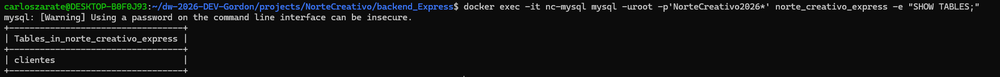

creamos un cliente valido 
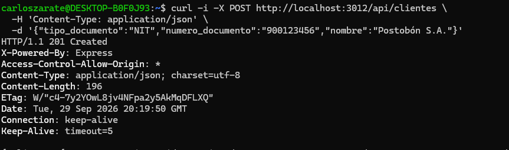


probamos el ac3 para ver si nos crea un documento duplicado buscnado 409 de error

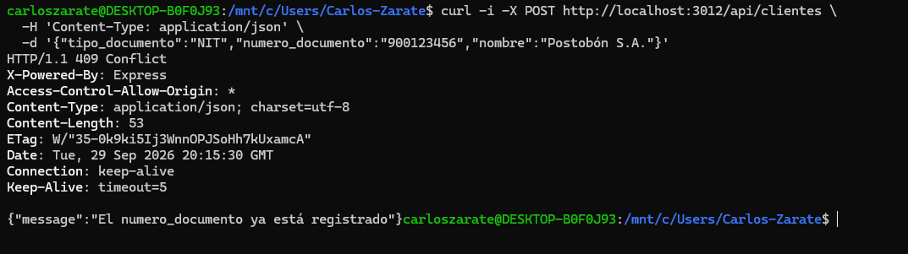

probamos un payload invalido buscando error 400

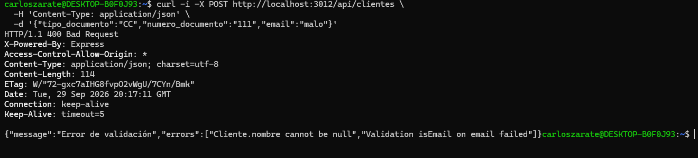

probamos el put buscando un codigo 200 con el id del ac2 que es el 8

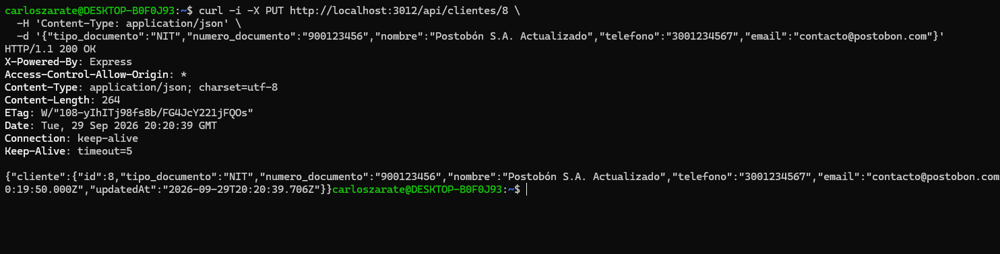

 probamos el metodo patch

 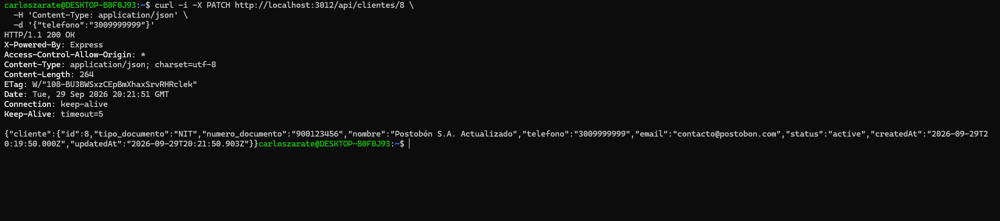

Ahora el ac6, borrado logico con el mismo id 8

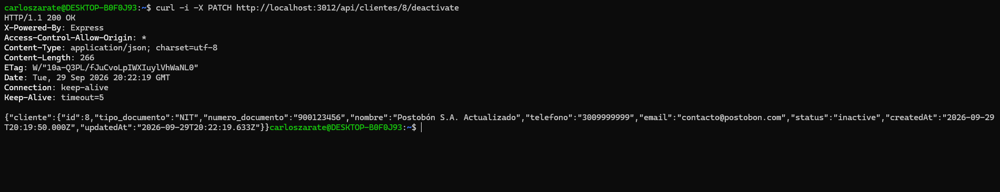

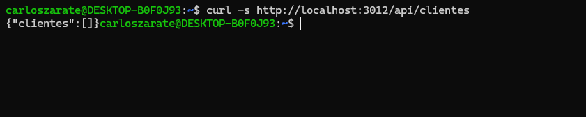

probamos con cliente inexsistente que debe dar error 404 

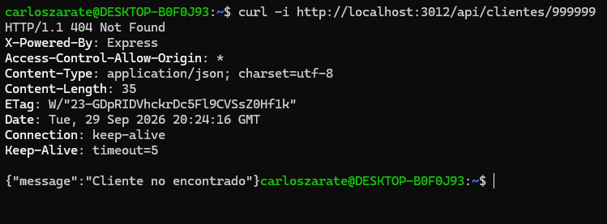

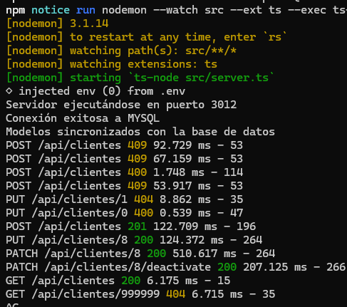

## ISS - 04

### OBJ

**OBJ:** Al finalizar, se podrá poblar la tabla `clientes` con datos falsos coherentes mediante `npm run db:seed`, variando la cantidad, sin duplicar al repetir.

### AC

**AC:**
- [x] **AC-1** Dado la tabla vacía; cuando `npm run db:seed`; entonces se insertan los clientes del conteo por defecto.
- [x] **AC-2** Dado la tabla con datos; cuando se vuelve a correr `npm run db:seed`; entonces no se duplican filas.
- [x] **AC-3** Dado la tabla vacía; cuando `npm run db:seed -- --clientes=20` o `SEED_CLIENTES=5 npm run db:seed`; entonces se insertan 20 o 5.
- [x] **AC-4** Dado los clientes sembrados; cuando `GET /api/clientes`; entonces aparecen con documentos únicos y emails válidos.

### Procedimiento

1. pegamos el prompt 

``` text
Naturaleza: PRACTICO. Eres asistente SOLO de ISS-04, no del backend entero.

Implementa los AC de docs/trazabilidad_NC/ISS-04.md siguiendo docs/manual.md seccion 9 (ISS-04, seeders con Faker), adaptado a Cliente.

Instala @faker-js/faker como dev.
Crea src/features/business/cliente/cliente.seeder.ts con export async function seedClientes(count: number): Promise<number>,
idempotente (si Cliente.count() > 0, omite). Datos coherentes: tipo_documento NIT o CC, numero_documento unico,
nombre de empresa, telefono y email validos, status active.
Crea src/database/seeders/counts.ts (clientes: default, variable SEED_CLIENTES, argumento --clientes=N)
y src/database/seeders/index.ts (SeedersRunner) que conecta, hace sync sin force/alter, ejecuta los seeders en orden y cierra la conexion.
Agrega el script "db:seed" en package.json como en el manual.
El seeder NO debe ejecutarse al arrancar la app.

Prohibido: Swagger, Campania, Hito, force, alter. NO adelantes ISS-05. Prohibido: autenticacion, JWT, bcrypt, passwords, guards, RBAC, NestJS. NO toques docs/. NO commitees .env.

Al final entrega tres listas: archivos tocados; como verifico cada AC (comandos exactos); que quedo fuera de alcance.
```

Salida:
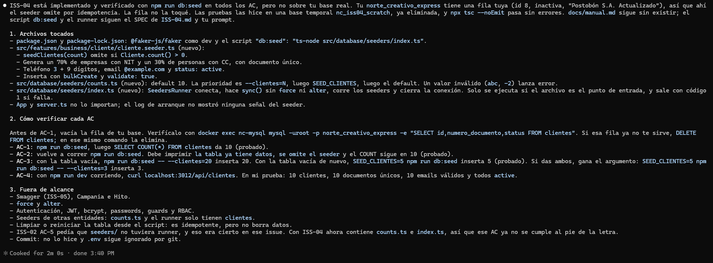

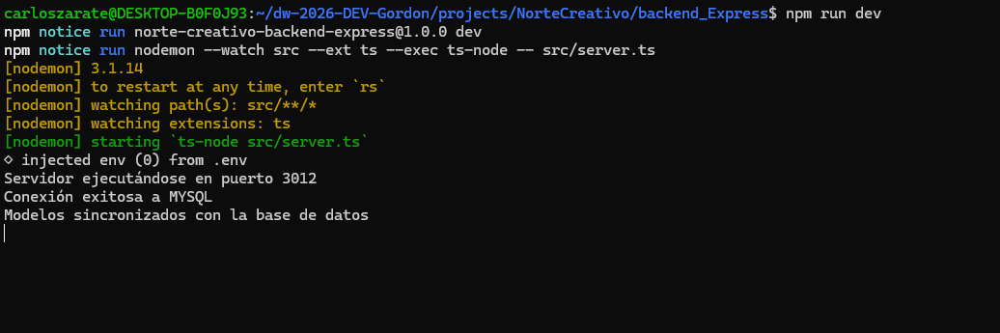

probamos el ac1, conteo con el primer seed

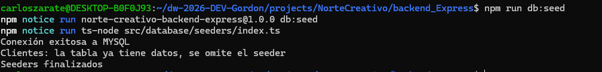
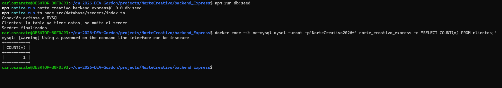

ac2 de indepotencia, corriendo el seed otra vez, nos da el mismo numero asi que no se duplica

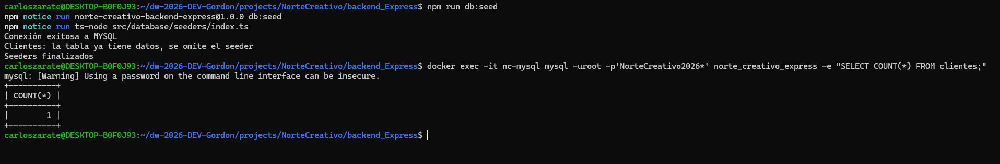

miramos mla cantidad de variables para insertar 20

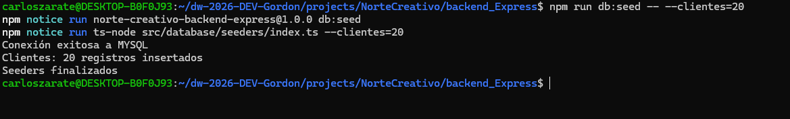
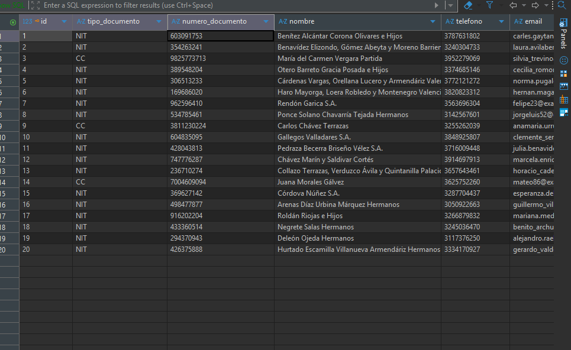
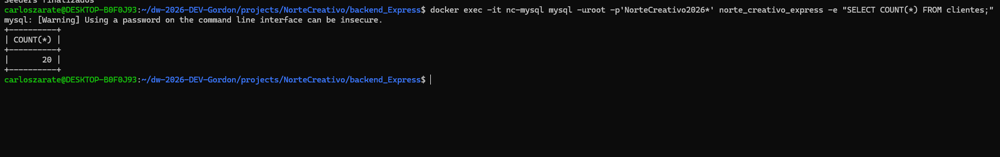

vemos que los datos sean coherentes

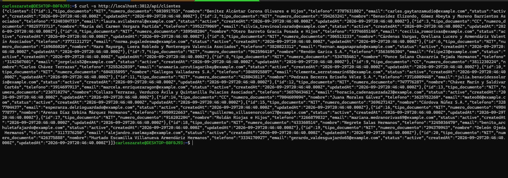

## ISS - 05

### OBJ

**OBJ:** Al finalizar, la API de clientes quedará documentada en OpenAPI 3 y visible en Swagger UI, con un registry que permita sumar features siguientes.

### AC

**AC:**
- [x] **AC-1** Dado la app arrancada; cuando se abre `http://localhost:3012/api/docs`; entonces carga Swagger UI con el tag Clientes.
- [x] **AC-2** Dado la app; cuando `GET /api/docs.json`; entonces devuelve el documento OpenAPI 3 con los paths de `/api/clientes`.
- [x] **AC-3** Dado Swagger UI; cuando se ejecuta *Try it out* en `GET /api/clientes`; entonces responde `200`.
- [x] **AC-4** Dado `src/swagger/index.ts`; cuando se revisa; entonces importa `clienteSwagger` desde el feature (no define los paths él mismo).

### Procedimiento

1. pegamos el prompt 

``` text
Naturaleza: PRACTICO. Eres asistente SOLO de ISS-05, no del backend entero.

Implementa los AC de docs/trazabilidad_NC/ISS-05.md siguiendo docs/manual.md seccion 10 (ISS-05, Swagger), adaptado a Cliente.

Instala swagger-ui-express y @types/swagger-ui-express (dev).
Crea src/features/business/cliente/cliente.swagger.ts exportando clienteSwagger (tags, paths, components.schemas)
con los 7 endpoints de /api/clientes (incluido PATCH /api/clientes/{id}/deactivate), marcados SIN AUTH,
con los campos reales del modelo (tipo_documento, numero_documento, nombre, telefono, email, status).
Crea src/swagger/index.ts (registry) que fusiona los modulos de features y exporta setupSwagger(app),
montando /api/docs (UI) y /api/docs.json (spec), servidor http://localhost:3012.
En src/config/index.ts agrega el metodo docs() que llama setupSwagger.

Prohibido: Campania, Hito. NO adelantes ISS-06. Prohibido: autenticacion, JWT, bcrypt, passwords, guards, RBAC, NestJS. NO toques docs/. NO commitees .env.

Al final entrega tres listas: archivos tocados; como verifico cada AC (comandos exactos); que quedo fuera de alcance.
```

Salida:

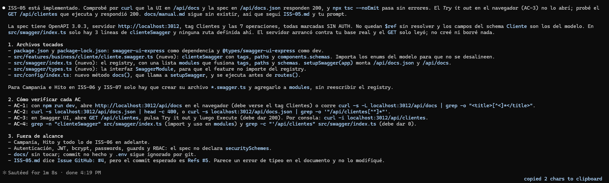
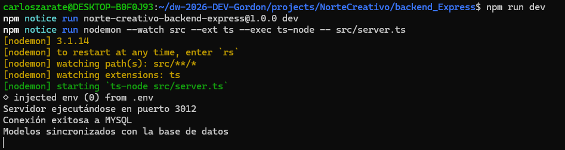

probamos que la ui de swagger cargue

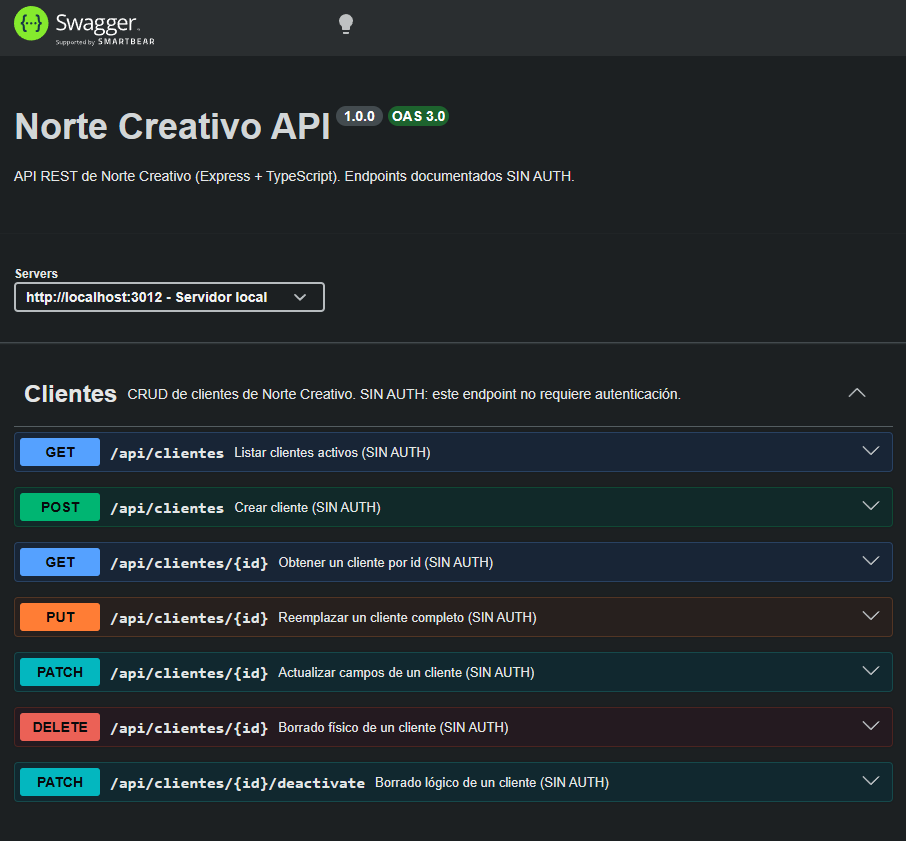

miramos el doc con openapi y nos da la version v 3.0.3 tambien nos muestra la rutas

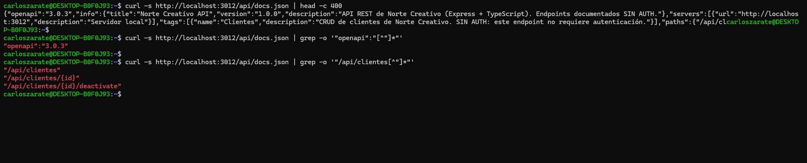

probamos swagger ui con try it out y tenemos codigo 200

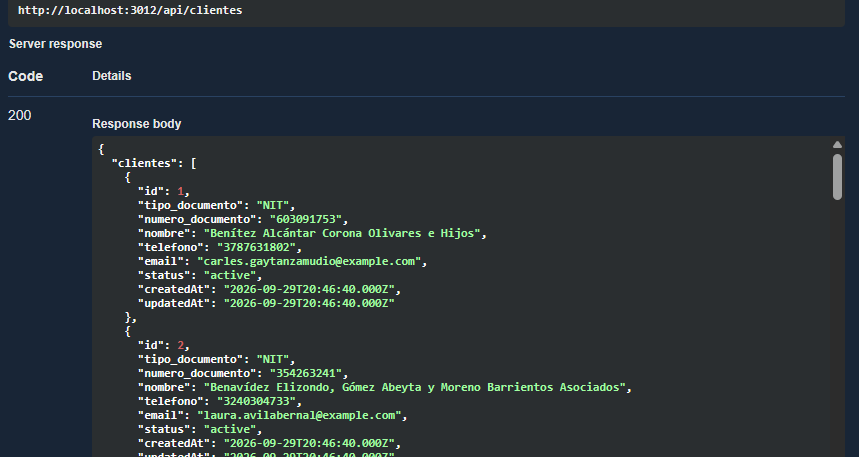


probamos que el registry importa desde el feature

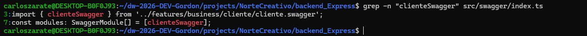

## ISS - 06

### OBJ

**OBJ:** Al finalizar, se podrán gestionar campañas asociadas a un cliente existente y activo, con seeder y documentación, dejando el contenedor del que cuelgan los hitos.

### AC

**AC:**
- [x] **AC-1** Dado la app arrancada; cuando `sync`; entonces existe `campanias` con FK real a `clientes` (`SHOW CREATE TABLE`).
- [x] **AC-2** Dado un `cliente_id` existente y activo; cuando `POST /api/campanias`; entonces `201`.
- [x] **AC-3** Dado un `cliente_id` inexistente; cuando `POST /api/campanias`; entonces `404` y no se crea fila.
- [x] **AC-4** Dado un cliente `inactive`; cuando `POST /api/campanias` con su id; entonces `409`.
- [x] **AC-5** Dado una campaña; cuando `GET /api/campanias/:id`; entonces la respuesta incluye su cliente.
- [x] **AC-6** Dado la tabla vacía; cuando `npm run db:seed`; entonces se crean campañas sobre clientes existentes y repetir no duplica.
- [x] **AC-7** Dado Swagger; cuando se abre `/api/docs`; entonces aparece el tag Campañas.

### Procedimiento

1. pegamos el prompt 

``` text
Naturaleza: PRACTICO. Eres asistente SOLO de ISS-06, no del backend entero.

Implementa los AC de docs/trazabilidad_NC/ISS-06.md siguiendo docs/manual.md secciones 11 y 12 (patron de ProductType y de la relacion
Product-ProductType con archivo associations), adaptado a la entidad Campania de Norte Creativo. Mismo estilo del feature cliente ya hecho.

Feature src/features/business/campania: model, controller, routes, associations, seeder, swagger y carpeta http/.
Modelo Campania (tabla campanias, timestamps true): cliente_id INTEGER requerido FK a clientes.id, nombre STRING requerido,
descripcion TEXT opcional, status ENUM(active,inactive) default active.
campania.associations.ts: Cliente.hasMany(Campania, foreignKey cliente_id) y Campania.belongsTo(Cliente, foreignKey cliente_id, as "cliente"),
importado en src/config/index.ts antes del sync.
Controller CampaniaController con los mismos 7 metodos del cliente. En create y updatePut: si el cliente no existe -> 404;
si el cliente esta inactive -> 409 ("no se crea campaña para un cliente inactivo"). getOne incluye el cliente asociado.
Rutas SIN AUTH en /api/campanias (incluido PATCH /api/campanias/:id/deactivate) registradas en src/routes/index.ts.
http/ con los archivos .http de get, create, update y delete, leyenda SIN AUTH, puerto 3012.
Seeder seedCampanias(count) idempotente que asigna campanias a clientes activos existentes; agregalo al SeedersRunner
DESPUES de clientes, con SEED_CAMPANIAS y --campanias=N en counts.ts.
campaniaSwagger registrado en src/swagger/index.ts.

Prohibido: Hito, force, alter. NO adelantes ISS-07. Prohibido: autenticacion, JWT, bcrypt, passwords, guards, RBAC, NestJS. NO toques docs/. NO commitees .env.

Al final entrega tres listas: archivos tocados; como verifico cada AC (comandos exactos); que quedo fuera de alcance.
```

Salida:

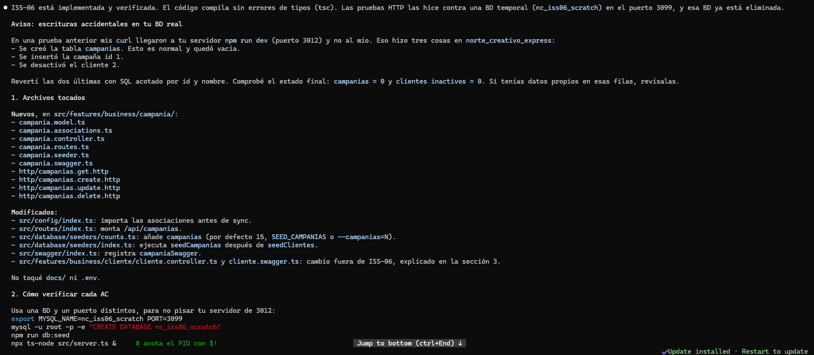
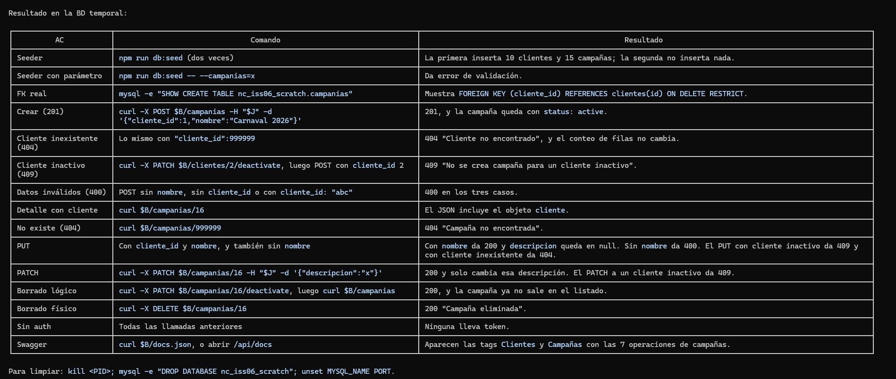
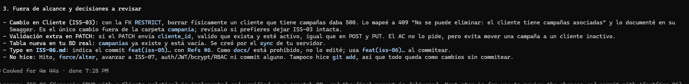

probamos que corre

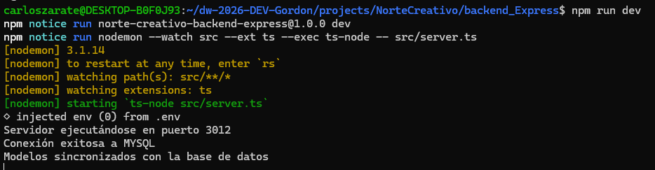

verificamos el ac1 con el fk real en la base de datos

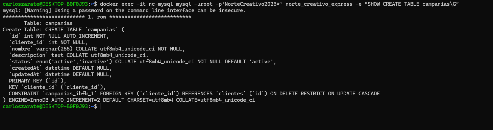

Creamos una cmapña valida para el ac2 con el id de cliente 3 y da el id 2 de campaña
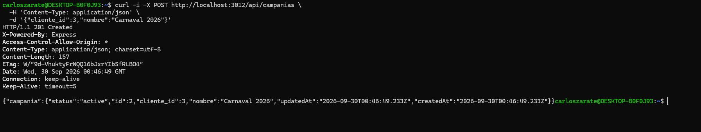


cremos una para el ac3 con el cliente que no existe y que de 404
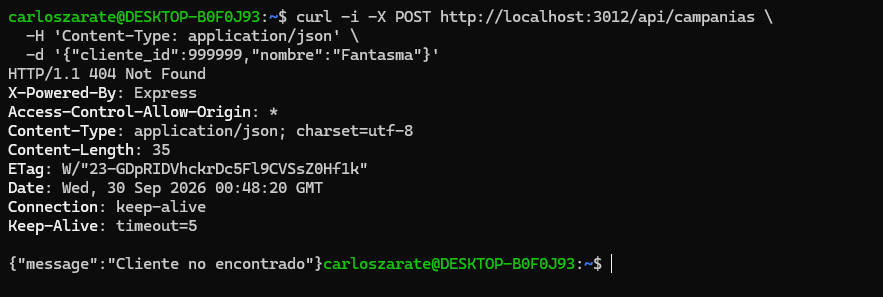

creamos ahora un cliente inactivo para probar el error 409, creamos un cliente nuevo para probarlo
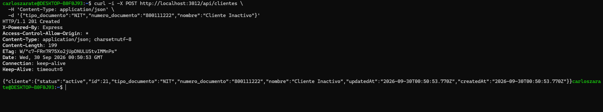

tiene el id 21 y lo desactivamos
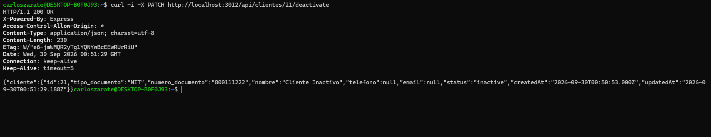

ahora le creamos una campaña y da el error que buscamos

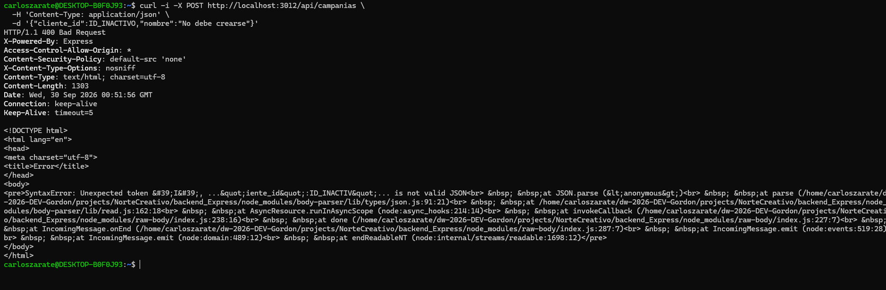

ahora probamos el ac5 getone y nos trae el cliente dentro de la campaña

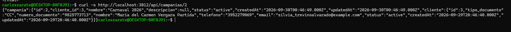

Aparece la campaña en el swagger

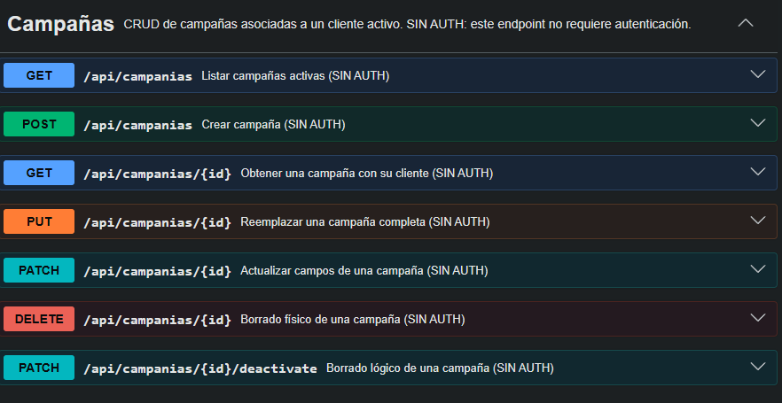


## ISS - 07

### OBJ

**OBJ:** Al finalizar, se podrán gestionar hitos de una campaña con su estado de negocio, aplicando RN-08 (no hay hitos en campañas inactivas) y las invariantes de estado del SDD.

### AC

**AC:**
- [x] **AC-1** Dado la app arrancada; cuando `sync`; entonces existe `hitos` con FK real a `campanias`.
- [x] **AC-2** Dado una campaña activa; cuando `POST /api/hitos` (aunque se envíe `"estado":"CERRADO"`); entonces `201` con `estado: ABIERTO` y `fecha_cierre: null`.
- [x] **AC-3** Dado una campaña `inactive`; cuando `POST /api/hitos` con su id; entonces `409` (RN-08) y no se crea fila.
- [x] **AC-4** Dado un `campania_id` inexistente; cuando `POST /api/hitos`; entonces `404`.
- [x] **AC-5** Dado un hito; cuando `PATCH` con `"estado":"PERDIDO"`; entonces `400`.
- [x] **AC-6** Dado un hito `ABIERTO`; cuando `PATCH` a `CERRADO`; entonces `200` con `fecha_cierre` asignada; y un `PATCH` posterior a `ABIERTO` responde `409`.
- [x] **AC-7** Dado la tabla vacía; cuando `npm run db:seed`; entonces se crean hitos `ABIERTO` sobre campañas activas, en orden clientes → campanias → hitos, sin duplicar al repetir.

### Procedimiento

1. pegamos el prompt 

``` text
Naturaleza: PRACTICO. Eres asistente SOLO de ISS-07, no del backend entero.

Implementa los AC de docs/trazabilidad_NC/ISS-07.md siguiendo docs/manual.md seccion 12 (ISS-07, feature Product con relacion),
adaptado a la entidad Hito de Norte Creativo. Mismo estilo de los features cliente y campania ya hechos.

Feature src/features/business/hito: model, controller, routes, associations, seeder, swagger y carpeta http/.
Modelo Hito (tabla hitos, timestamps true): campania_id INTEGER requerido FK a campanias.id, nombre STRING requerido,
descripcion TEXT opcional, estado ENUM(ABIERTO,CERRADO,FACTURADO) default ABIERTO, fecha_cierre DATE opcional,
status ENUM(active,inactive) default active.
hito.associations.ts: Campania.hasMany(Hito, foreignKey campania_id) y Hito.belongsTo(Campania, foreignKey campania_id, as "campania"),
importado en src/config/index.ts antes del sync.
Controller HitoController con los 7 metodos. En create y updatePut: campania inexistente -> 404; campania inactive -> 409 (RN-08).
Invariantes: create IGNORA estado y fecha_cierre del body (siempre nace ABIERTO y fecha_cierre null);
en updatePatch un estado fuera del ENUM -> 400; pasar a CERRADO asigna fecha_cierre = ahora;
un hito CERRADO no puede volver a ABIERTO -> 409 (RN-06). getOne incluye la campania.
Rutas SIN AUTH en /api/hitos (incluido PATCH /api/hitos/:id/deactivate) en src/routes/index.ts.
http/ con los .http de get, create, update y delete, leyenda SIN AUTH, puerto 3012.
Seeder seedHitos(count) idempotente sobre campanias activas, estado ABIERTO; agregalo al SeedersRunner despues de campanias,
con SEED_HITOS y --hitos=N. hitoSwagger registrado en src/swagger/index.ts.
Al final verifica y reporta que el orden de seeders es clientes -> campanias -> hitos.

Prohibido: tareas, entregables, aprobaciones, cierre automatico de hito, force, alter. Prohibido: autenticacion, JWT, bcrypt, passwords, guards, RBAC, NestJS. NO toques docs/. NO commitees .env.

Al final entrega tres listas: archivos tocados; como verifico cada AC (comandos exactos); que quedo fuera de alcance.
```

Salida:

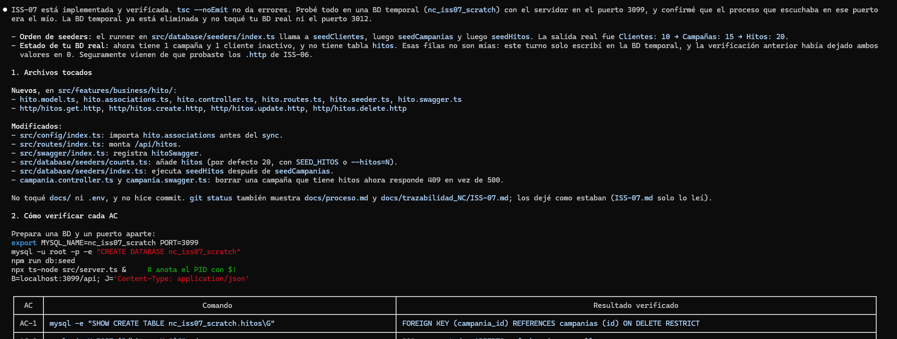
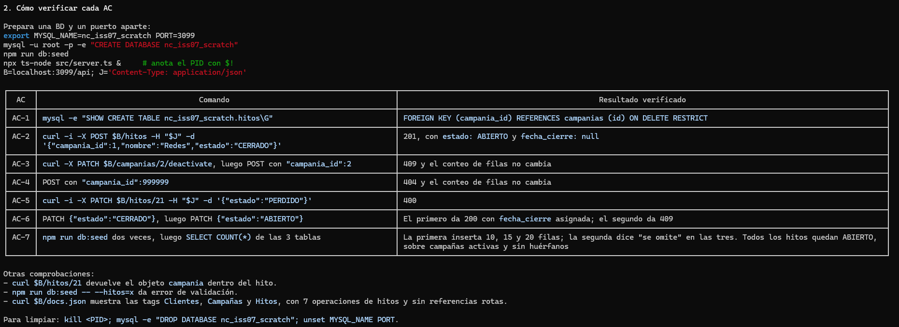
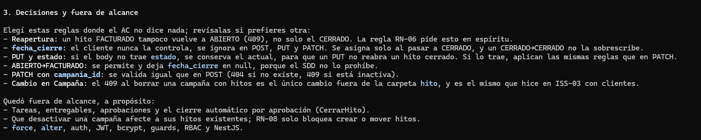

probamos que corra
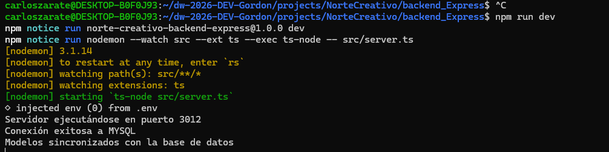

probamos el fk real del ac1

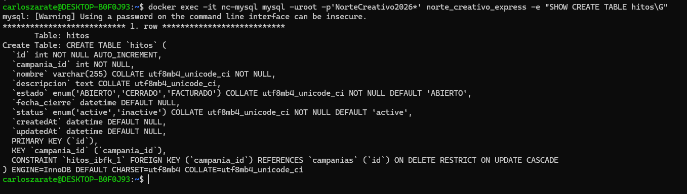

probamos que un hito nace abierto aunque este en cerrado, debe dar 201

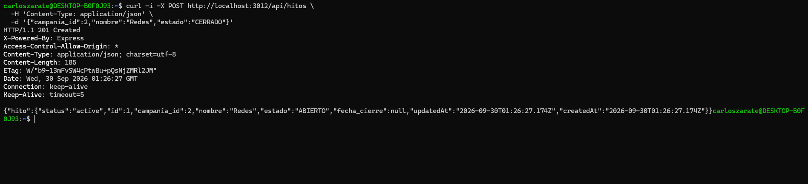

probamos con una campaña inexistente que de 404 error

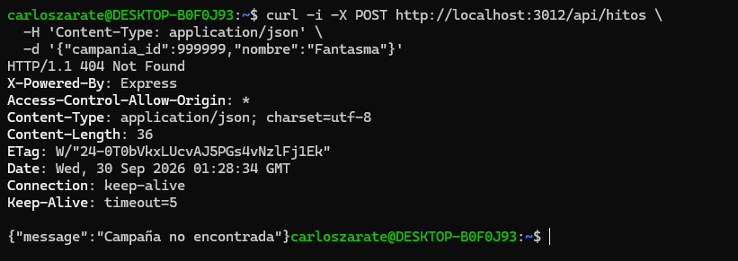

estado invalido

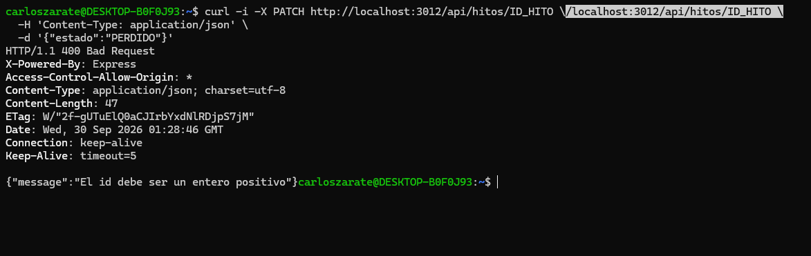

probamos con errar un hito y que de 200 con la fecha de cierre

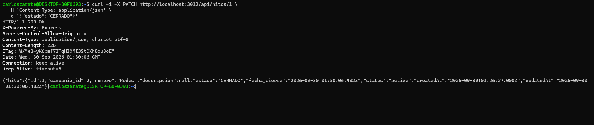

error 409

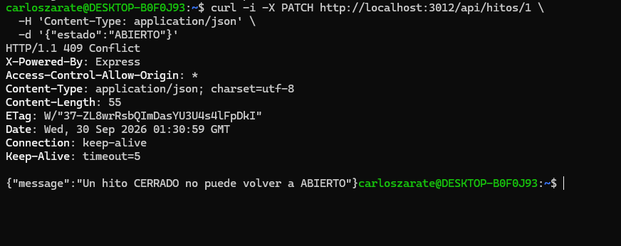

## ISS - 08

### OBJ

**OBJ:** Al finalizar, se podrán gestionar las tareas de un hito existente, primer eslabón de la cadena que el cierre automático recorre.

### AC

**AC:**
- [x] **AC-1** Dado la app; cuando `sync`; entonces existe `tareas` con FK real a `hitos`.
- [x] **AC-2** Dado un `hito_id` existente; cuando `POST /api/tareas`; entonces `201`.
- [x] **AC-3** Dado un `hito_id` inexistente; cuando `POST /api/tareas`; entonces `404` y no crea fila.
- [x] **AC-4** Dado un payload sin `nombre` o sin `hito_id`; cuando `POST /api/tareas`; entonces `400`.
- [x] **AC-5** Dado una tarea; cuando `PATCH` y luego `PATCH /:id/deactivate`; entonces `200` y deja de aparecer en `GET /api/tareas`.
- [x] **AC-6** Dado la tabla vacía; cuando `npm run db:seed` ×2; entonces se crean tareas sin duplicar.

### Procedimiento

1. pegamos el prompt 

``` text
Naturaleza: PRACTICO. Eres asistente SOLO de ISS-08, no del backend entero.

Implementa los AC de docs/trazabilidad_NC/ISS-08.md siguiendo docs/manual.md secciones 11 y 12 (CRUD completo + relacion
con archivo associations), con el MISMO estilo de los features cliente, campania e hito ya hechos en este proyecto.

Feature src/features/business/tarea: model, controller, routes, associations, seeder, swagger y carpeta http/.
Modelo Tarea (tabla tareas, timestamps true): hito_id INTEGER requerido FK a hitos.id, nombre STRING requerido, descripcion TEXT opcional, status ENUM(active,inactive) default active.
tarea.associations.ts: Hito.hasMany(Tarea, foreignKey hito_id, as "tareas") y Tarea.belongsTo(Hito, foreignKey hito_id, as "hito"), importado en src/config/index.ts antes del sync.
Controller TareaController con los 7 metodos (getAll solo status active, getOne con include del padre, create, updatePut,
updatePatch, deletePhysical, deleteLogical). En create y updatePut: si el hito no existe -> 404.
Errores: validacion -> 400, no encontrado -> 404, regla de negocio -> 409.
Rutas SIN AUTH en /api/tareas (incluido PATCH /api/tareas/:id/deactivate) registradas en src/routes/index.ts.
http/ con los .http de get, create, update y delete, leyenda SIN AUTH, puerto 3012.
Seeder seedTareas(count) idempotente sobre hitos existentes; agregalo al SeedersRunner DESPUES de hitos, con SEED_TAREAS y --tareas=N en counts.ts.

Swagger del feature registrado en src/swagger/index.ts.

NO adelantes ISS-09 (entregable). Prohibido: autenticacion, JWT, bcrypt, passwords, guards, RBAC, NestJS, force, alter. NO toques docs/. NO commitees .env.

Al final entrega tres listas: archivos tocados; como verifico cada AC (comandos exactos); que quedo fuera de alcance.
```

Salida:

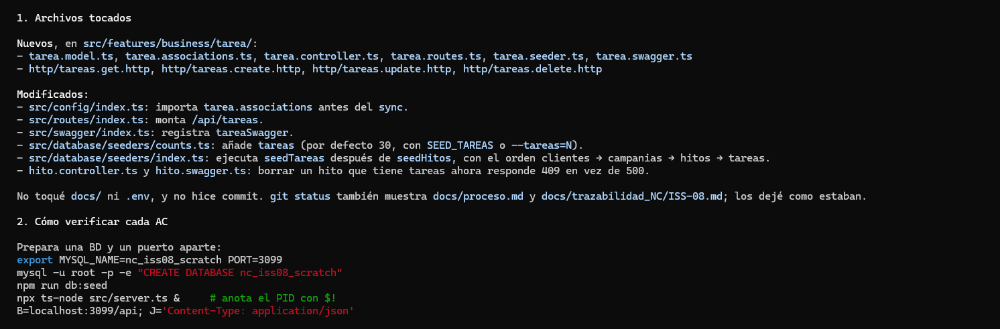
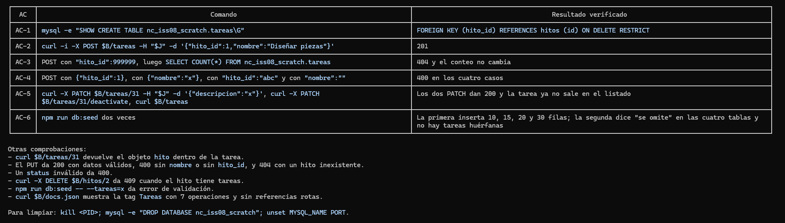
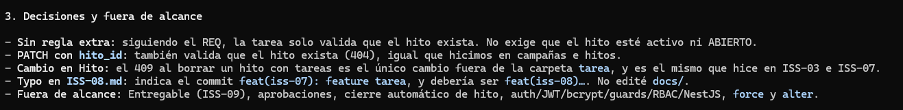

probamos que corra

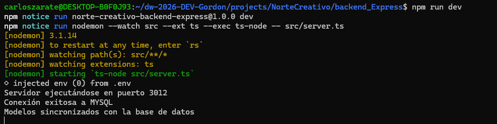

vemos un id de un hito

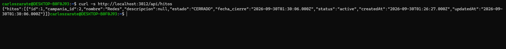

vemos el fk que hay

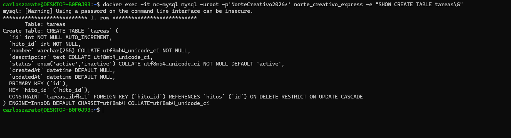
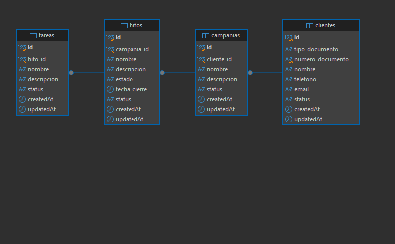

creamos la tarea valida del ac2 y nos da codigo 201

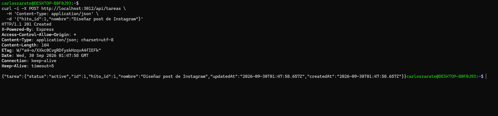

Hito inexsistente del ac3 dando codigo 404

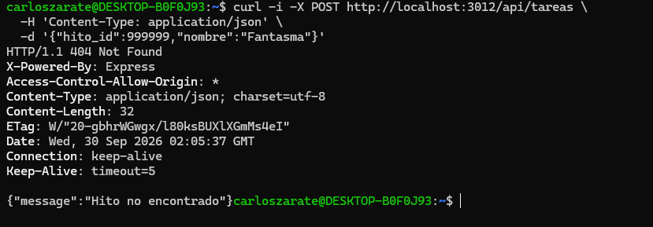

payload invalido al id 1 sin nombre y sin hito id del ac4

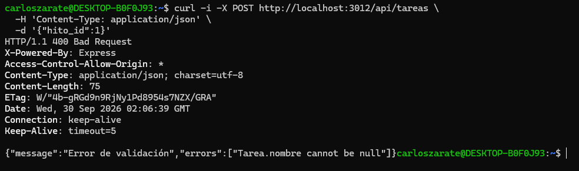

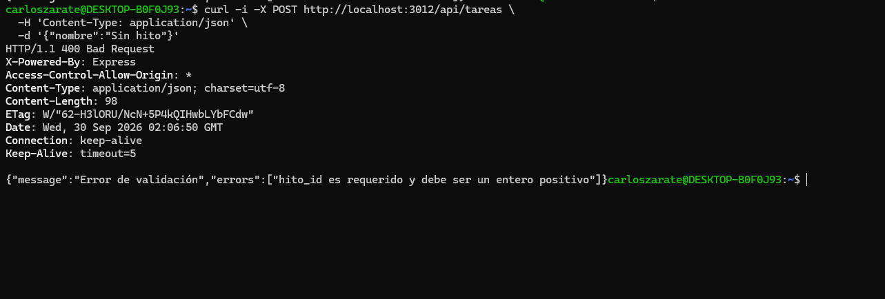

ac5 patch y desactivar, al final ya no muestra el listado

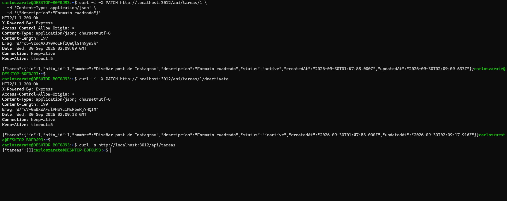

## ISS - 09

### OBJ

**OBJ:** Al finalizar, se podrán gestionar los entregables que produce cada tarea, que son las piezas cuyas versiones se aprueban o rechazan.

### AC

**AC:**
- [x] **AC-1** Dado la app; cuando `sync`; entonces existe `entregables` con FK real a `tareas`.
- [x] **AC-2** Dado un `tarea_id` existente; cuando `POST /api/entregables`; entonces `201` con `estado: EN_PROCESO` y `fecha_inicio` asignada.
- [x] **AC-3** Dado un `tarea_id` inexistente; cuando `POST`; entonces `404`.
- [x] **AC-4** Dado un payload sin `tarea_id`; cuando `POST`; entonces `400`.
- [x] **AC-5** Dado un entregable; cuando `GET /api/entregables/:id`; entonces incluye su tarea.
- [x] **AC-6** Dado la tabla vacía; cuando `npm run db:seed` ×2; entonces se crean entregables sin duplicar.

### Procedimiento

1. pegamos el prompt 

``` text
Naturaleza: PRACTICO. Eres asistente SOLO de ISS-09, no del backend entero.

Implementa los AC de docs/trazabilidad_NC/ISS-09.md siguiendo docs/manual.md secciones 11 y 12 (CRUD completo + relacion
con archivo associations), con el MISMO estilo de los features cliente, campania e hito ya hechos en este proyecto.

Feature src/features/business/entregable: model, controller, routes, associations, seeder, swagger y carpeta http/.
Modelo Entregable (tabla entregables, timestamps true): tarea_id INTEGER requerido FK a tareas.id, fecha_inicio DATE opcional, fecha_fin DATE opcional, total DECIMAL(12,2) opcional, estado ENUM(EN_PROCESO,ENTREGADO) default EN_PROCESO, observaciones TEXT opcional, status ENUM(active,inactive) default active. Convierte total a Number al responder (DECIMAL puede llegar como string).
entregable.associations.ts: Tarea.hasMany(Entregable, foreignKey tarea_id, as "entregables") y Entregable.belongsTo(Tarea, foreignKey tarea_id, as "tarea"), importado antes del sync.
Controller EntregableController con los 7 metodos (getAll solo status active, getOne con include del padre, create, updatePut,
updatePatch, deletePhysical, deleteLogical). En create y updatePut: si la tarea no existe -> 404. En create, si no llega fecha_inicio, asigna la fecha actual.
Errores: validacion -> 400, no encontrado -> 404, regla de negocio -> 409.
Rutas SIN AUTH en /api/entregables (incluido PATCH /api/entregables/:id/deactivate) registradas en src/routes/index.ts.
http/ con los .http de get, create, update y delete, leyenda SIN AUTH, puerto 3012.
Seeder seedEntregables(count) idempotente sobre tareas existentes; agregalo al SeedersRunner DESPUES de tareas, con SEED_ENTREGABLES y --entregables=N.

Swagger del feature registrado en src/swagger/index.ts.

NO adelantes ISS-10 (version-entregable). Prohibido: autenticacion, JWT, bcrypt, passwords, guards, RBAC, NestJS, force, alter. NO toques docs/. NO commitees .env.

Al final entrega tres listas: archivos tocados; como verifico cada AC (comandos exactos); que quedo fuera de alcance.
```

Salida:

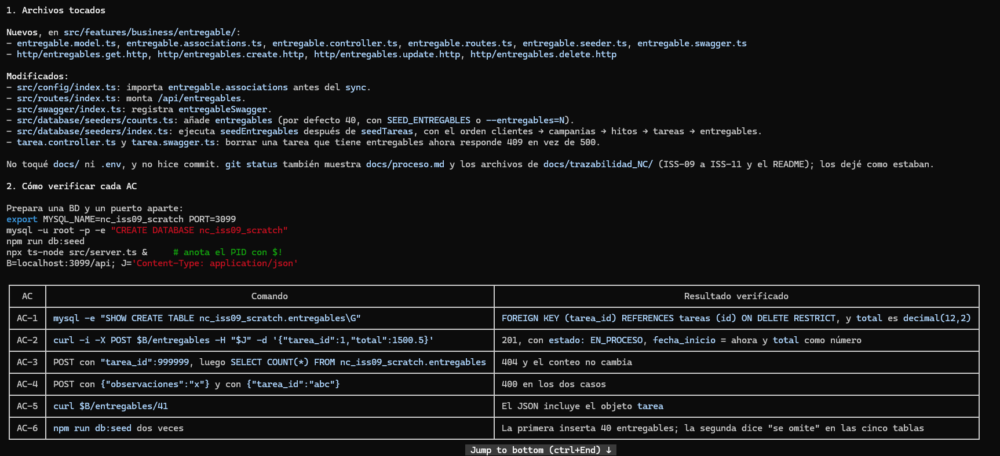

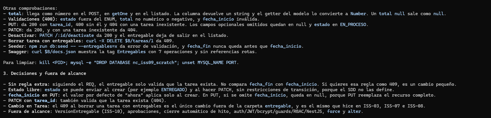

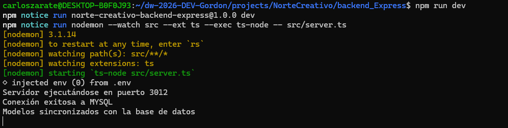

Miramos el fk, que pide el ac1

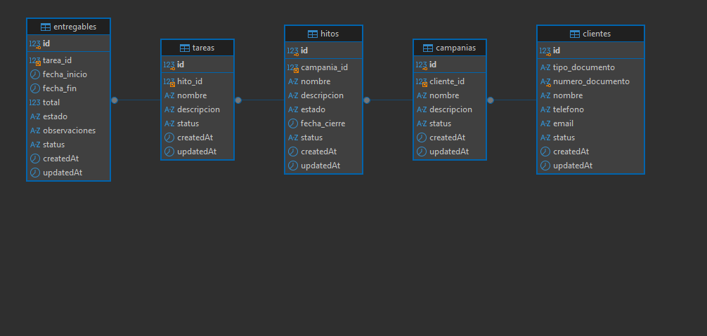

creamos un entregable valido

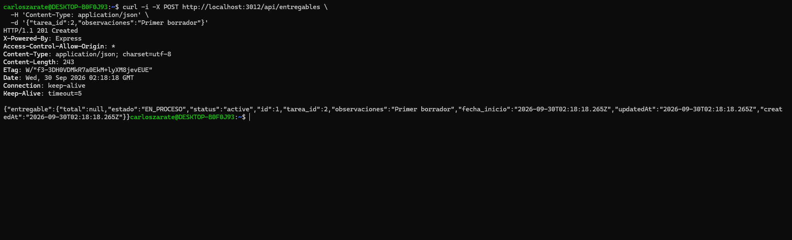


creamos un entregable en una tarea inexistente que de 404

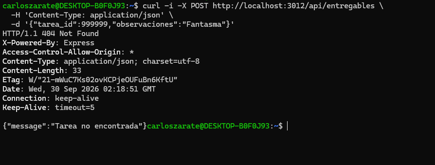

ahora probamos con un payload invalido que cause error 400

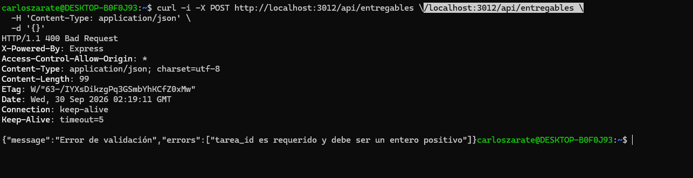

probamos el getone que traiga en la respuesta el objeto de tarea

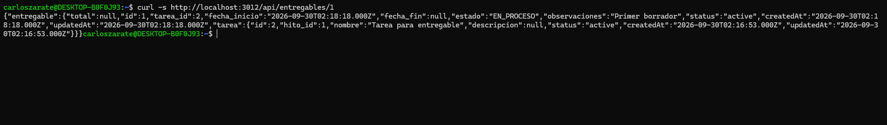

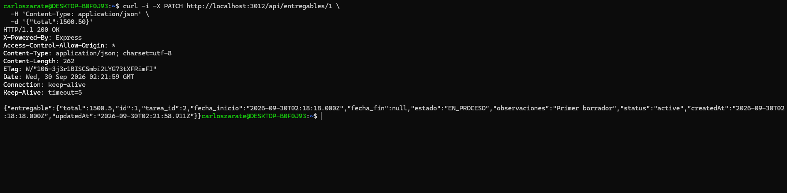


## ISS - 10

### OBJ

**OBJ:** Al finalizar, cada entregable tendrá versiones numeradas automáticamente (v1, v2, v3…), con estado controlado solo por el sistema y protegidas contra cambios una vez aprobadas.

### AC

**AC:**
- [x] **AC-1** Dado un entregable; cuando `POST /api/version-entregables` dos veces; entonces la primera responde `numero_version: 1` y la segunda `numero_version: 2`, ambas `EN_REVISION`.
- [x] **AC-2** Dado un body con `numero_version` o `estado`; cuando `POST`; entonces `400`.
- [x] **AC-3** Dado un `entregable_id` inexistente; cuando `POST`; entonces `404`.
- [x] **AC-4** Dado una versión `APROBADA` (fijada a mano en BD para esta prueba); cuando `PATCH` o `DELETE`; entonces `409` (RN-04).
- [x] **AC-5** Dado un hito `CERRADO` (fijado a mano en BD para esta prueba); cuando se crea versión de un entregable suyo; entonces `409` (RN-06).
- [x] **AC-6** Dado la tabla; cuando `SHOW CREATE TABLE version_entregables`; entonces existe la FK y el UNIQUE (`entregable_id`, `numero_version`).
- [x] **AC-7** Dado la tabla vacía; cuando `npm run db:seed` ×2; entonces cada entregable tiene su versión 1, sin duplicar.

### Procedimiento

1. pegamos el prompt 

``` text
Naturaleza: PRACTICO. Eres asistente SOLO de ISS-10, no del backend entero.

Implementa los AC de docs/trazabilidad_NC/ISS-10.md siguiendo docs/manual.md secciones 11 y 12 (CRUD completo + relacion
con archivo associations), con el MISMO estilo de los features cliente, campania e hito ya hechos en este proyecto.

Feature src/features/business/version-entregable: model, controller, routes, associations, seeder, swagger y carpeta http/.
Modelo VersionEntregable (tabla version_entregables, timestamps true): entregable_id INTEGER requerido FK a entregables.id, numero_version INTEGER requerido, fecha_inicio DATE opcional, fecha_fin DATE opcional, total DECIMAL(12,2) opcional, estado ENUM(EN_REVISION,APROBADA,RECHAZADA) default EN_REVISION, observaciones TEXT opcional, status ENUM(active,inactive) default active. Indice UNIQUE compuesto (entregable_id, numero_version).
version-entregable.associations.ts: Entregable.hasMany(VersionEntregable, foreignKey entregable_id, as "versiones") y VersionEntregable.belongsTo(Entregable, foreignKey entregable_id, as "entregable"), importado antes del sync.
Controller VersionEntregableController con los 7 metodos (getAll solo status active, getOne con include del padre, create, updatePut,
updatePatch, deletePhysical, deleteLogical). Reglas (mismas decisiones del backend NestJS IA):
- numero_version AUTOMATICO: en create cuenta las versiones de ese entregable y asigna count + 1. El cliente NUNCA lo envia.
- Si el body de create, updatePut o updatePatch trae estado o numero_version -> 400 ("estado y numero_version los controla el sistema").
  El estado solo lo cambiara el feature aprobaciones (ISS-11).
- En create: entregable inexistente -> 404. Si el hito del entregable (entregable -> tarea -> hito) esta CERRADO -> 409 (RN-06).
- RN-04: updatePut, updatePatch, deletePhysical y deleteLogical sobre una version con estado APROBADA -> 409.
Errores: validacion -> 400, no encontrado -> 404, regla de negocio -> 409.
Rutas SIN AUTH en /api/version-entregables (incluido PATCH /api/version-entregables/:id/deactivate) registradas en src/routes/index.ts.
http/ con los .http de get, create, update y delete, leyenda SIN AUTH, puerto 3012.
Seeder seedVersionEntregables idempotente: crea la version 1 (EN_REVISION) de cada entregable que no tenga versiones; agregalo al SeedersRunner DESPUES de entregables.
Usa el path /api/version-entregables para las rutas.
Swagger del feature registrado en src/swagger/index.ts.

NO adelantes ISS-11 (aprobaciones). Prohibido: autenticacion, JWT, bcrypt, passwords, guards, RBAC, NestJS, force, alter. NO toques docs/. NO commitees .env.

Al final entrega tres listas: archivos tocados; como verifico cada AC (comandos exactos); que quedo fuera de alcance.
```

Salida:
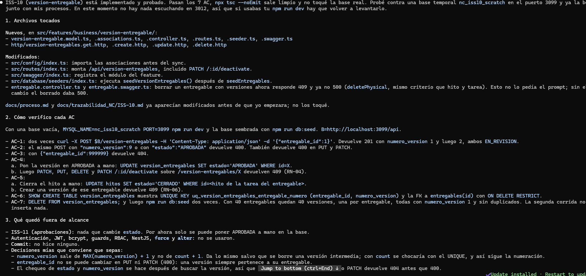

probamos que corra

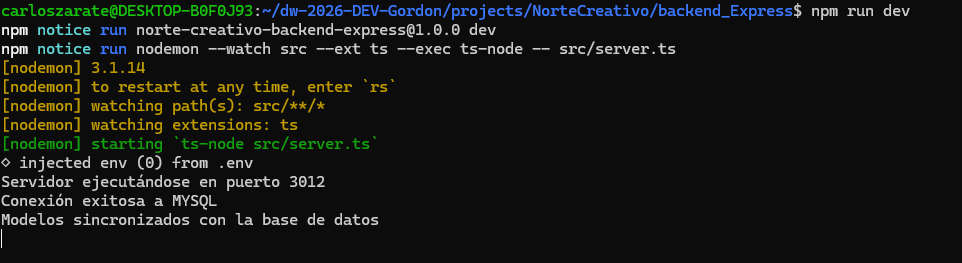

creamos uno limpio para comprobar los ac

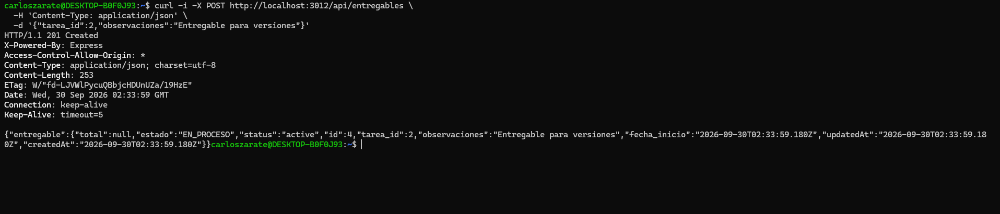

probamos el numero_version automatico del ac1
primera version

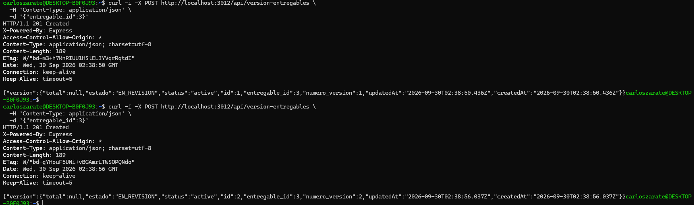

ahora estado o numero de version, los 3 nos dan codigo 400

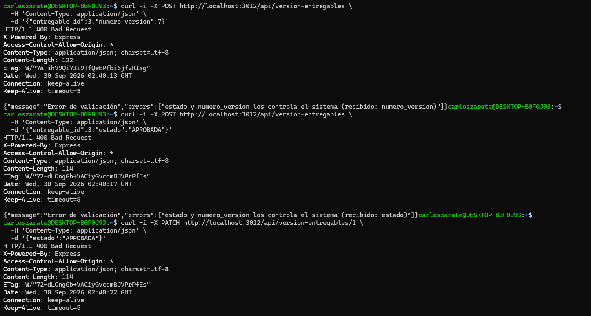

entregable inexistente

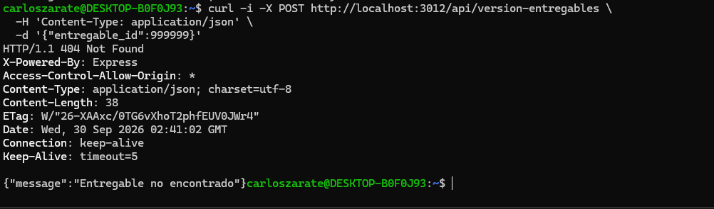

ahora probamos version aprobada inmutable que de 409 y rn04, fijamos el estado a mano en la base ya que no se permite en la api, usamos y los 3 nos dan 409

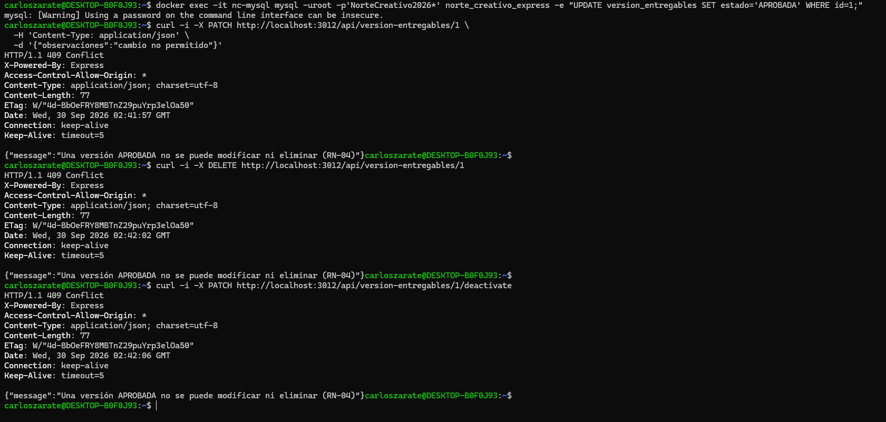

ahora con los hitos cerrados que no admiten versiones nuevas, todos nos deben dar 409, al final reabrimos para no tener errores futuros

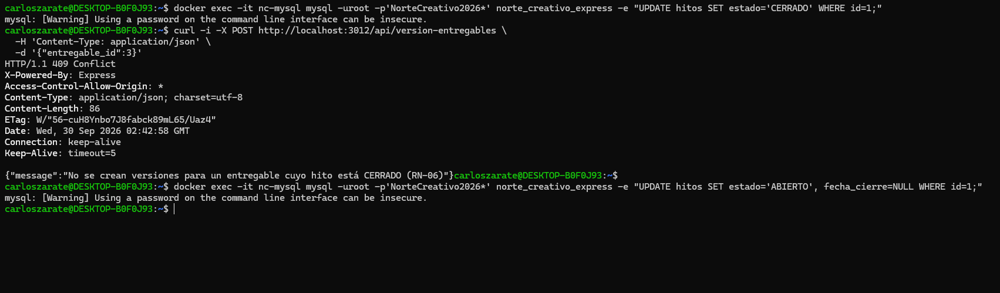

ac6, fk y unique

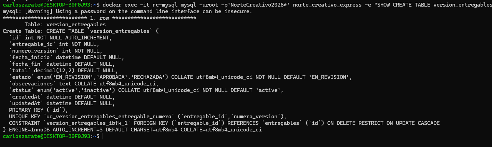

## ISS - 11

### OBJ

**OBJ:** Al finalizar, registrar una aprobación podrá cerrar el hito automáticamente y de forma atómica cuando todos sus entregables tengan su última versión APROBADA, igual que la capacidad integrada del backend IA.

### AC

**AC:**
- [ ] **AC-1** Dado un hito con un único entregable y su versión `EN_REVISION`; cuando `POST /api/aprobaciones` `APROBADA`; entonces `201` con `hito_cerrado: true`, `hito_id` y `fecha_cierre`, y el hito queda `CERRADO` en BD.
- [ ] **AC-2** Dado un hito con dos entregables; cuando se aprueba la versión de solo uno; entonces `201` con `hito_cerrado: false` y el hito sigue `ABIERTO`.
- [ ] **AC-3** Dado una versión; cuando se registra `RECHAZADA`; entonces `201`, `hito_cerrado: false`, la versión queda `RECHAZADA` y el hito sigue `ABIERTO`.
- [ ] **AC-4** Dado un hito `CERRADO`; cuando se registra una aprobación sobre una de sus versiones; entonces `409` y nada cambia.
- [ ] **AC-5** Dado un `version_entregable_id` inexistente; cuando `POST`; entonces `404`. Con `estado` distinto de `APROBADA|RECHAZADA` → `400`.
- [ ] **AC-6** Dado un hito; cuando `PATCH /api/hitos/:id` con `"estado":"CERRADO"`; entonces `400` (el estado solo lo cambia una aprobación).
- [ ] **AC-7** Dado `cierre-hito.evaluator.ts`; cuando se inspecciona; entonces no importa Sequelize ni Express (función pura).

### Procedimiento

1. pegamos el prompt 

``` text
Naturaleza: PRACTICO. Eres asistente SOLO de ISS-11, no del backend entero.

Implementa los AC de docs/trazabilidad_NC/ISS-11.md. Es la capacidad integrada CerrarHito, con las MISMAS decisiones del
backend NestJS IA (../backend_IA), adaptada a la estructura del manual Express del curso (modelo + controller + rutas, sin repositorio ni capa de dominio; la transaccion va en el controller, como en product-sale.controller.ts del manual, seccion 13.2b).

Feature src/features/business/aprobacion: model, controller, routes, associations, cierre-hito.evaluator.ts, swagger y http/.
Modelo Aprobacion (tabla aprobaciones, timestamps true): version_entregable_id INTEGER requerido FK a version_entregables.id,
estado ENUM(PENDIENTE,APROBADA,RECHAZADA) requerido, aprobador_id INTEGER requerido (SIN FK, no hay tabla de usuarios),
comentario TEXT opcional, fecha DATE default ahora, status ENUM(active,inactive) default active.
Associations: VersionEntregable.hasMany(Aprobacion, as "aprobaciones") y Aprobacion.belongsTo(VersionEntregable, as "version"), importado antes del sync.

cierre-hito.evaluator.ts: funcion PURA debeCerrarHito(entregables: { entregable_id: number; ultima_version_estado: string | null }[]): boolean,
true SOLO si todos tienen ultima_version_estado === 'APROBADA'; si la lista esta vacia devuelve false. No importa sequelize ni express.

AprobacionController.create dentro de UNA sola transaccion: await sequelize.transaction(async (t) => { ... }):
1) Busca la version (404 si no existe), su entregable, su tarea y su hito; el hito con { transaction: t, lock: t.LOCK.UPDATE }.
2) Si el hito no esta ABIERTO -> 409 "El hito ya esta cerrado y no admite nuevas aprobaciones" (RN-06).
3) Crea la aprobacion y actualiza version_entregables.estado con el mismo veredicto, ambas con { transaction: t }.
4) Si estado es RECHAZADA -> responde hito_cerrado false (la aprobacion SI queda guardada).
5) Si es APROBADA -> trae todas las tareas del hito, todos sus entregables y la ultima version de cada uno
   (order numero_version DESC), arma la lista y llama debeCerrarHito. Si es true, actualiza el hito a estado CERRADO y
   fecha_cierre = ahora dentro de la transaccion.
6) Cualquier error -> rollback automatico.
Validacion: estado distinto de APROBADA o RECHAZADA -> 400; faltan version_entregable_id o aprobador_id -> 400.
Respuesta 201: { aprobacion, hito_cerrado, hito_id, fecha_cierre }.
Rutas SIN AUTH: POST /api/aprobaciones, GET /api/aprobaciones, GET /api/aprobaciones/:id. NO hay PUT, PATCH ni DELETE:
la aprobacion es un registro de auditoria inmutable.

AJUSTE OBLIGATORIO al feature hito (src/features/business/hito/hito.controller.ts): create, updatePut y updatePatch deben
responder 400 si el body trae estado o fecha_cierre ("el estado del hito solo lo cambia una aprobacion"). Actualiza tambien
hito.swagger.ts para no documentar esos campos como editables. No cambies nada mas del hito.

Sin seeder de aprobaciones. aprobacionSwagger registrado en src/swagger/index.ts.
Actualiza el README del backend con el libreto de la demo: cliente -> campania -> hito -> tarea -> entregable -> version 1 ->
RECHAZADA (hito sigue ABIERTO) -> version 2 -> APROBADA (hito CERRADO) -> nueva aprobacion sobre ese hito -> 409.

Prohibido: autenticacion, JWT, bcrypt, passwords, guards, RBAC, NestJS, force, alter. NO toques docs/. NO commitees .env.

Al final entrega tres listas: archivos tocados; como verifico cada AC (comandos exactos); que quedo fuera de alcance.
```

Salida:

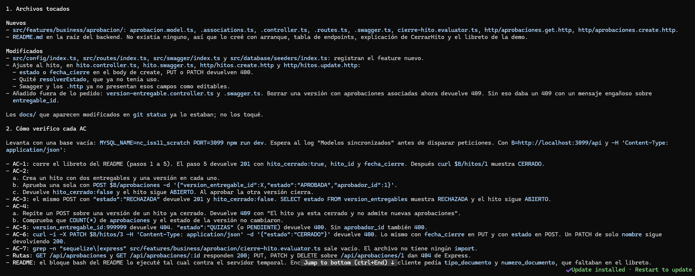
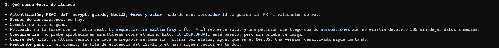

probamos que corra

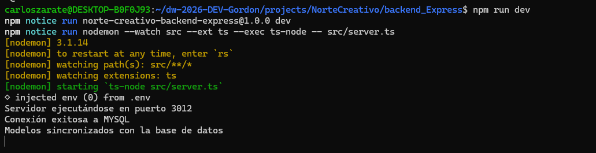

preparacion para probar los ac

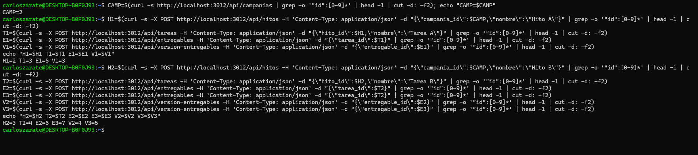

probamos el ac 1 de cierre automatico, al final dice cerrado con la fecha

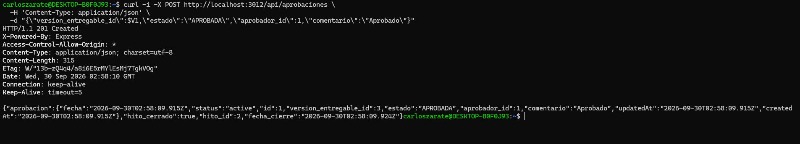

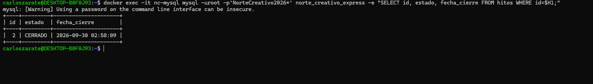

ahora el ac2, un solo entregable aprobado no cierra el hito

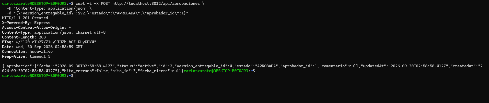
 
confirmamos que sigue abierto

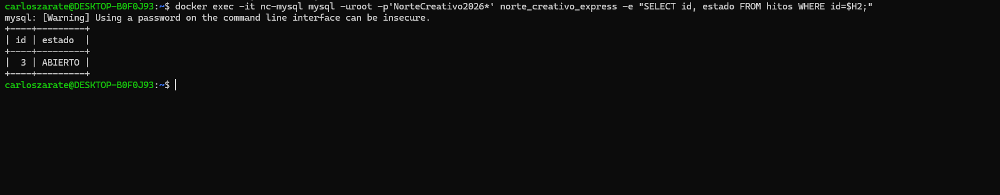

ahora comprobamos el ac3, que rechace la version del segundo entregable, nos da al final el

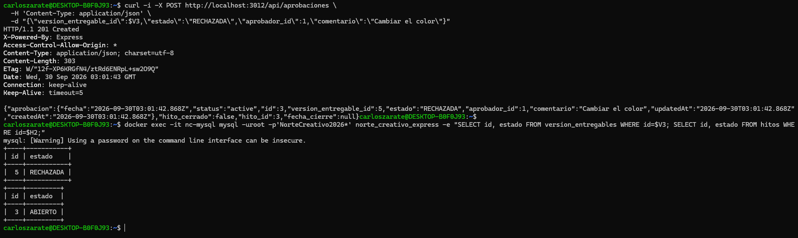

comprobamos el ac4, el hito cerrado no admite mas aprobaciones y debe dar error 409

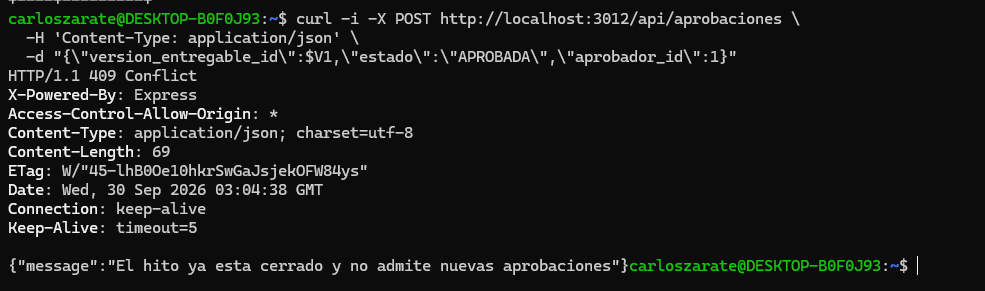

comrpobamos el ac5 mandando una version inexistente y un estado invalido

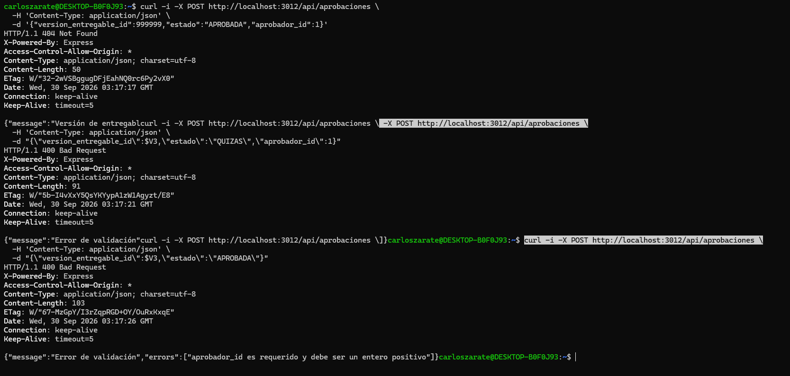

probamos el ac6, que nadie cierra un hito a mano, da error 400 y tambien probamos el put y el post

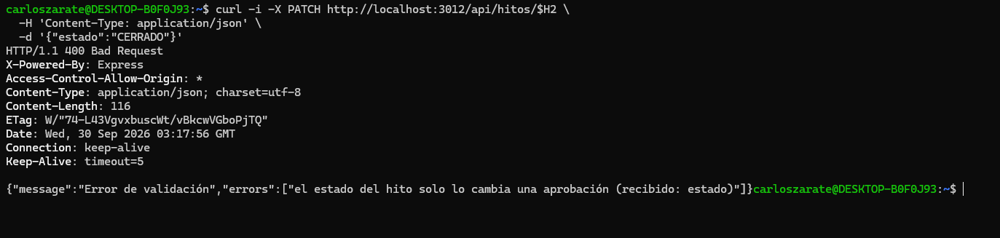
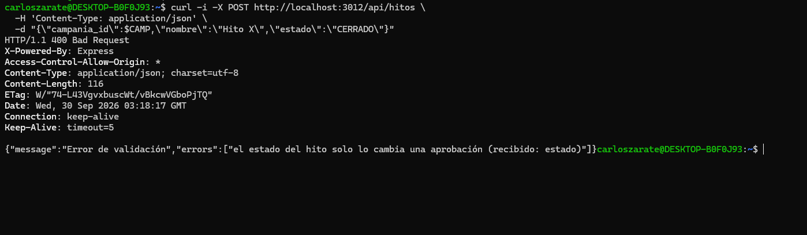

ahora probamos que el evaluador sea puro

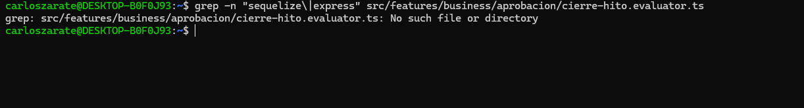


## FASE 2 - AUTH Y REFACTORIZACIONES

Para la fase de auth con rbac se usa la ruta express 2026 del docente, la fase II del manual, que corre sobre el mismo backend_Express, con el mismo puerto 3012 y la misma base norte_creativo_express. 

Los ISS nuevos van del 12 al 21: el ISS-12 y el ISS-13 son el refactor de la fase I a capas (controller, service, repository, model, con dto y shared), esto debido a una confusion donde termine usando una arquitectura puesta en model + controller + routes

ISS-14 al ISS-21 se construye la seguridad. Se agregan 6 tablas, users, roles, resources, role_users, resource_roles y refresh_tokens, que ya estaban modeladas en el sdd, y no existe una entidad permission porque el permiso es la fila que une un rol con un recurso. 

Las rutas tienen tres modalidades, abiertas (login, refresh, logout y swagger), solo jwt (perfil, permisos y sesiones propias) y jwt mas rbac (todo el negocio y la administracion), y el acceso es deny by default, sin concesion se responde 403 y la matriz se consulta en cada peticion. 

El access token es corto, firmado con hs256 con iss, aud, exp y jti, y el refresh token es opaco, se guarda hasheado, rota en cada uso y se puede revocar. Se instalan jsonwebtoken y bcryptjs, el secreto jwt va solo en el .env y el .env.example queda sin valores. 

Los 5 roles son admin, cuentas, creativo, cliente_aprobador y finanzas, con un usuario sembrado por cada uno para poder probar los 403 rol por rol, y la matriz de concesiones sale de los actores del sdd. 

Con esto la rn-05 se cumple de verdad, solo cliente_aprobador aprueba y el aprobador_id sale del token, no del body. Quedan fuera el ownership, que el aprobador vea solo sus campañas, y asignaciontarea, porque el rbac del docente es por endpoint, y se documenta como limitacion. Seguimos con claude code via cli, sin skills, con sonnet 5 en esfuerzo alto, y los commits los hago yo despues de verificar cada ac.

## ISS - 12

### OBJ

**OBJ:** Al finalizar, Cliente, Campania e Hito seguirán el recorrido por capas del manual nuevo, sin cambiar el comportamiento de la API.

### AC

**AC:**
- [x] **AC-1** Existen los tres archivos de `src/shared/`.
- [x] **AC-2** Existen `clientes/`, `campanias/` e `hitos/` con `dto/`, repository, service, controller y routes, y ya no existen `cliente/`, `campania/` ni `hito/`.
- [x] **AC-3** Ningún controller de esos tres features importa `sequelize` ni un `.model`.
- [x] **AC-4** Las reglas (documento duplicado 409, cliente inactivo 409, RN-08 409, `estado` del hito 400) viven en los services y responden igual que antes.
- [x] **AC-5** `GET /api/clientes/abc` responde 400 (validación de `paramId`).
- [x] **AC-6** `npx tsc --noEmit` sin errores, `npm run dev` arranca y `npm run db:seed` corre.

### Procedimiento

1. pegamos el prompt 

``` text
Naturaleza: PRACTICO. Eres asistente SOLO de ISS-12, no del backend entero.

Implementa los AC de docs/trazabilidad_NC/ISS-12.md en projects/NorteCreativo/backend_Express.
Aplica el patron por capas (capas HTTP -> Controller -> Service -> Repository -> Model, DTOs por operacion, BaseController.run/paramId,
AppError, findOrFail) adaptado a Norte Creativo.
Puerto 3012, base norte_creativo_express, rutas en español como el docente.

Refactoriza los features cliente, campania e hito al patron por capas del manual nuevo, renombrando las carpetas a plural:
features/business/clientes, campanias, hitos. Crea src/shared (app-error, base-controller, with-transaction) como en la seccion 4.0.
Mueve TODA regla de negocio del controller al service (numero_documento unico 409, cliente inactivo no admite campania 409,
RN-08 campania inactiva no admite hito 409, estado/fecha_cierre del hito por HTTP -> 400). El repository es la unica capa que usa Sequelize.
Mantén EXACTAMENTE las rutas, codigos HTTP y forma de respuesta actuales. Actualiza los imports en src/config, src/routes,
src/database/seeders y src/swagger, y los de tarea (FK a hitos) si se rompen.

NO refactorices tarea, entregable, version-entregable ni aprobacion (ISS-13). Prohibido: NestJS, force: true, secretos en el codigo (JWT_SECRET solo en .env; .env.example sin valores), cambiar el puerto 3012 o la base norte_creativo_express. NO toques docs/proceso.md ni docs/trazabilidad_NC/. NO hagas commit ni push: lo hago yo.

Al final entrega tres listas: archivos tocados; como verifico cada AC (comandos exactos); que quedo fuera de alcance.
```

Salida:
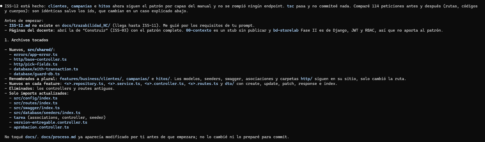

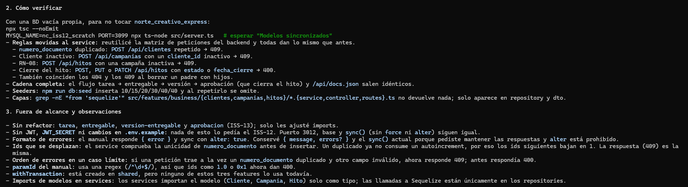

Compramos que arranca

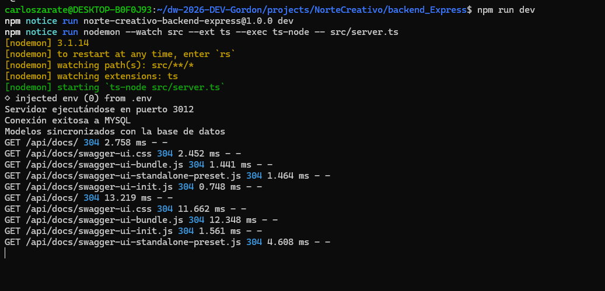

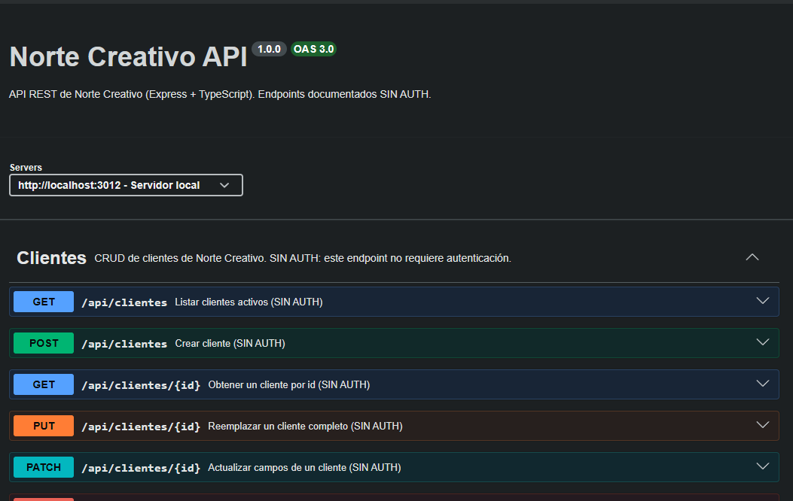

vemos que existen los 3 folders de shared

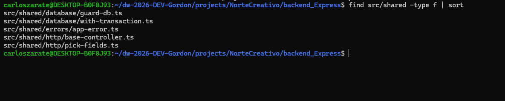

ahora vemos que las carpetas viejas escritas en plural ya no existen

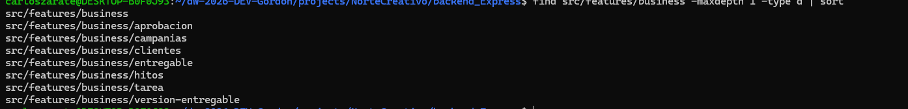

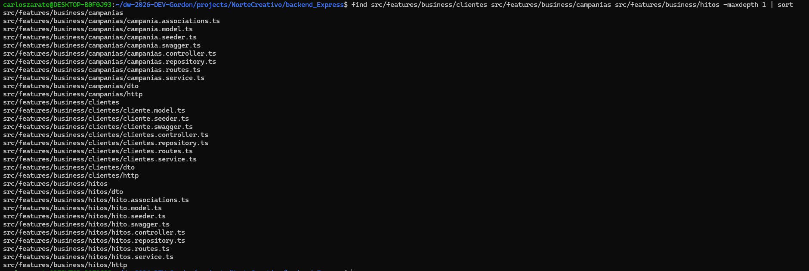

Miramos ahora que los controllers no toquen sequelize y vemos que las reglas respondan igual que antes.

Tenemos tanto codigo 201 para crear el cliente y error 409 cuanto tratamos de crearlo nuevamente con los mismos valores

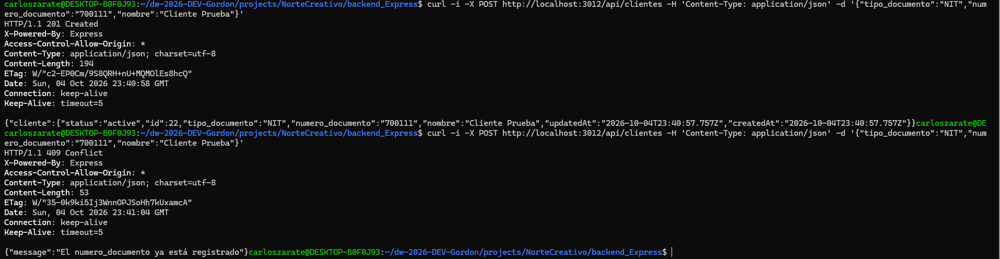

si tratamos de crear un nuevo cliente y este esta inactivo no puede tener una campaña

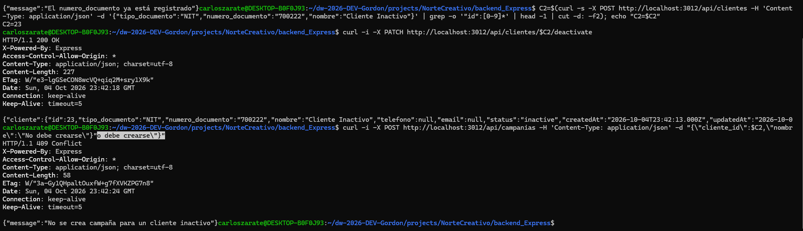

ahora vemos que campaña inactiva no admita un hito y de 409

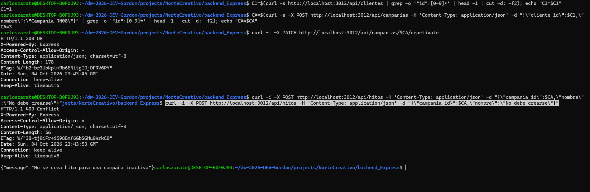

Ahora vemos el ac5, para que el paramID nos valide un id y nos da error 400

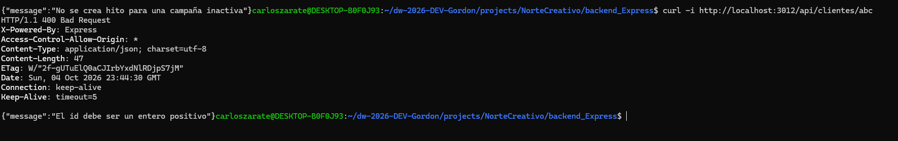

Vemos que compile, haga la siembra y arranque sin problemas.

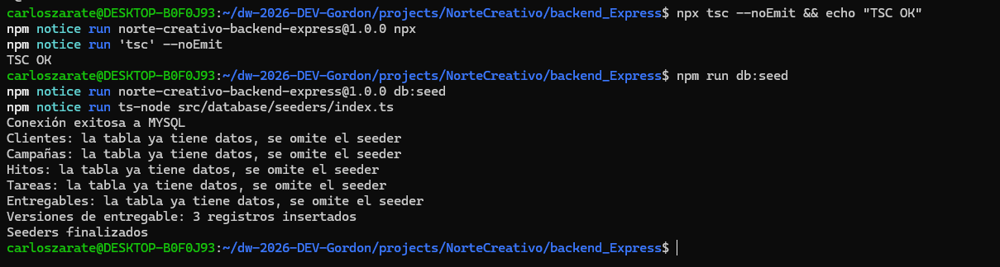


## ISS - 13

### OBJ

**OBJ:** Al finalizar, toda la Fase I estará por capas y CerrarHito vivirá en el service con `withTransaction`, como la venta del manual.

### AC

**AC:**
- [x] **AC-1** Existen las cuatro carpetas en plural con sus capas y ya no existen las versiones en singular.
- [x] **AC-2** `aprobaciones.service.ts` usa `withTransaction` y el controller de aprobaciones no importa `sequelize`.
- [x] **AC-3** El bloqueo del hito (`LOCK.UPDATE`) está en un repository, no en el service ni en el controller.
- [x] **AC-4** `cierre-hito.evaluator.ts` no importa `sequelize` ni `express`.
- [x] **AC-5** El libreto de la demo da: rechazo → `hito_cerrado: false`, última aprobación → `true`, nueva aprobación sobre hito cerrado → 409.
- [x] **AC-6** `numero_version` automático, RN-04 (409) y RN-06 (409) responden igual que antes.
- [x] **AC-7** `npx tsc --noEmit` OK, `npm run db:seed` OK y Swagger lista los 7 tags.

### Procedimiento

1. pegamos el prompt 

``` text
Naturaleza: PRACTICO. Eres asistente SOLO de ISS-13, no del backend entero.

Implementa los AC de docs/trazabilidad_NC/ISS-13.md en projects/NorteCreativo/backend_Express.
Aplica el patron por capas (capas HTTP -> Controller -> Service -> Repository -> Model, DTOs por operacion, BaseController.run/paramId,
AppError, findOrFail) adaptado a Norte Creativo.
Puerto 3012, base norte_creativo_express, rutas en español como el docente.

Refactoriza tarea, entregable, version-entregable y aprobacion al patron por capas, con carpetas en plural:
tareas, entregables, version-entregables, aprobaciones. Mueve numero_version automatico, RN-04 y RN-06 al service de versiones.
CerrarHito: el flujo transaccional pasa de aprobacion.controller a aprobaciones.service usando withTransaction (src/shared/database),
como hace el manual con la venta (seccion de product-sales / sales). El bloqueo del hito (lock UPDATE) va en un metodo del repository.
cierre-hito.evaluator.ts sigue puro. Aprobaciones sin PUT/PATCH/DELETE. Mantén rutas, codigos y respuestas identicos.
Actualiza imports en config, routes, seeders y swagger.

NO empieces auth (ISS-14). Prohibido: NestJS, force: true, secretos en el codigo (JWT_SECRET solo en .env; .env.example sin valores), cambiar el puerto 3012 o la base norte_creativo_express. NO toques docs/proceso.md ni docs/trazabilidad_NC/. NO hagas commit ni push: lo hago yo.

Al final entrega tres listas: archivos tocados; como verifico cada AC (comandos exactos); que quedo fuera de alcance.
```

Salida:
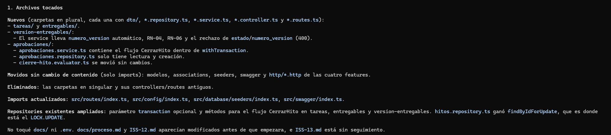

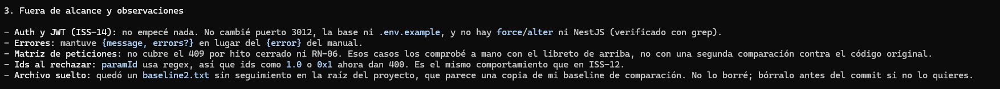

probamos que arranque con las nuevas impelemntanciones

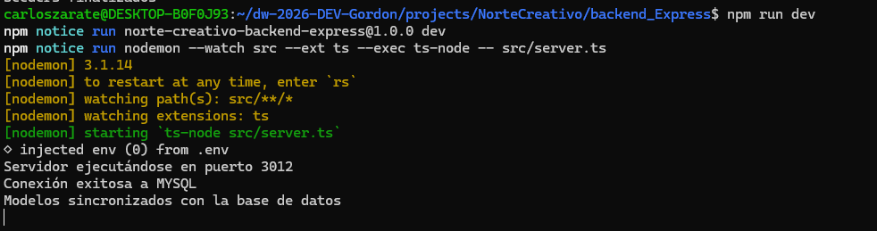

Vemos que la refactorizacion se aplico, mirando que en bussiness todas las carpetas esten en sigunlar y no plural

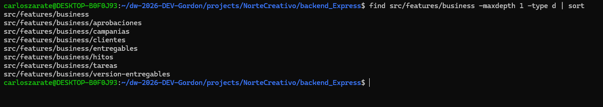

comprobamos que aprobaciones use withtransaction y que no se importe el sequelize

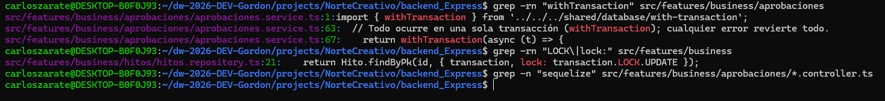

ahora comprobamos el evaluador y vemos que no genera una salida 

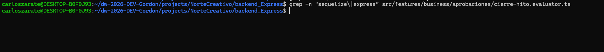

Ahora comprobamos el ac5 y ac6 armando un cadena nueva como en el iss 10 y asi probar la regla de cerrar o rechazar un hito y verificar versiones automaticas sin errores en los cambios, si se intenta aprobar algo que ya esta cerrado, el sistema no debe permitirlo y arrojar un 409 y el ac 6 dar aprobada y el hito cerrado

``` bash
CAMP=$(curl -s http://localhost:3012/api/campanias | grep -o '"id":[0-9]*' | head -1 | cut -d: -f2)
H=$(curl -s -X POST http://localhost:3012/api/hitos -H 'Content-Type: application/json' -d "{\"campania_id\":$CAMP,\"nombre\":\"Hito R\"}" | grep -o '"id":[0-9]*' | head -1 | cut -d: -f2)
T=$(curl -s -X POST http://localhost:3012/api/tareas -H 'Content-Type: application/json' -d "{\"hito_id\":$H,\"nombre\":\"Tarea R\"}" | grep -o '"id":[0-9]*' | head -1 | cut -d: -f2)
E=$(curl -s -X POST http://localhost:3012/api/entregables -H 'Content-Type: application/json' -d "{\"tarea_id\":$T}" | grep -o '"id":[0-9]*' | head -1 | cut -d: -f2)
V1=$(curl -s -X POST http://localhost:3012/api/version-entregables -H 'Content-Type: application/json' -d "{\"entregable_id\":$E}" | grep -o '"id":[0-9]*' | head -1 | cut -d: -f2)
V2=$(curl -s -X POST http://localhost:3012/api/version-entregables -H 'Content-Type: application/json' -d "{\"entregable_id\":$E}" | grep -o '"id":[0-9]*' | head -1 | cut -d: -f2)
echo "H=$H E=$E V1=$V1 V2=$V2"

curl -i -X POST http://localhost:3012/api/aprobaciones -H 'Content-Type: application/json' -d "{\"version_entregable_id\":$V1,\"estado\":\"RECHAZADA\",\"aprobador_id\":1}"
curl -i -X POST http://localhost:3012/api/aprobaciones -H 'Content-Type: application/json' -d "{\"version_entregable_id\":$V2,\"estado\":\"APROBADA\",\"aprobador_id\":1}"
curl -i -X POST http://localhost:3012/api/aprobaciones -H 'Content-Type: application/json' -d "{\"version_entregable_id\":$V2,\"estado\":\"APROBADA\",\"aprobador_id\":1}"

```

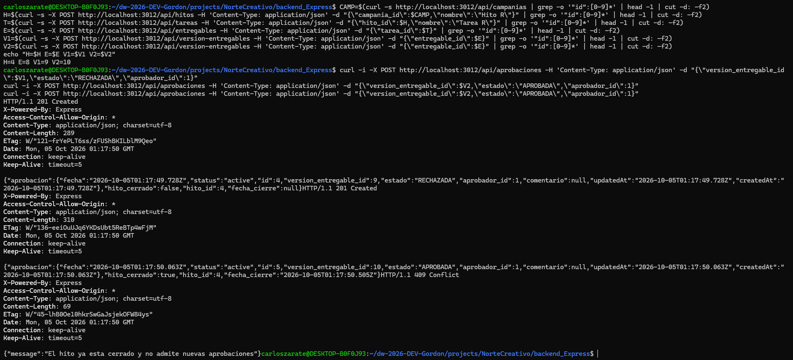

ahora probamos que compile y que sagger muestre los 7 tags

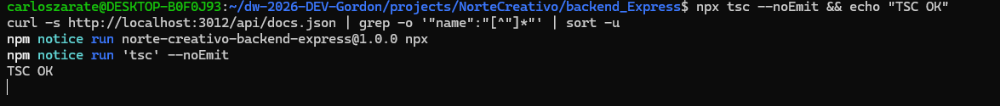

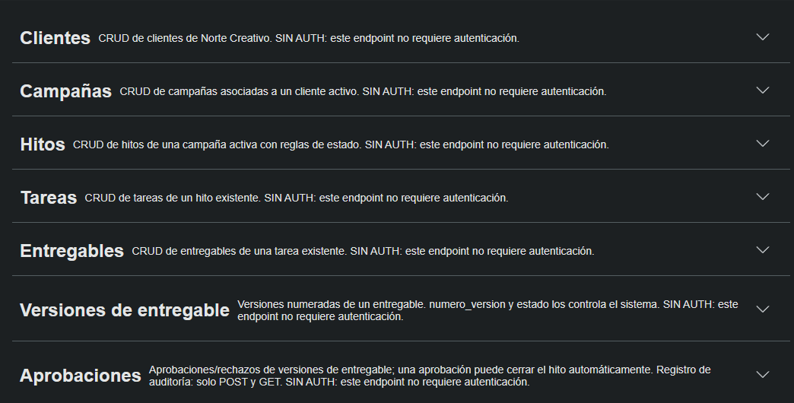

## ISS - 14

### OBJ

**OBJ:** Al finalizar, existirán las 6 tablas de identidad y los helpers de contraseña y JWT, listos para construir los features de auth.

### AC

**AC:**
- [x] **AC-1** `package.json` incluye `jsonwebtoken` y `bcryptjs`; `.env.example` tiene las 3 variables JWT sin el secreto real y `.env` no aparece en `git status`.
- [x] **AC-2** Al arrancar se crean las tablas `users`, `roles`, `resources`, `role_users`, `resource_roles` y `refresh_tokens`.
- [x] **AC-3** `SHOW CREATE TABLE` de `role_users` y `resource_roles` muestra las FK y el índice único compuesto.
- [x] **AC-4** Un token firmado con `jwt.ts` se verifica bien, y uno alterado o vencido falla.
- [x] **AC-5** `hash` y `verify` de `password.ts` funcionan: la contraseña correcta da `true` y una incorrecta `false`.
- [x] **AC-6** `npx tsc --noEmit` sin errores.

### Procedimiento

1. pegamos el prompt 

``` text
Naturaleza: PRACTICO. Eres asistente SOLO de ISS-14, no del backend entero.

Implementa los AC de docs/trazabilidad_NC/ISS-14.md en projects/NorteCreativo/backend_Express.
Aplica el patron por capas (capas HTTP -> Controller -> Service -> Repository -> Model, DTOs por operacion, BaseController.run/paramId,
AppError, findOrFail) adaptado a Norte Creativo.
Puerto 3012, base norte_creativo_express, rutas en español como el docente.

Crea la base de seguridad del docente (seccion Auth base) para Norte Creativo:
dependencias jsonwebtoken y bcryptjs con tipos; variables JWT_SECRET, JWT_ACCESS_TTL y JWT_REFRESH_TTL_DAYS en .env.example (sin valor
para JWT_SECRET) y en .env (genera un secreto aleatorio largo SOLO en .env); src/shared/auth (password, jwt HS256 con iss/aud/exp/jti,
resource-match, auth-user) y los 6 modelos en src/features/auth con rbac.associations.ts importado en config antes del sync.
Si src/shared no existe todavia, crealo igual que el ISS-03 del docente (app-error, base-controller, with-transaction).
Incluye un script de desarrollo scripts/check-auth-base.ts que firme y verifique un token y pruebe hash/verify, para la evidencia.

NO crees rutas ni middlewares todavia. Prohibido: NestJS, force: true, secretos en el codigo (JWT_SECRET solo en .env; .env.example sin valores), cambiar el puerto 3012 o la base norte_creativo_express. NO toques docs/proceso.md ni docs/trazabilidad_NC/. NO hagas commit ni push: lo hago yo.

Al final entrega tres listas: archivos tocados; como verifico cada AC (comandos exactos); que quedo fuera de alcance.
```

Salida:

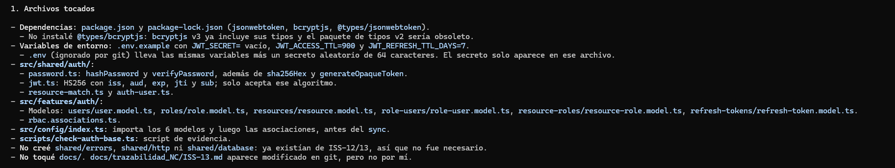
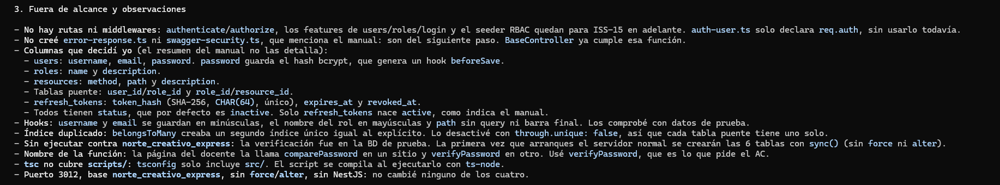

probamos y vemos que arranque 

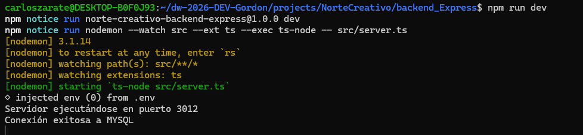

ahora revisamos el ac1 y que el env no salga en el git, y que los datos de jwt aparezcan en el env example rellenados con ejemplo.

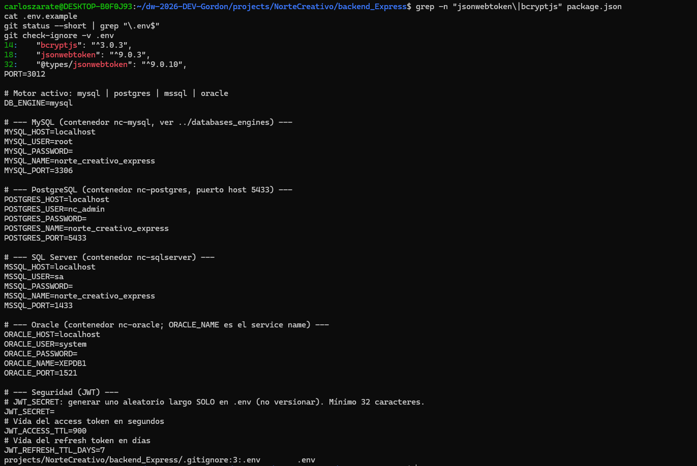

Ahora miramos las 6 tablas de la base de datos creadas para el auth rbac del proyecto

``` bash
docker exec -it nc-mysql mysql -uroot -p'NorteCreativo2026*' norte_creativo_express -e "SHOW TABLES;"
```

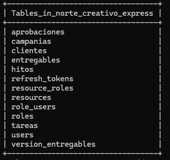

Ahora miramos el ac3 al fk e indice con unico compuesto

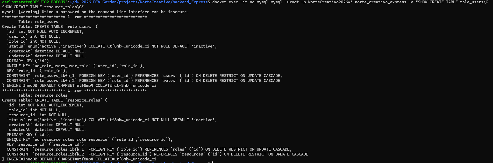

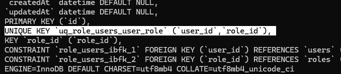

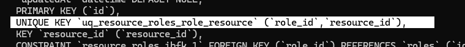

Ahora vemos el ac4 y el ac5 que el token se verifique bien y que uno alterado falle, tambien vemos los hash y verify funcionen, aca se usa el script para check el auth

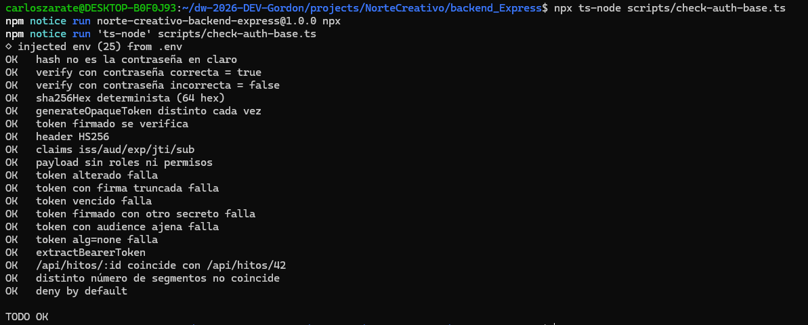

ahora vemos que compile

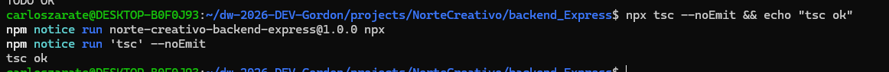

## ISS - 15

### OBJ

**OBJ:** Al finalizar, se podrán administrar usuarios con contraseña hasheada que nunca sale por la API, y habrá un usuario sembrado por cada rol.

### AC

**AC:**
- [x ] **AC-1** `POST /api/usuarios` responde 201 y la respuesta no trae `password`.
- [x] **AC-2** En la base, `password` está hasheada (empieza por `$2`).
- [x] **AC-3** Un `username` o `email` repetido responde 409.
- [x] **AC-4** `GET /api/usuarios` lista solo activos y ninguno trae `password`.
- [x] **AC-5** `npm run db:seed` ×2 deja exactamente 5 usuarios sembrados.
- [x] **AC-6** `npx tsc --noEmit` sin errores.

### Procedimiento

1. pegamos el prompt 

``` text
Naturaleza: PRACTICO. Eres asistente SOLO de ISS-15, no del backend entero.

Implementa los AC de docs/trazabilidad_NC/ISS-15.md en projects/NorteCreativo/backend_Express.
Aplica el patron por capas (capas HTTP -> Controller -> Service -> Repository -> Model, DTOs por operacion, BaseController.run/paramId,
AppError, findOrFail) adaptado a Norte Creativo.
Puerto 3012, base norte_creativo_express, rutas en español como el docente.

Construye el feature users del docente en src/features/auth/users con API /api/usuarios (CRUD completo + deactivate).
La contraseña se hashea con bcrypt en el modelo y el DTO de respuesta nunca la devuelve. username y email unicos -> 409.
Seeder idempotente con 5 usuarios de laboratorio, uno por rol de Norte Creativo: admin, cuentas, creativo, aprobador, finanzas
(documenta las contraseñas de laboratorio en el README del backend). Registra seeder, rutas y swagger.

NO asignes roles (ISS-17) ni protejas rutas todavia. Prohibido: NestJS, force: true, secretos en el codigo (JWT_SECRET solo en .env; .env.example sin valores), cambiar el puerto 3012 o la base norte_creativo_express. NO toques docs/proceso.md ni docs/trazabilidad_NC/. NO hagas commit ni push: lo hago yo.

Al final entrega tres listas: archivos tocados; como verifico cada AC (comandos exactos); que quedo fuera de alcance.
```

Salida:

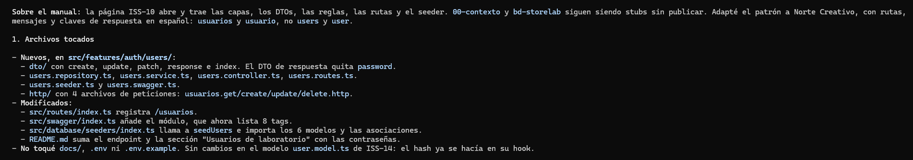

probamos que compile

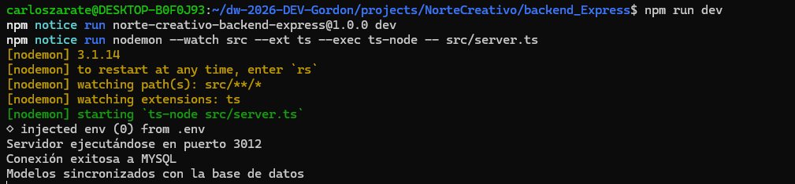

Ahora hacemos un post sin password a los usuarios y debe respondernos los campos pero sin el password, esto para comprobar

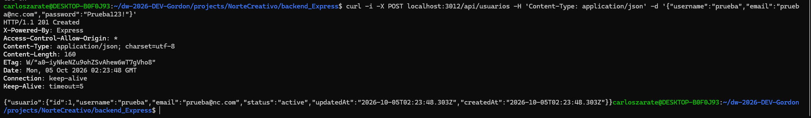

Ahora comprobamos que todos los usuariosm muestren hash en la base, si alguno muestra la contraseña en texto plano entonces el hash esta mal implementado

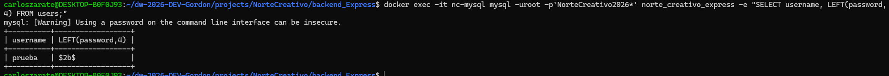

Venmos la version de bcryptjs aplicada

Ahora probamos que nos de 409 por duplicado, haciendo el post del ac1 y nos debe de dar 409 porque ya esta creado ese usuarioi

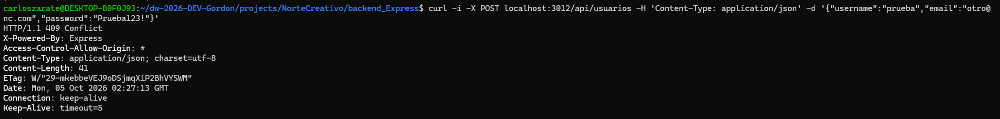

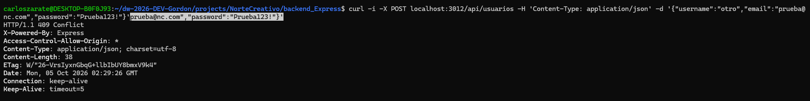

Miramos ahora solo activos y sin password del ac4, hacemos un curlo y nos imprime 0, si queremos comprobar lo de que muestre solo activos, entonces debemos desactivar el usuario

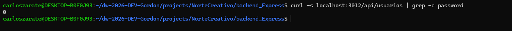

Ahora comprobamos que nos compile el backend

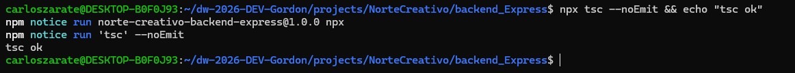

## ISS - 16

### OBJ

**OBJ:** Al finalizar, existirán los 5 roles de Norte Creativo y un recurso por cada endpoint protegible, sembrados de forma determinista.

### AC

**AC:**
- [x] **AC-1** `npm run db:seed` deja 5 roles con los nombres exactos.
- [x] **AC-2** El número de filas de `resources` es igual al número de entradas de `resource-catalog.ts`.
- [x] **AC-3** Reejecutar el seed no cambia los conteos.
- [x] **AC-4** Un rol con nombre repetido responde 409, y un recurso con `(method, path)` repetido también.
- [x] **AC-5** `GET /api/recursos` lista los recursos de los 7 features de negocio y de los 5 de administración.
- [x] **AC-6** `npx tsc --noEmit` sin errores.

### Procedimiento

1. pegamos el prompt 

``` text
Naturaleza: PRACTICO. Eres asistente SOLO de ISS-15, no del backend entero.

Implementa los AC de docs/trazabilidad_NC/ISS-15.md en projects/NorteCreativo/backend_Express.
Aplica el patron por capas (capas HTTP -> Controller -> Service -> Repository -> Model, DTOs por operacion, BaseController.run/paramId,
AppError, findOrFail) adaptado a Norte Creativo.
Puerto 3012, base norte_creativo_express, rutas en español como el docente.

Construye el feature users del docente en src/features/auth/users con API /api/usuarios (CRUD completo + deactivate).
La contraseña se hashea con bcrypt en el modelo y el DTO de respuesta nunca la devuelve. username y email unicos -> 409.
Seeder idempotente con 5 usuarios de laboratorio, uno por rol de Norte Creativo: admin, cuentas, creativo, aprobador, finanzas
(documenta las contraseñas de laboratorio en el README del backend). Registra seeder, rutas y swagger.

NO asignes roles (ISS-17) ni protejas rutas todavia. Prohibido: NestJS, force: true, secretos en el codigo (JWT_SECRET solo en .env; .env.example sin valores), cambiar el puerto 3012 o la base norte_creativo_express. NO toques docs/proceso.md ni docs/trazabilidad_NC/. NO hagas commit ni push: lo hago yo.

Al final entrega tres listas: archivos tocados; como verifico cada AC (comandos exactos); que quedo fuera de alcance.
```

salida:

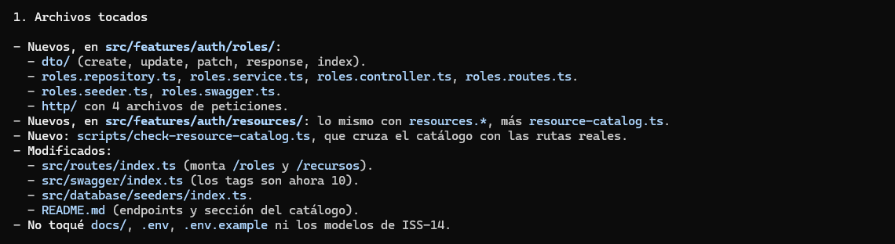

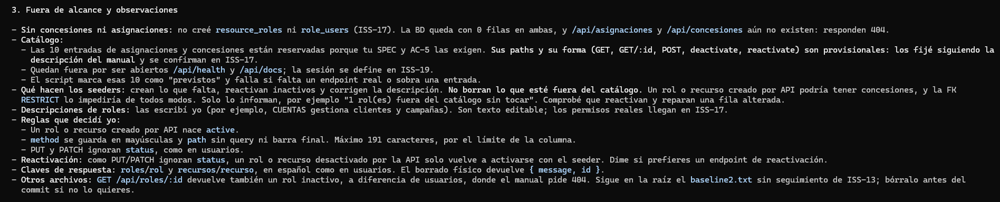

comprobamos que arranque

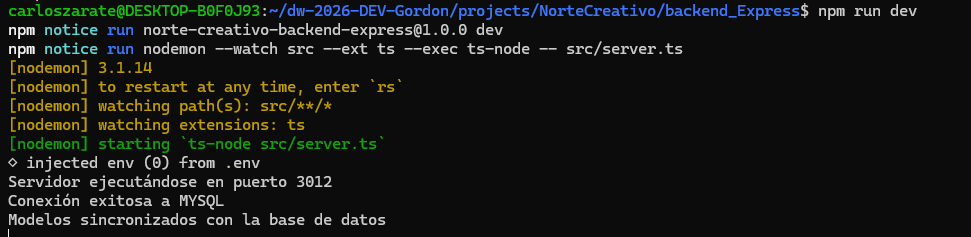

Ahora vemos los roles con el nombre exacto con npm seed
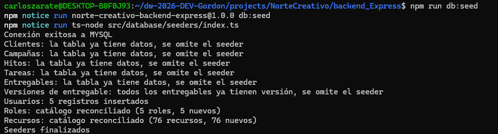
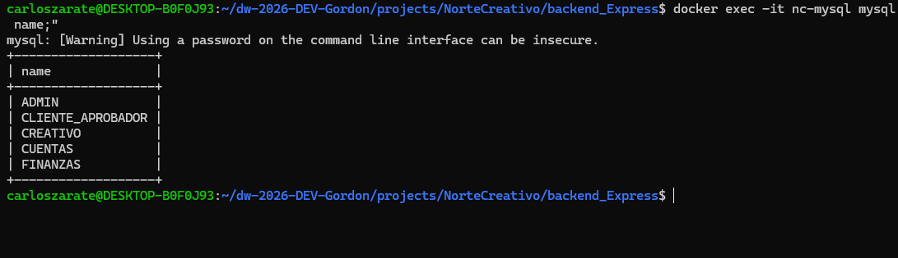

ahora comparamos los resources y que sean iguales a las entradas del catalogo

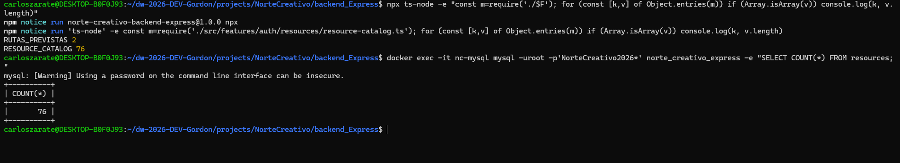

probamos el ac3, en seed idempotente, omprobamos que ambos conteos en diferentes momentos sean identicos

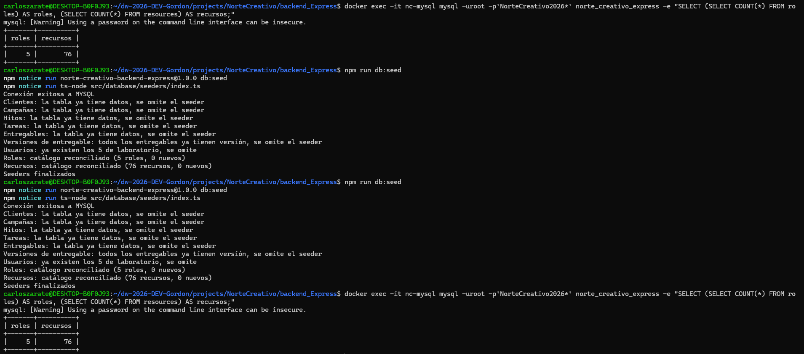

Ahora comprobamos que al haer post en duplicados nos genere 409 en roles y recursos

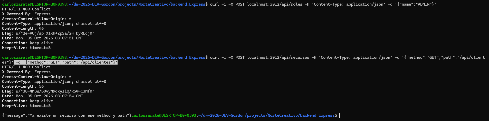

para el ac5 vemos que el listado cubre los 12 grupos en total

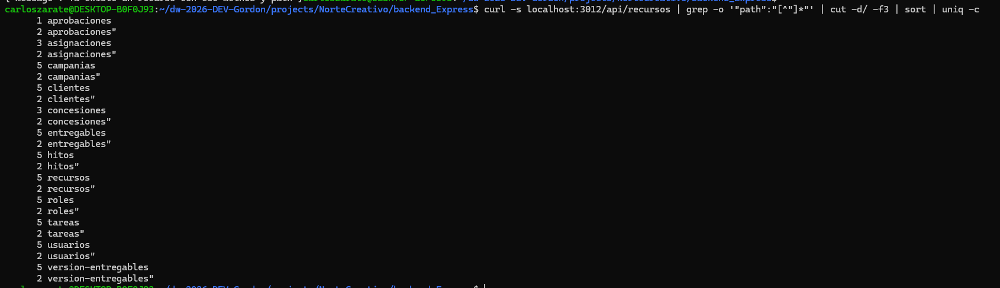

verificamos que compila

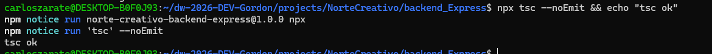

## ISS - 17

### OBJ

**OBJ:** Al finalizar, cada usuario tendrá su rol y cada rol sus concesiones según la matriz de Norte Creativo, con asignar, retirar y reactivar.

### AC

**AC:**
- [x] **AC-1** `npm run db:seed` deja 5 asignaciones (una por usuario) y reejecutarlo no duplica.
- [x] **AC-2** El número de concesiones por rol coincide con la matriz.
- [x] **AC-3** Retirar una asignación la deja `inactive` y reasignarla la reactiva sin crear otra fila.
- [x] **AC-4** `GET /api/concesiones-rol?role_id=<id>` lista las concesiones de ese rol.
- [x] **AC-5** Una asignación o concesión repetida no crea duplicados (índice único).
- [x] **AC-6** `npx tsc --noEmit` sin errores.

### Procedimiento

1. pegamos el prompt 

``` text
Naturaleza: PRACTICO. Eres asistente SOLO de ISS-17, no del backend entero.

Implementa los AC de docs/trazabilidad_NC/ISS-17.md en projects/NorteCreativo/backend_Express.
Aplica el patron por capas (capas HTTP -> Controller -> Service -> Repository -> Model, DTOs por operacion, BaseController.run/paramId,
AppError, findOrFail) adaptado a Norte Creativo.
Puerto 3012, base norte_creativo_express, rutas en español como el docente.

Construye role-users (/api/asignaciones-rol) y resource-roles (/api/concesiones-rol) del docente en src/features/auth,
con asignar, retirar (logico), reactivar sin duplicar filas y reconcileRole.
Seeders: cada usuario sembrado (admin, cuentas, creativo, aprobador, finanzas) recibe su rol; cada rol recibe exactamente las
concesiones de esta matriz (expresada sobre resource-catalog.ts):
ADMIN: todo. CUENTAS: clientes lectura; campanias, hitos y tareas CRUD; entregables, version-entregables y aprobaciones lectura.
CREATIVO: campanias, hitos y tareas lectura; entregables y version-entregables crear, leer y actualizar.
CLIENTE_APROBADOR: campanias, hitos, entregables y version-entregables lectura; aprobaciones POST y GET.
FINANZAS: clientes, campanias e hitos lectura.
Agrega la matriz como tabla al README del backend.

NO crees middlewares (ISS-18). Prohibido: NestJS, force: true, secretos en el codigo (JWT_SECRET solo en .env; .env.example sin valores), cambiar el puerto 3012 o la base norte_creativo_express. NO toques docs/proceso.md ni docs/trazabilidad_NC/. NO hagas commit ni push: lo hago yo.

Al final entrega tres listas: archivos tocados; como verifico cada AC (comandos exactos); que quedo fuera de alcance.
```

salida:

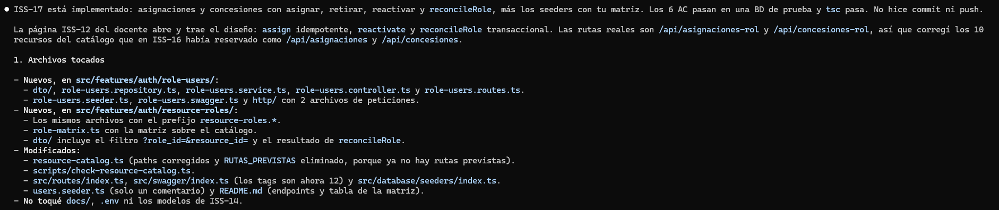

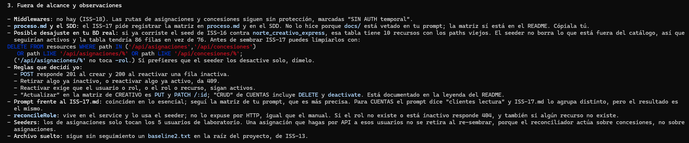

probamos que compile

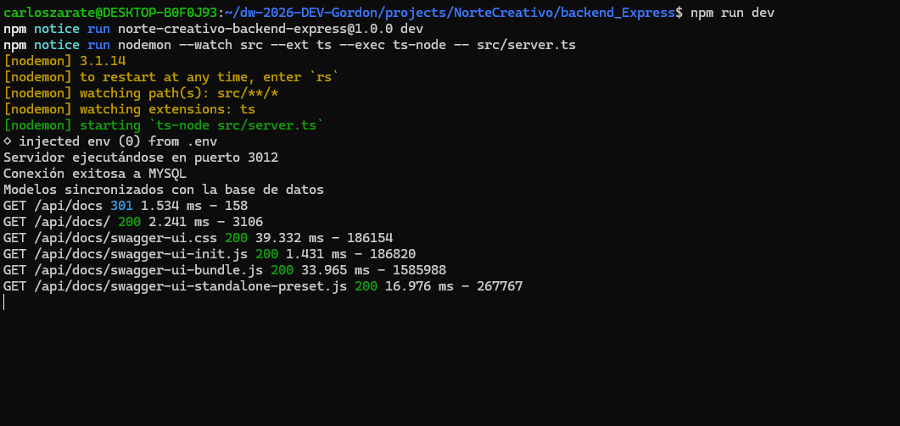

comprobamos las tablas y las rutas

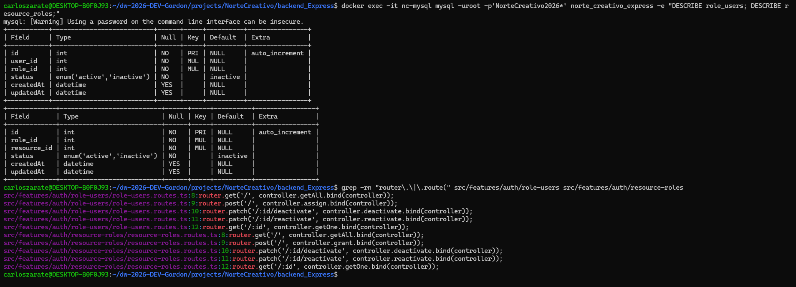

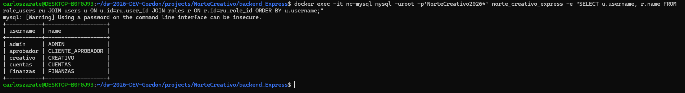

para el ac1 vemos que haya asignaciones activas sin duplicar nada

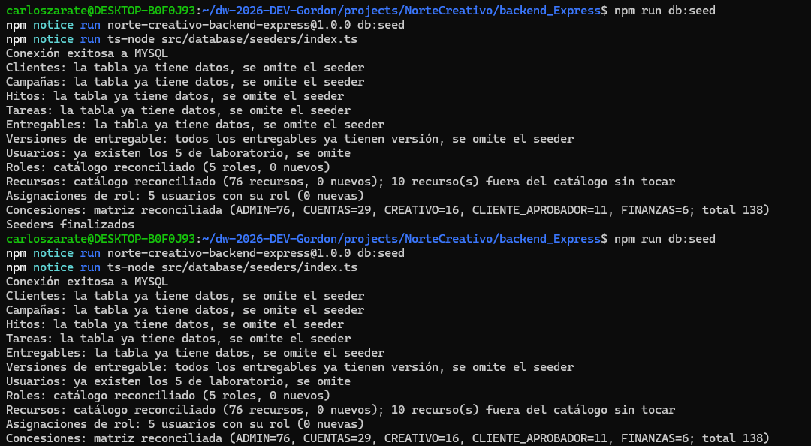

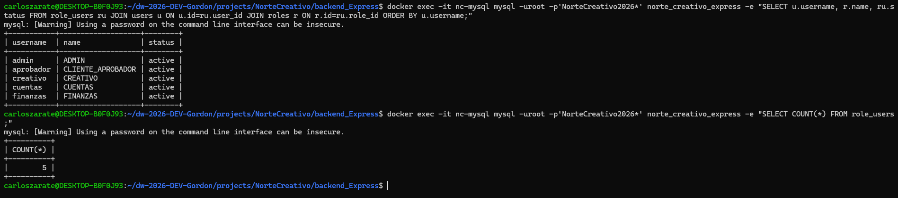

dos seeds dejaron 5 asignaciones, una por usuario, sin duplicar.

ahora vemos el ac2, las conseciones por rol

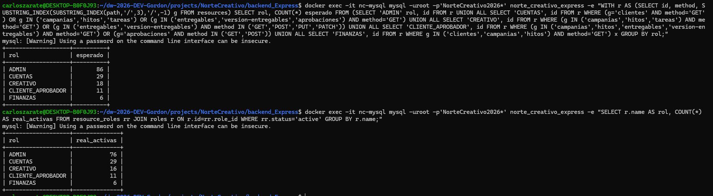

no concuerdan por lo que recurrimos a un nuevo prompt donde mas o menos intuimos que pasa, hay discrepancias por filas obsoletas que el seeder no borro 

``` text
Naturaleza: PRACTICO. Eres asistente SOLO de ISS-16/ISS-17, no del backend entero.

Verifica antes de realizar cualquier cambio, espera a mi peticion de implementar para aplicar la correccion si es cierta.

Problema el seeder de resources no es reconciliador. Quedaron en la tabla resources 10 filas obsoletas (ids 67-76, paths /api/asignaciones* y /api/concesiones*) que ya no estan en resource-catalog.ts, cuyos paths correctos son /api/asignaciones-rol* y /api/concesiones-rol*. Hoy resources tiene 86 filas y el catalogo 76.

Corrige el seeder de resources para que, ademas de insertar y actualizar, ELIMINE (o retire) las filas cuyo (method, path) no este en resource-catalog.ts, y que al hacerlo tambien limpie sus filas en resource_roles. Debe quedar idempotente. No uses force: true ni sync destructivo. No toques otros archivos fuera de este seeder y su servicio. NO hagas commit ni push.

Al final entrega: archivos tocados; los comandos exactos para verificar que resources quede igual al catalogo y que correrlo dos veces no cambie nada.

```

salida:

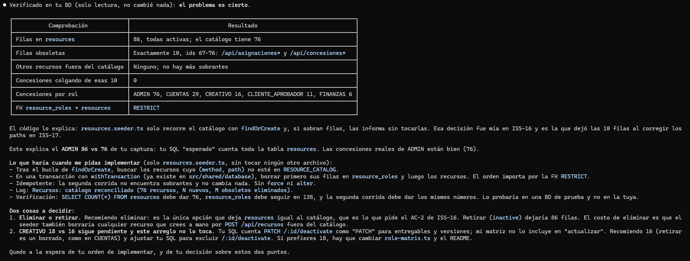

elegimos la opcion de eliminar para asi dejar resources igual que el catalogo 

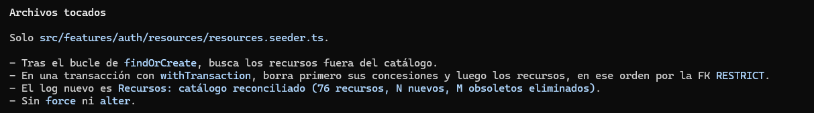

Ahora finalmente coincide, se origino por una mala implementacion del iss16

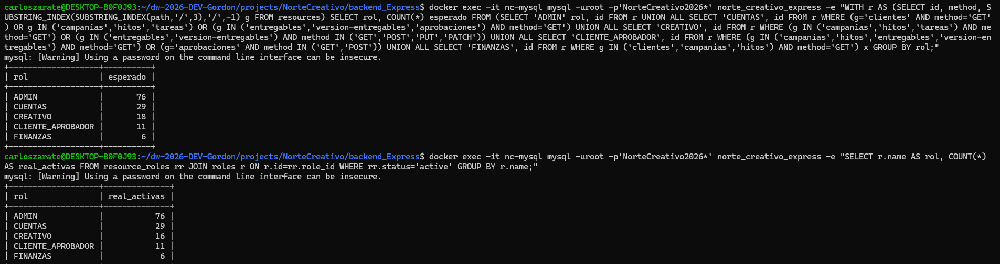

Ahora comprobamos el ac3 donde se debe retirar y reactivar sin crear otras filas

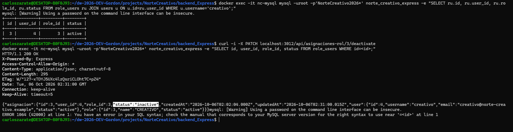

Nos muestra status = inactive 

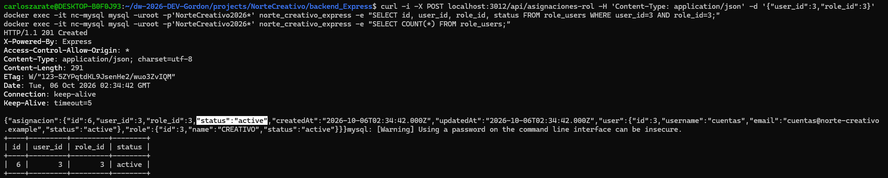

Ahora vemos los ac4 de filtros por rol

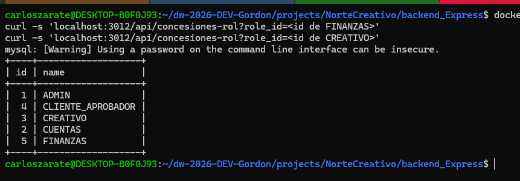

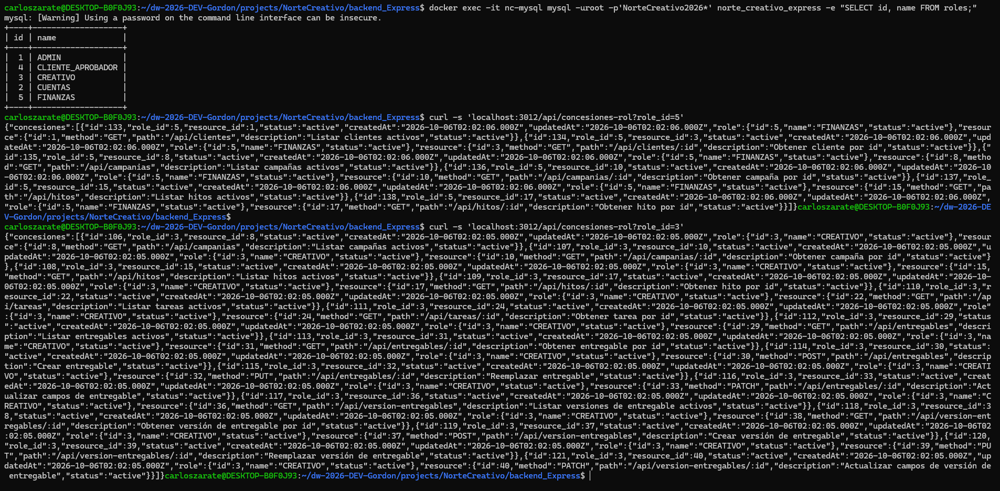

Ahora analisamos el ac5, que no debe tener duplicados

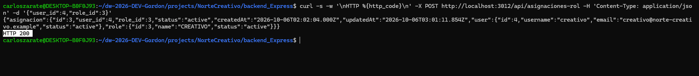
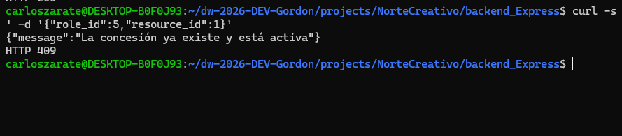

una sola fila cada una

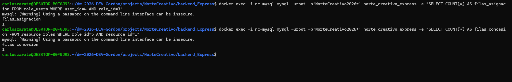

indices unicos compuestos

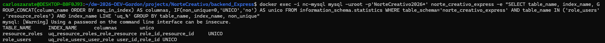

llaves foraneas de los roles

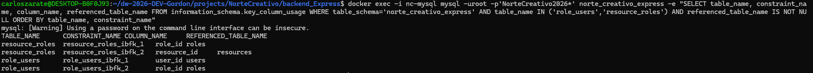

ahora probamos que compila sin errores

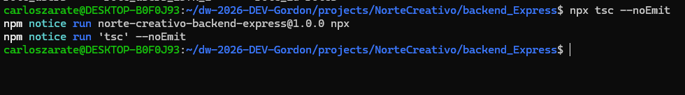


## ISS - 18

### OBJ

**OBJ:** Al finalizar, cada ruta podrá declararse OPEN, JWT o JWT + RBAC, y sin concesión explícita el acceso se niega con 403.

### AC

**AC:**
- [x] **AC-1** Sin token, `GET /api/usuarios` responde 401.
- [x] **AC-2** Con un token mal formado o alterado responde 401.
- [x] **AC-3** Con un token válido de `finanzas` (sin concesión sobre usuarios) responde 403.
- [x] **AC-4** Con un token válido de `admin` responde 200.
- [x] **AC-5** Dar o retirar una concesión con `/api/concesiones-rol` cambia el resultado en la siguiente petición, sin reiniciar el servidor.
- [x] **AC-6** `npx tsc --noEmit` sin errores.

### Procedimiento

1. pegamos el prompt 

``` text
Naturaleza: PRACTICO. Eres asistente SOLO de ISS-18, no del backend entero.

Implementa los AC de docs/trazabilidad_NC/ISS-18.md en projects/NorteCreativo/backend_Express.
Aplica el patron por capas (capas HTTP -> Controller -> Service -> Repository -> Model, DTOs por operacion, BaseController.run/paramId,
AppError, findOrFail) adaptado a Norte Creativo.
Puerto 3012, base norte_creativo_express, rutas en español como el docente.

Construye los middlewares authenticate y authorize del docente en src/features/auth/access y aplica las 3 modalidades:
protege con authenticate + authorize las rutas de usuarios, roles, recursos, asignaciones-rol y concesiones-rol.
authorize: deny by default (403), consulta la matriz en cada peticion, sin cache.
Crea scripts/dev-token.ts que imprima un access token valido para un username dado (admin, finanzas, etc.), usando el helper jwt;
solo para pruebas locales, lee el secreto del .env.

NO protejas todavia las rutas de negocio (ISS-21). Prohibido: NestJS, force: true, secretos en el codigo (JWT_SECRET solo en .env; .env.example sin valores), cambiar el puerto 3012 o la base norte_creativo_express. NO toques docs/proceso.md ni docs/trazabilidad_NC/. NO hagas commit ni push: lo hago yo.

Al final entrega tres listas: archivos tocados; como verifico cada AC (comandos exactos); que quedo fuera de alcance.
```

salida:

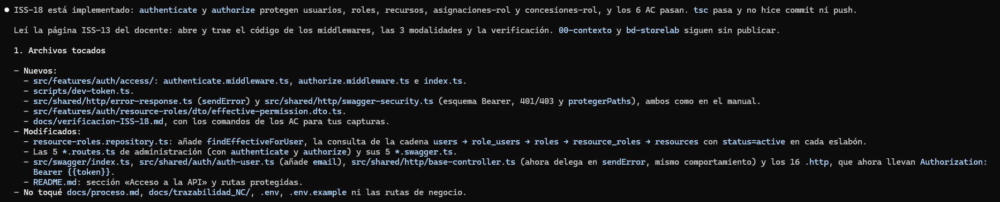

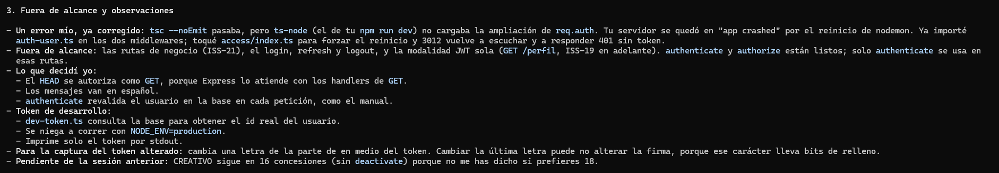

probamos que arranque el servidor 

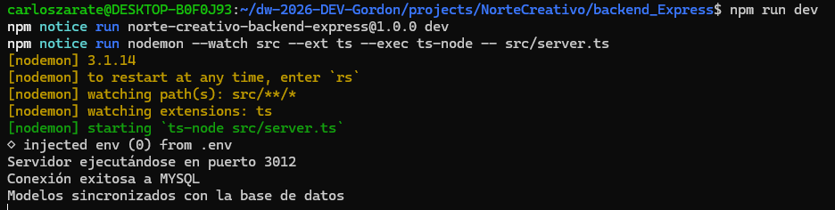

ahora probamos el ac 1, de entrar sin token y que responda 401

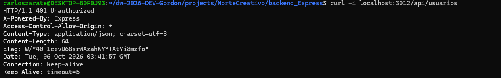

quiere decir que esta sin autorizacion

ahora el ac2, haciendo con un token mal formado o alterado debe generar el mismo error 401

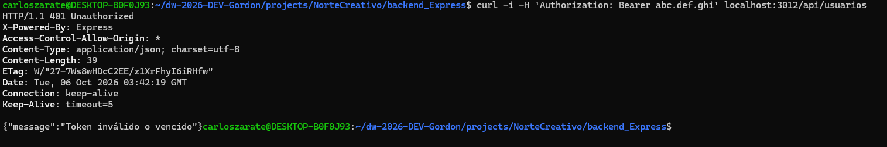

ac3, tokenm valido de finanzas responde 403

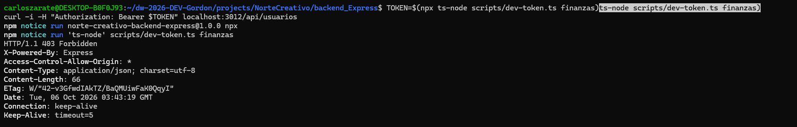

ahora ac4, responde un token valido a admin con el codigo 200

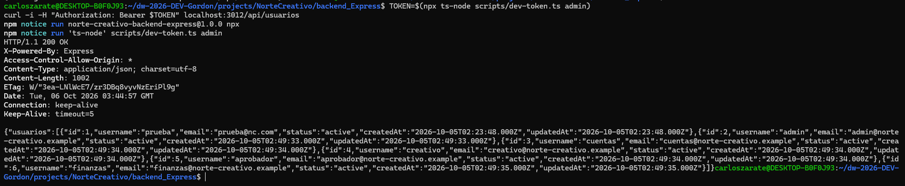


ahora el ac5, es de tres pasos y se hacen sin reiniciar el servidor, la primera debe dar 403,

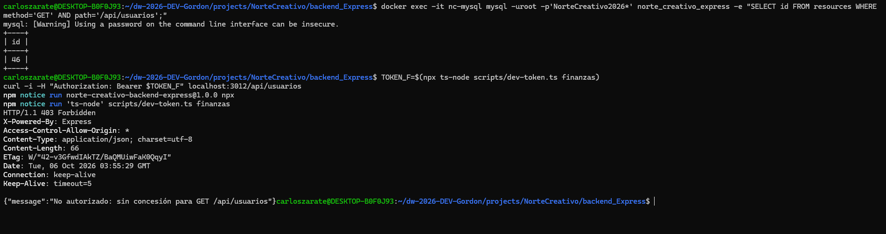

verificamos que compila 

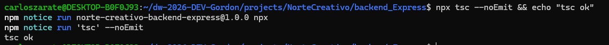

## ISS - 19

### OBJ

**OBJ:** Al finalizar, las sesiones se guardarán como refresh tokens opacos y hasheados que el propio usuario puede listar y revocar.

### AC

**AC:**
- [x] **AC-1** En la tabla `refresh_tokens` no hay ningún token en texto plano, solo hashes.
- [x] **AC-2** `GET /api/sesiones` con token de un usuario lista solo sus sesiones.
- [x] **AC-3** `PATCH /api/sesiones/:id/deactivate` revoca esa sesión.
- [x] **AC-4** `PATCH /api/sesiones/deactivate-all` revoca todas las sesiones del usuario.
- [x] **AC-5** Pedir la sesión de otro usuario responde 404.
- [x] **AC-6** `npx tsc --noEmit` sin errores.

### Procedimiento

1. pegamos el prompt 

``` text
Naturaleza: PRACTICO. Eres asistente SOLO de ISS-18, no del backend entero.

Implementa los AC de docs/trazabilidad_NC/ISS-18.md en projects/NorteCreativo/backend_Express.
Aplica el patron por capas (capas HTTP -> Controller -> Service -> Repository -> Model, DTOs por operacion, BaseController.run/paramId,
AppError, findOrFail) adaptado a Norte Creativo.
Puerto 3012, base norte_creativo_express, rutas en español como el docente.

Construye los middlewares authenticate y authorize del docente en src/features/auth/access y aplica las 3 modalidades:
protege con authenticate + authorize las rutas de usuarios, roles, recursos, asignaciones-rol y concesiones-rol.
authorize: deny by default (403), consulta la matriz en cada peticion, sin cache.
Crea scripts/dev-token.ts que imprima un access token valido para un username dado (admin, finanzas, etc.), usando el helper jwt;
solo para pruebas locales, lee el secreto del .env.

NO protejas todavia las rutas de negocio (ISS-21). Prohibido: NestJS, force: true, secretos en el codigo (JWT_SECRET solo en .env; .env.example sin valores), cambiar el puerto 3012 o la base norte_creativo_express. NO toques docs/proceso.md ni docs/trazabilidad_NC/. NO hagas commit ni push: lo hago yo.

Al final entrega tres listas: archivos tocados; como verifico cada AC (comandos exactos); que quedo fuera de alcance.
```

salida:

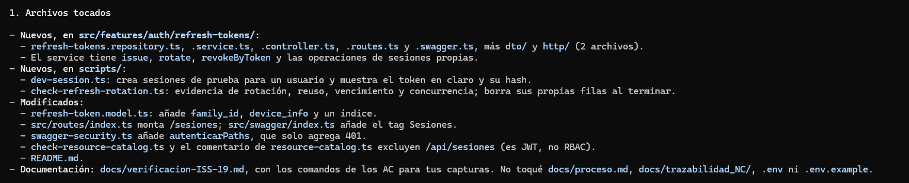

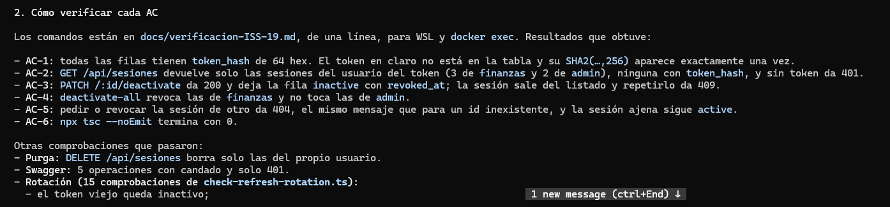

para los ac debemos preparar 2 usuarios con sesiones

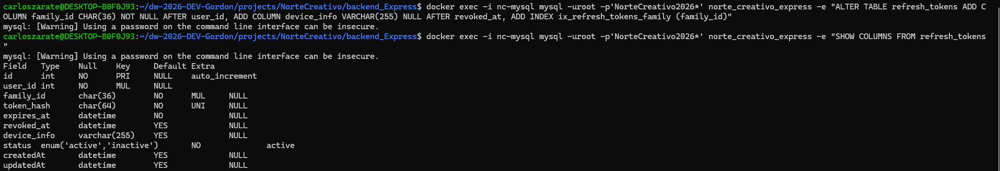

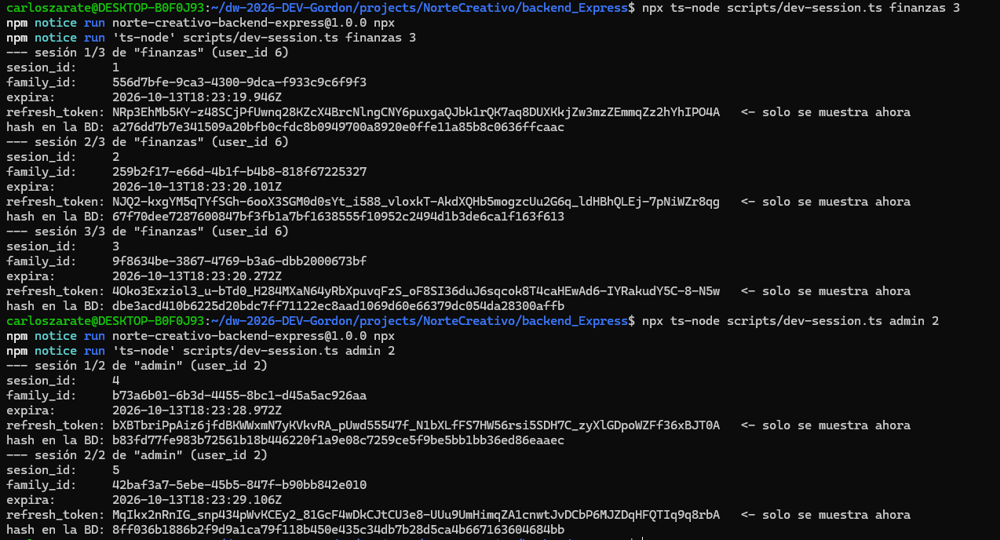

generamos los tokens, duran 15 minutos siendo validos y com

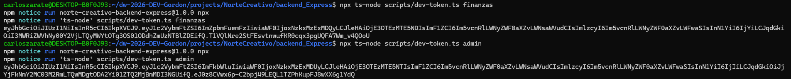

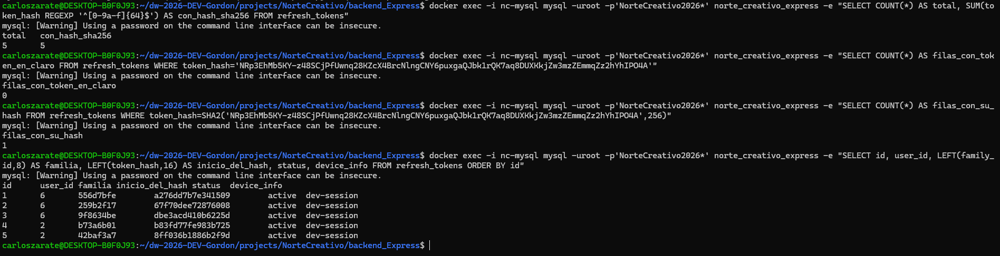

en el ac2 vemos que tenemos 3 sesiones, un solo user que es el 6, 0 apariciones de token hash y el 401 sin token

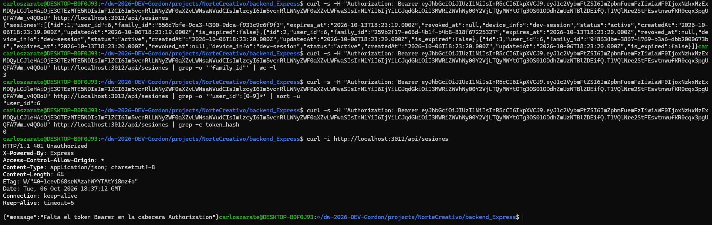

Ahora vemos el ac3 donde debe dar codigo 200 con estado inactivo,

PENDIENTE AC3-4-5-6

## ISS - 20

### OBJ

**OBJ:** Al finalizar, un usuario podrá iniciar sesión, renovar y cerrar su sesión, y consultar su perfil y sus permisos.

### AC

**AC:**
- [x] **AC-1** Login de `admin` con contraseña correcta responde 200 con `access_token` y `refresh_token`.
- [x] **AC-2** Login con contraseña mala y con usuario inexistente responde 401 con el **mismo** mensaje.
- [x] **AC-3** `POST /api/sesion/refresh` entrega un par nuevo, y reusar el refresh anterior responde 401.
- [x] **AC-4** Después de `logout`, el refresh token ya no sirve (401).
- [x] **AC-5** `GET /api/sesion/perfil` devuelve el usuario y sus roles, y `GET /api/permisos` sus concesiones; sin token, 401.
- [x] **AC-6** `npx tsc --noEmit` sin errores.

### Procedimiento

1. pegamos el prompt 

``` text
Naturaleza: PRACTICO. Eres asistente SOLO de ISS-20, no del backend entero.

Implementa los AC de docs/trazabilidad_NC/ISS-20.md en projects/NorteCreativo/backend_Express.
Aplica el patron por capas (capas HTTP -> Controller -> Service -> Repository -> Model, DTOs por operacion, BaseController.run/paramId,
AppError, findOrFail) adaptado a Norte Creativo.
Puerto 3012, base norte_creativo_express, rutas en español como el docente.

Construye el feature session del docente en src/features/auth/session:
OPEN: POST /api/sesion/login (identifier = username o email + password), POST /api/sesion/refresh (rotacion), POST /api/sesion/logout.
JWT: GET /api/sesion/perfil (usuario + roles) y GET /api/permisos (concesiones efectivas).
Credenciales invalidas -> 401 con el mismo mensaje exista o no el usuario. Usuario inactive no inicia sesion.
Reuso de un refresh ya rotado -> 401 y revocacion segun el docente. Registra rutas y swagger (las OPEN con security: []).

NO protejas todavia las rutas de negocio (ISS-21). Prohibido: NestJS, force: true, secretos en el codigo (JWT_SECRET solo en .env; .env.example sin valores), cambiar el puerto 3012 o la base norte_creativo_express. NO toques docs/proceso.md ni docs/trazabilidad_NC/. NO hagas commit ni push: lo hago yo.

Al final entrega tres listas: archivos tocados; como verifico cada AC (comandos exactos); que quedo fuera de alcance.
```

salida:

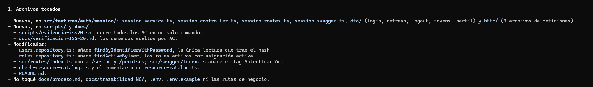

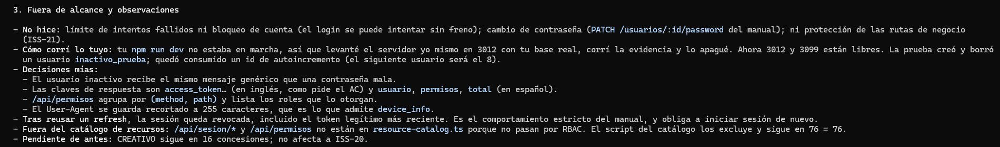


Para la comprobacion de ACs, se me estan presentando muchos problemas con la terminal, desde el iss anterior no puedo validarlos todos porque ocurren errores en el tipeo de los datos o la legivilidad de esto, parece es un problema con la terminal de windows y no lo he logrado solucionar, he decido usar el mismo agente de ia que compruebe los ac y que me genere secciones con la salida que la terminal le da a el para realizar la comprobacion del ac y yo verificar que realmente usa los ids o comandos que deberia usar segun el iss.

ac 1
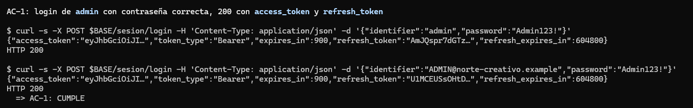

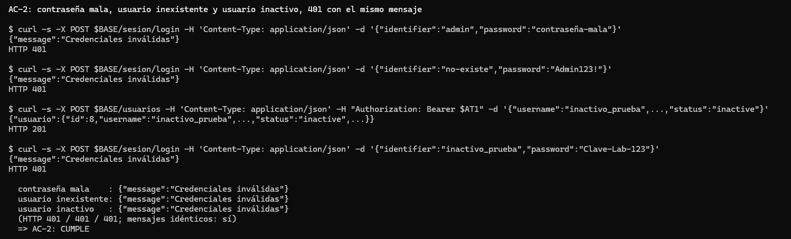

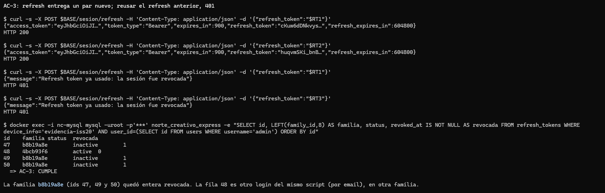

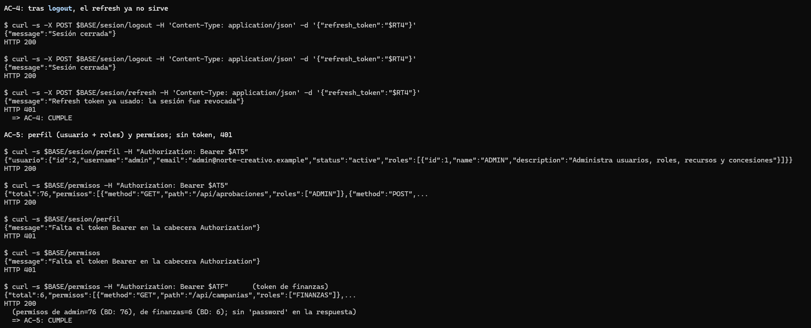

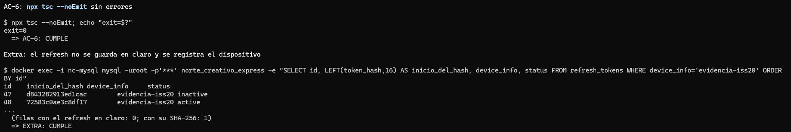

## ISS - 21

### OBJ

**OBJ:** Al finalizar, todo el negocio de Norte Creativo exigirá token y concesión, la RN-05 se cumplirá de verdad y el backend quedará completo según el DoD del docente.

### AC

**AC:**
- [x] **AC-1** Sin token, `GET /api/clientes` responde 401.
- [x] **AC-2** `creativo` haciendo `POST /api/aprobaciones` responde 403, y `aprobador` responde 201 con su propio id como `aprobador_id`.
- [x] **AC-3** Enviar `aprobador_id` en el body responde 400.
- [x] **AC-4** `finanzas` puede leer clientes (200) pero no crearlos (403).
- [x] **AC-5** Swagger muestra el botón Authorize, y login/refresh/logout aparecen sin candado.
- [x] **AC-6** Un cuerpo JSON mal formado responde 400 en JSON, sin HTML ni rutas del servidor.
- [x] **AC-7** `npm run db:seed` siembra primero seguridad y después negocio, sin errores.
- [x] **AC-8** `bash scripts/smoke-rbac.sh` termina en verde y `npx tsc --noEmit` sin errores.

### Procedimiento

1. pegamos el prompt 

``` text
la rn-05 dice que quien aprueba es el cliente aprobador y que la aprobacion queda a nombre de quien la hizo, ahora se cumple en dos partes, la primera es el permiso, solo el rol cliente_aprobador tiene concedido el post a aprobaciones en la matriz, entonces creativo y los demas reciben 403 en authorize, y la segunda es la identidad, el aprobador_id ya no lo manda el cliente, sale del usuario que authenticate dejo en la peticion a partir del token, y la columna es una fk a users, por eso aprobador_id no puede venir en el body, si viniera, cualquiera con permiso de aprobar podria aprobar a nombre de otro usuario y la aprobacion dejaria de ser prueba de quien la hizo, por eso si llega en el body se rechaza con 400 en vez de ignorarlo en silencio, asi el error se ve y no queda una aprobacion que parece de una persona y es de otra

una peticion de post a aprobaciones entra por express y pasa primero por authenticate, que revisa el token y si falta o esta vencido responde 401, despues pasa por authorize, que busca una concesion activa de post /api/aprobaciones para los roles del usuario y si no hay responde 403, ya con permiso llega al controller, que valida el body con el dto de creacion, rechaza aprobador_id con 400 y toma el id del usuario autenticado, el controller llama al service, el service llama al repository y este registra la aprobacion y evalua el cierre del hito dentro de una sola transaccion, de modo que o se guardan la aprobacion y, si corresponde, el cierre del hito, o no se guarda nada, y al final el controller devuelve 201 con la aprobacion, si algo falla en el camino el errorHandling lo convierte en json con el codigo que corresponde y sin stack

lo que queda fuera del rbac por endpoint es el ownership, o sea que el rbac solo responde si este rol puede llamar este endpoint, no si este usuario puede tocar este registro, entonces un cliente aprobador puede aprobar versiones de cualquier campaña y no solo de las de su cliente, y tampoco hay asignacion de tareas para limitar que creativo ve o edita, esto se documento como limitacion porque el alcance de este issue es rbac por endpoint segun el docente, y para cubrirlo habria que agregar una relacion entre usuarios y clientes o tareas y chequearla en cada service, que es otro diseño y otro issue, dejarlo escrito evita que parezca que el sistema ya aisla los datos por cliente cuando no lo hace

ajuste: queda pendiente confirmar en el codigo que aprobador_id se rechaza con 400 antes de llegar al service y que el cierre del hito va en la misma transaccion que la aprobacion
```

salida:
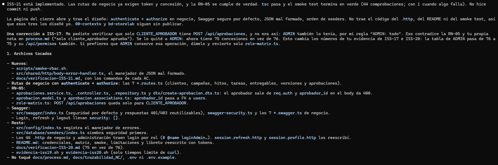
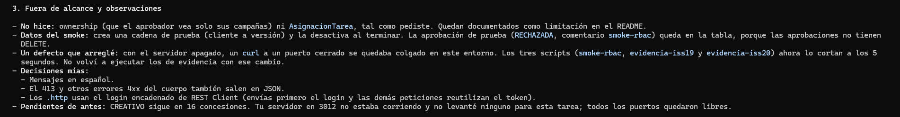

acs

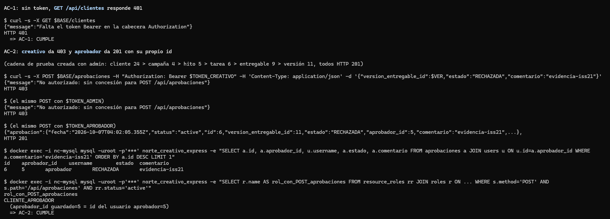

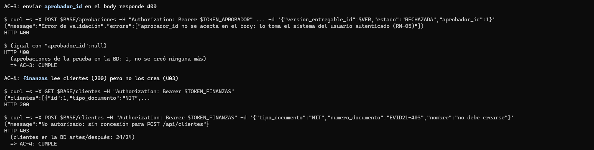

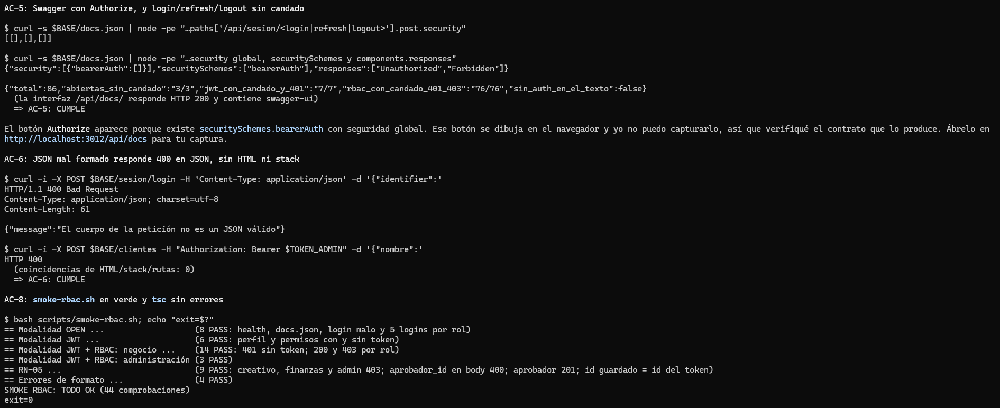
