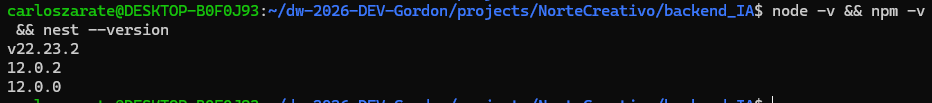
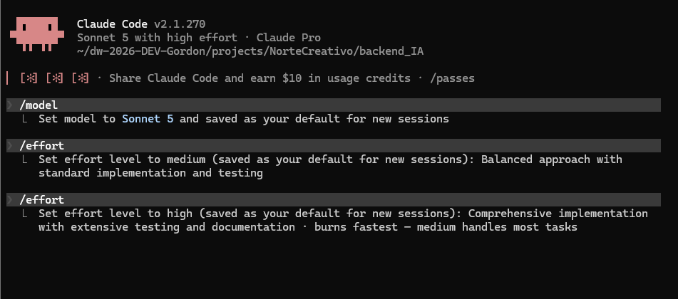
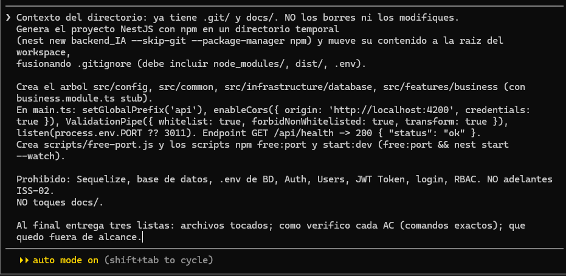
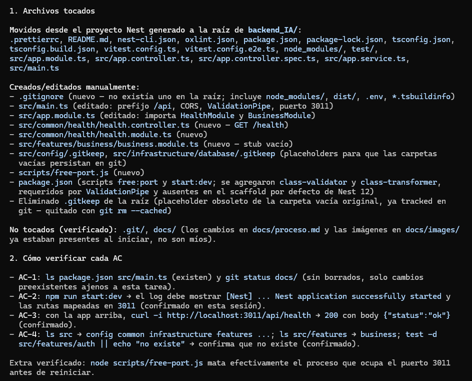
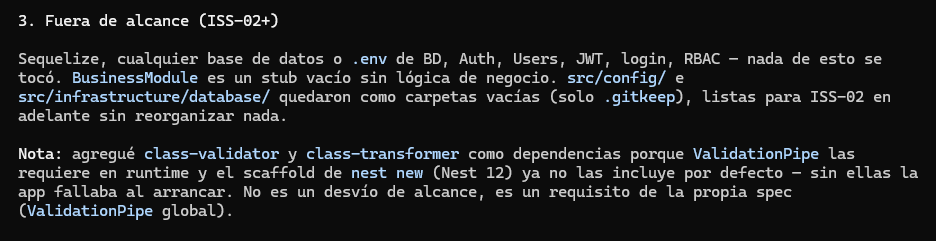
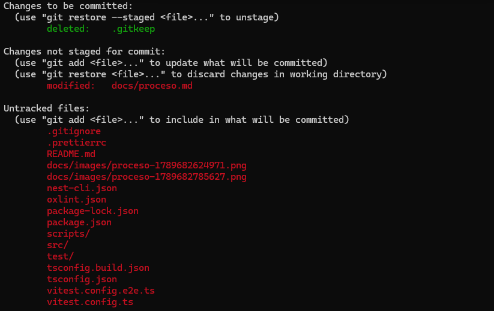
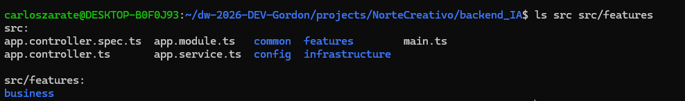
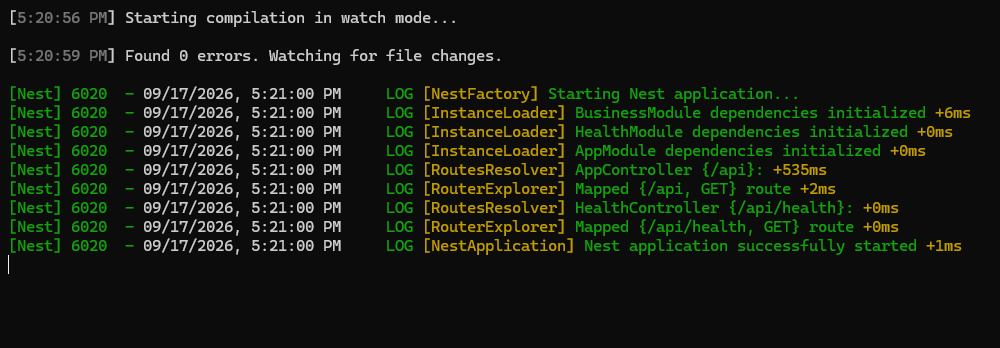
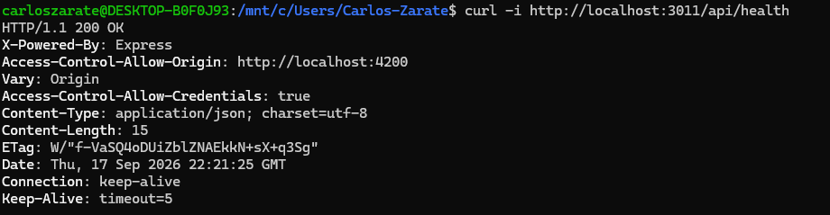

## PROCESO.MD 
### BITACORA GENERAL DE LA CONSTRUCCION DEL BACKEND NESTJS DE NORTE CREATIVO - SOLO BUSINESS
### ESTUDIANTE: CARLOS H. ZARATE
### HERRAMIENTAS: Claude Code
---


## FASE 0 - REQUISITOS PREVIOS Y PREPARACION

Empezamos verificando que versiones de nodejs, npm y nest tenemos instalados en el wsl / linux

Tambien organizamos los nuevos ISS, en esta ocasion, juntare la entidad tarea, entregable y versionentregable en un unico iss, estas 3 entidades son iguales de simples cada una solo tiene un fk a la entidad anterior, sin ninguna regla de negocio especial, por lo que es un trabajo repetido 3 veces.

Tambien, configuramos claudecode via CLI, no usamos ninguna skill y mantendremos uso del modelo Sonnet 5 y un esfuerzo alto, en dado caso sea requerido, usaremos el modelo Opus 5.


Comando:
```bash
node -v && npm -v && nest --version
```

Salida: 



## ISS - 01 

### OBJ

OBJ: Al finalizar, el desarrollador podrá arrancar un proyecto NestJS versionado en Git, con el árbol de Clean Architecture, para construir sobre él las features de Norte Creativo sin reorganizar carpetas.

### AC

**AC (Dado → Cuando → Entonces; deciden el Gate):**
- [x] **AC-1** Dado el workspace con `.git/` y `docs/`; cuando la IA termina; entonces existen `package.json` y `src/main.ts`, y `docs/` sigue intacto (`git status` no muestra borrados en esa carpeta).
- [x] **AC-2** Dado el proyecto con dependencias instaladas; cuando **el desarrollador** ejecuta `npm run start:dev`; entonces la app levanta sin error y el log muestra `Nest application successfully started` en el puerto `3011`.
- [x] **AC-3** Dado la app arriba; cuando se hace `GET http://localhost:3011/api/health`; entonces responde `200` con `{ "status": "ok" }`.
- [x] **AC-4** Dado `src/`; cuando se listan sus carpetas; entonces existen `config/`, `common/`, `infrastructure/database/`, `features/business/` y **no** existe `features/auth/`.

### Procedimiento

1. pegamos el prompt 

``` text
Naturaleza: PRACTICO. Eres asistente SOLO de ISS-01, no del backend entero.

Implementa los AC de docs/trazabilidad/ISS-01.md.

Contexto del directorio: ya tiene .git/ y docs/. NO los borres ni los modifiques.
Genera el proyecto NestJS con npm en un directorio temporal
(nest new backend_IA --skip-git --package-manager npm) y mueve su contenido a la raiz del workspace,
fusionando .gitignore (debe incluir node_modules/, dist/, .env).

Crea el arbol src/config, src/common, src/infrastructure/database, src/features/business (con business.module.ts stub).
En main.ts: setGlobalPrefix('api'), enableCors({ origin: 'http://localhost:4200', credentials: true }), ValidationPipe({ whitelist: true, forbidNonWhitelisted: true, transform: true }),
listen(process.env.PORT ?? 3011). Endpoint GET /api/health -> 200 { "status": "ok" }.
Crea scripts/free-port.js y los scripts npm free:port y start:dev (free:port && nest start --watch).

Prohibido: Sequelize, base de datos, .env de BD, Auth, Users, JWT Token, login, RBAC. NO adelantes ISS-02.
NO toques docs/.

Al final entrega tres listas: archivos tocados; como verifico cada AC (comandos exactos); que quedo fuera de alcance.
```


Salida:




Verificamos que docs/ este intacta 



Verificamos que exista config, features, common, infraestructure y sus subcarpetas, asi como que no exista features/auth



Verificamos que el proyecto arranque.




Arranca y procedemos a diligenciar los ISS y el kamban

## ISS - 02

### OBJ

OBJ: Al finalizar, la app validará su .env al arrancar y se conectará a la base de datos norte_creativo del motor indicado por DB_DIALECT, con logger y filtro de errores comunes, para que las features siguientes persistan datos sin configurar nada más.

### AC

**AC (Dado → Cuando → Entonces; deciden el Gate):**
- [ ] **AC-1** Dado un `.env` con `DB_DIALECT=mysql`, bloque `DB_MYSQL_*` completo y la BD `norte_creativo` existente; cuando **el desarrollador** ejecuta `npm run start:dev`; entonces el log muestra la conexión a la BD como exitosa y la app queda escuchando en `3011`.
- [ ] **AC-2** Dado una **copia** del `.env` a la que se le quitó una variable crítica del bloque activo (`DB_MYSQL_HOST`, `DB_MYSQL_USERNAME` o `DB_MYSQL_NAME`); cuando se arranca la app con esa copia; entonces el boot **falla antes de conectar** (sin `ECONNREFUSED`) con un mensaje `Error de configuración: …` que nombra la variable faltante; y al restaurar el `.env` original vuelve a arrancar.
- [ ] **AC-3** Dado el código fuente; cuando se busca `sync(`; entonces la única llamada es `sync({ alter: false })` y no existe `force: true` en ningún archivo.
- [ ] **AC-4** Dado el repositorio; cuando se revisa `git status` y `.env.example`; entonces `.env` **no** aparece para commit y `.env.example` contiene `DB_DIALECT` y los cuatro bloques completos.

## ISS - 03

### OBJ

OBJ: Al finalizar, cualquier consumidor HTTP podrá registrar y consultar clientes persistidos en norte_creativo, con validación de entrada, para contar con la primera feature completa que sirve de patrón a las siguientes.

### AC


**AC (Dado → Cuando → Entonces; deciden el Gate):**
- [ ] **AC-1** Dado la app arrancada y la tabla `clientes` vacía; cuando corre el seeder al arrancar; entonces `GET /api/clientes` responde `200` con al menos 1 cliente en `data.items` (`data.meta.total` ≥ 1), y **arrancar de nuevo no duplica** filas.
- [ ] **AC-2** Dado un payload válido `{ "tipoDocumento": "NIT", "numeroDocumento": "...", "nombre": "...", "email": "..." }`; cuando `POST /api/clientes`; entonces responde `201` con el cliente creado en `data` (con `id`) y la fila existe en la tabla.
- [ ] **AC-3** Dado un payload sin `nombre` (o con un campo no permitido); cuando `POST /api/clientes`; entonces responde `400` y el conteo de filas **no cambia**.
- [ ] **AC-4** Dado un `numeroDocumento` ya registrado; cuando `POST /api/clientes` con ese documento; entonces responde `409` y no crea fila.
- [ ] **AC-5** Dado un `id` inexistente; cuando `GET /api/clientes/999999`; entonces responde `404`.
- [ ] **AC-6** Dado `domain/entities/cliente.entity.ts`; cuando se inspecciona; entonces es TypeScript puro: sin decoradores de Sequelize, sin `extends Model`, sin imports de NestJS.

## ISS - 04

### OBJ

OBJ: Al finalizar, se podrán registrar y consultar campañas asociadas a un cliente existente, validando la FK, para dar el contenedor bajo el cual cuelgan los hitos.

### AC

**AC (Dado → Cuando → Entonces; deciden el Gate):**
- [ ] **AC-1** Dado el seeder corrido; cuando `GET /api/campanias`; entonces responde `200` con ≥ 1 campaña en `data.items`, sin duplicar al reiniciar.
- [ ] **AC-2** Dado un `clienteId` existente y payload válido; cuando `POST /api/campanias`; entonces responde `201` con la campaña creada en `data`.
- [ ] **AC-3** Dado un `clienteId` **inexistente**; cuando `POST /api/campanias`; entonces responde `404` y no crea fila.
- [ ] **AC-4** Dado un payload sin `nombre` o con campo no permitido; cuando `POST /api/campanias`; entonces responde `400`.
- [ ] **AC-5** Dado un `id` inexistente; cuando `GET /api/campanias/999999`; entonces responde `404`.
- [ ] **AC-6** Dado `domain/entities/campania.entity.ts`; cuando se inspecciona; entonces es TypeScript puro.

## ISS - 05

### OBJ

OBJ: Al finalizar, se podrán registrar y consultar hitos de una campaña, con el campo estado y la regla de que una campaña inactiva no admite hitos nuevos, para preparar la cadena que el cierre automático recorrerá.

### AC

**AC (Dado → Cuando → Entonces; deciden el Gate):**
- [ ] **AC-1** Dado el seeder corrido; cuando `GET /api/hitos`; entonces responde `200` con ≥ 1 hito en `data.items`, sin duplicar al reiniciar.
- [ ] **AC-2** Dado una `campaniaId` existente y activa; cuando `POST /api/hitos`; entonces responde `201` con el hito creado en estado `ABIERTO`.
- [ ] **AC-3** Dado una `campaniaId` inexistente; cuando `POST /api/hitos`; entonces responde `404`.
- [ ] **AC-4** Dado un payload sin `nombre` o campo no permitido; cuando `POST /api/hitos`; entonces responde `400`.
- [ ] **AC-5** Dado un `id` inexistente; cuando `GET /api/hitos/999999`; entonces responde `404`.
- [ ] **AC-6** Dado `domain/entities/hito.entity.ts`; cuando se inspecciona; entonces es TypeScript puro y el método `cerrar()` lanza excepción si el hito no está ABIERTO.

## ISS - 06

### OBJ

OBJ: Al finalizar, existirá la cadena completa Tarea → Entregable → VersionEntregable, cada una con su CRUD mínimo y sus FK validadas, para que ISS-07 pueda recorrerla al evaluar el cierre del hito.

### AC


**AC (Dado → Cuando → Entonces; deciden el Gate):**
- [ ] **AC-1** Dado el seeder corrido; cuando `GET /api/tareas`; entonces responde `200` con ≥ 1 tarea, sin duplicar al reiniciar.
- [ ] **AC-2** Dado un `hitoId` existente; cuando `POST /api/tareas`; entonces `201`. Con `hitoId` inexistente → `404`.
- [ ] **AC-3** Dado un `tareaId` existente; cuando `POST /api/entregables`; entonces `201`. Con `tareaId` inexistente → `404`.
- [ ] **AC-4** Dado un `entregableId` existente; cuando `POST /api/version-entregables` dos veces sobre el mismo entregable; entonces la primera crea `numeroVersion: 1` y la segunda `numeroVersion: 2` (automático).
- [ ] **AC-5** Dado cualquier payload sin su FK requerida o con campo no permitido; cuando se hace el POST; entonces responde `400`.
- [ ] **AC-6** Dado las tres entidades de dominio; cuando se inspeccionan; entonces son TypeScript puro (sin Sequelize/NestJS/extends Model).

## ISS - 07

### OBJ

OBJ: Al finalizar, registrar una aprobación podrá cerrar el hito automáticamente y de forma atómica cuando todos los entregables del hito tengan su última versión APROBADA, y el backend expondrá Swagger en /api/docs con todas las features integradas.

### AC

**AC (Dado → Cuando → Entonces; deciden el Gate):**
- [ ] **AC-1** Dado un hito con un único entregable cuya última versión está EN_REVISION; cuando `POST /api/aprobaciones` con `estado: APROBADA` sobre esa versión; entonces responde `201` con `data.hitoCerrado: true`, `data.hitoId` y `data.fechaCierre`, y el hito queda `CERRADO` en BD.
- [ ] **AC-2** Dado un hito con dos entregables, uno aprobado y otro aún EN_REVISION; cuando se aprueba solo uno; entonces responde `201` con `data.hitoCerrado: false` y el hito sigue `ABIERTO`.
- [ ] **AC-3** Dado una versión; cuando `POST /api/aprobaciones` con `estado: RECHAZADA`; entonces responde `201`, `data.hitoCerrado: false`, y el hito sigue `ABIERTO` (RN-01).
- [ ] **AC-4** Dado un hito ya `CERRADO`; cuando `POST /api/aprobaciones` sobre una versión de ese hito; entonces responde `409` (RN-06) y el hito no cambia.
- [ ] **AC-5** Dado un `versionEntregableId` inexistente; cuando `POST /api/aprobaciones`; entonces responde `404`.
- [ ] **AC-6** Dado la app arrancada; cuando se abre `GET http://localhost:3011/api/docs`; entonces Swagger carga y lista las 7 features.
- [ ] **AC-7** Dado `domain/entities/aprobacion.entity.ts` y `domain/services/cierre-hito-evaluator.ts`; cuando se inspeccionan; entonces son TypeScript puro (sin Sequelize/NestJS).