## PROCESO.MD 
### BITACORA GENERAL DE LA CONSTRUCCION DEL BACKEND NESTJS DE NORTE CREATIVO - SOLO BUSINESS
### ESTUDIANTE: CARLOS H. ZARATE

---

## FASE 0 - REQUISITOS PREVIOS

Empezamos verificando que versiones de nodejs, npm y nest tenemos instalados en el wsl / linux

Comando:
```bash
node -v && npm -v && nest --version
```

Salida: 
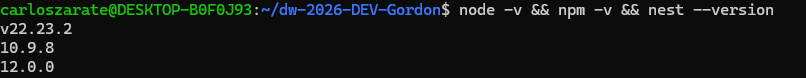

---

## SEG-01 - Esqueleto de NestJs Arrancable

Se busca crear un backend basico y en blanco, sin ninguna feature, listo para ejecutar nuestras implementaciones requeridas

### 01.1 Creacion de carpeta del proyecto 

```bash
mkdir -p backend_manual
chmod -R 777 backend_manual
cd backend_manual
```

### 01.2 Crear el proyecto base con nest new

Entramos a la ruta /dw-2026-DEV-Gordon/projects/NorteCreativo/backend_manual y usamos el comando siguiente para crear el backend ahi dentro

Comando:
```bash
nest new . --package-manager npm --skip-git
```

Salida:
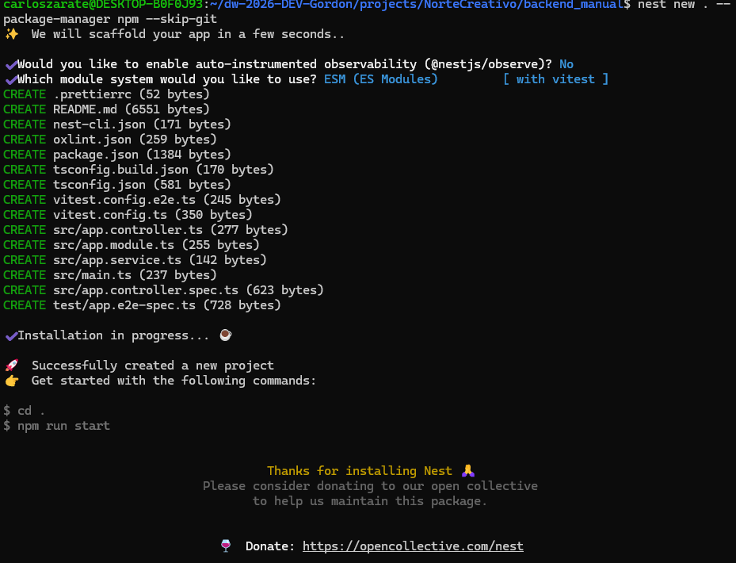

### 01.3 Convertir a ESM y definir los scripts

Debemos hacer eso para que se use un estandar moderno de modulos llamado ECMASCRIPT MODULES, y asi construir, ejecutar y formatear el codigo con vitest

Comando:
```bash
cat > package.json <<'EOF_MANUAL'
{
  "name": "norte-creativo-backend-manual",
  "version": "0.0.1",
  "private": true,
  "type": "module",
  "scripts": {
    "build": "nest build",
    "start": "nest start",
    "start:dev": "npm run free:port && nest start --watch",
    "start:prod": "node dist/main",
    "lint": "oxlint src/ test/",
    "format": "prettier --write \"src/**/*.ts\" \"test/**/*.ts\"",
    "test": "vitest run",
    "test:watch": "vitest",
    "test:cov": "vitest run --coverage",
    "test:e2e": "vitest run --config ./vitest.config.e2e.ts",
    "free:port": "node scripts/free-port.js"
  }
}
EOF_MANUAL
```
Salida:
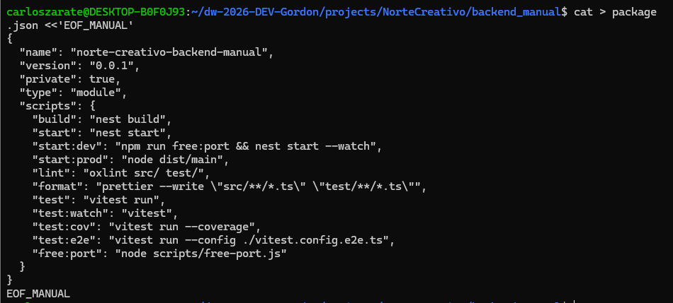

### 01.4 Instalar dependencias adicionales

Añadimos en este punto las dependecnias vitales que no vienen por defecto en el proyecto base de nestjs, se divide por dependencias de produccion ( swagger, sequelize, drivers, class validator ) y dependencias de desarrollo de herramientas de testing y linters

Comando:
Produccion ( 1 ) y desarrollo ( 2 )
```bash
npm install @nestjs/swagger \
  sequelize sequelize-typescript mysql2 pg oracledb tedious \
  class-validator class-transformer dotenv

npm install -D @types/supertest @types/express \
  vitest @vitest/coverage-v8 vite-tsconfig-paths supertest \
  oxlint source-map-support
```
Salida: 
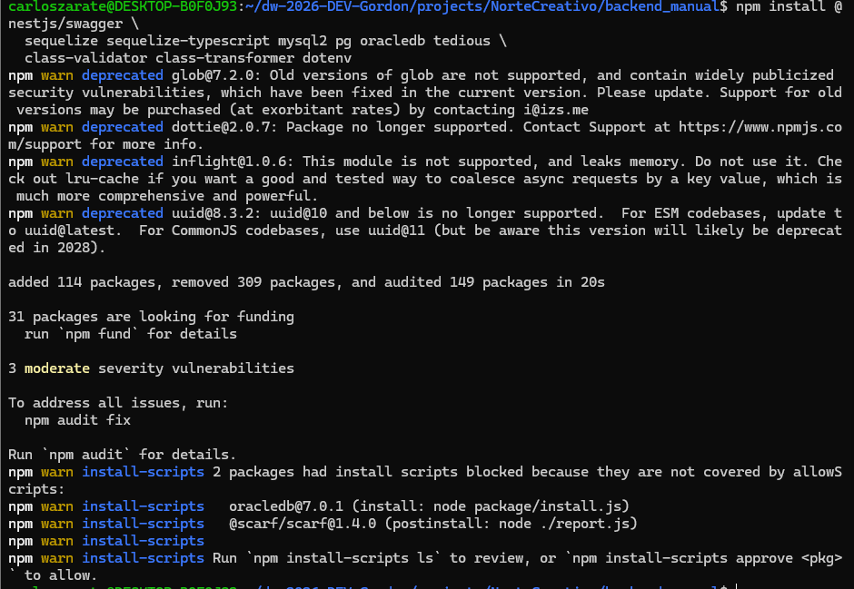
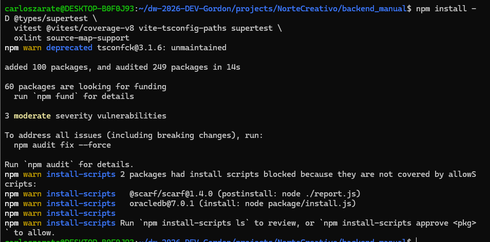

### 01.5 Configurar Typescript y tooling

Aqui escribimos nuevas reglas de compiulacion, en el archivo tsconfig.json, para asi asgurar que tengamos un tipado estricto adaptado a lo que pide ESM

Comando:
```bash
cat > tsconfig.json <<'EOF_MANUAL'
{
  "compilerOptions": {
    "module": "nodenext",
    "moduleResolution": "nodenext",
    "resolvePackageJsonExports": true,
    "esModuleInterop": true,
    "isolatedModules": true,
    "declaration": true,
    "removeComments": true,
    "emitDecoratorMetadata": true,
    "experimentalDecorators": true,
    "allowSyntheticDefaultImports": true,
    "target": "ES2023",
    "sourceMap": true,
    "outDir": "./dist",
    "incremental": true,
    "skipLibCheck": true,
    "strict": true,
    "strictPropertyInitialization": false,
    "types": ["vitest/globals", "node"]
  }
}
EOF_MANUAL
```

```bash
cat > tsconfig.build.json <<'EOF_MANUAL'
{
  "extends": "./tsconfig.json",
  "compilerOptions": { "rootDir": "./src" },
  "include": ["src"],
  "exclude": ["node_modules", "test", "dist", "**/*spec.ts"]
}
EOF_MANUAL
```

```bash
cat > nest-cli.json <<'EOF_MANUAL'
{
  "$schema": "https://json.schemastore.org/nest-cli",
  "collection": "@nestjs/schematics",
  "sourceRoot": "src",
  "compilerOptions": { "deleteOutDir": true }
}
EOF_MANUAL
```

```bash
cat > .prettierrc <<'EOF_MANUAL'
{
  "singleQuote": true,
  "trailingComma": "all"
}
EOF_MANUAL
```

COnfiguramos un Gitignore

```bash
cat > .gitignore <<'EOF_MANUAL'
node_modules/
dist/
.env
.env.local
.env.*.local
*.log
npm-debug.log*
*.tsbuildinfo
EOF_MANUAL
```
Salida: 
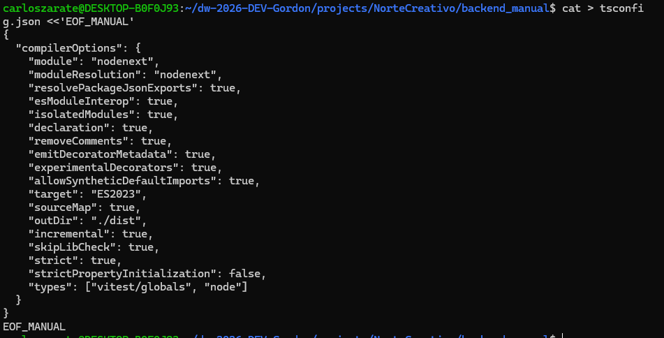
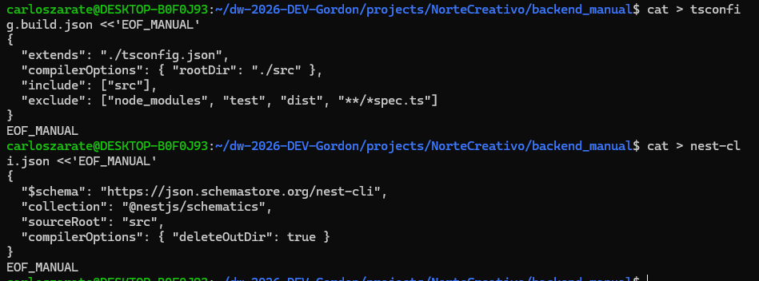
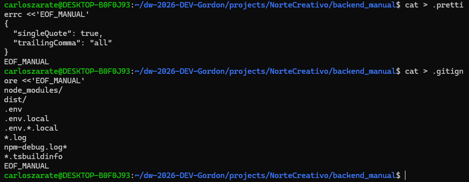

### 01.6 Script auxiliar y variables de entorno

El script proporcionado por el docente, llamado free-port.js, nos permite matar automaticamente cualquier proceso fantasma que ocupe alguno de nuestros puertos, y crea una plantilla .env.example, que sirgve para generar de forma segura y gestionar las credenciales de la base de datos, puede que durante el desarrollo omita esto y las credenciales sean visibles por temas de hacer pruebas, o recurra a correr todo sobre un sqlite, solo para pruebas tempranas.

comando:
```bash
mkdir -p scripts
cat > scripts/free-port.js <<'EOF_MANUAL'
import { execSync } from 'node:child_process';

const port = process.env.PORT ?? 3010;
const label = `[free-port]`;

function findAndKill(p) {
  const commands = [`lsof -ti tcp:${p}`, `fuser ${p}/tcp 2>/dev/null`];
  for (const cmd of commands) {
    try {
      const out = execSync(cmd, { encoding: 'utf8' }).trim();
      if (!out) continue;
      for (const pid of out.split(/\s+/).filter(Boolean)) {
        try {
          execSync(`kill -9 ${pid}`, { stdio: 'ignore' });
          console.log(`${label} liberado: mató PID ${pid} en el puerto ${p}`);
        } catch { /* ya no existe */ }
      }
      return;
    } catch { /* comando no disponible o puerto libre */ }
  }
  console.log(`${label} puerto ${p} libre`);
}

findAndKill(port);
EOF_MANUAL
```
Para el backend_manual usare el puerto 3010, diferente al backend_ia para no tener choques si llego a ejecutar ambos backends a la vez.

```bash
cat > .env.example <<'EOF_MANUAL'
PORT=3010
NODE_ENV=development
DB_DIALECT=mysql
DB_MYSQL_HOST=<IP_HOST_DOCKER>
DB_MYSQL_PORT=3306
DB_MYSQL_USERNAME=admin
DB_MYSQL_PASSWORD=<PASSWORD>
DB_MYSQL_NAME=norte_creativo_manual
EOF_MANUAL
```

con el siguiente comando podemos copiar lo hecho en el env example a un env determinado

```bash
cp .env.example .env
```
Salida:
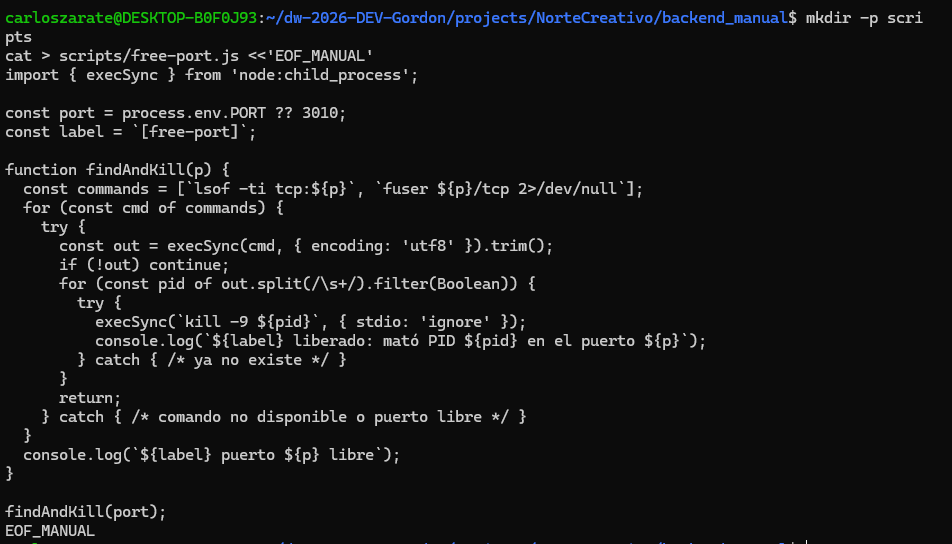

### 01.7 Estructura de carpetas

Creamos un arbol de directorios basado en lo que pide la Clean Architecture, se separan los dominios, la aplicacion y la infraestructura para todas las entidades del negocio que se planearon.

comando:

```bash
mkdir -p src/common/exceptions src/common/filters src/common/interceptors
mkdir -p src/config/environment
mkdir -p src/infrastructure/database/sequelize src/infrastructure/database/seeders
mkdir -p src/health
mkdir -p src/features/business
for f in clientes campanias hitos tareas entregables version-entregables aprobaciones; do
  mkdir -p "src/features/business/$f/domain/entities" \
           "src/features/business/$f/domain/interfaces" \
           "src/features/business/$f/domain/exceptions" \
           "src/features/business/$f/application/dto" \
           "src/features/business/$f/application/mappers" \
           "src/features/business/$f/application/use-cases" \
           "src/features/business/$f/infrastructure/persistence/models" \
           "src/features/business/$f/infrastructure/persistence/repositories" \
           "src/features/business/$f/infrastructure/persistence/seeders" \
           "src/features/business/$f/presentation/http/controllers"
done
```

Salida: 

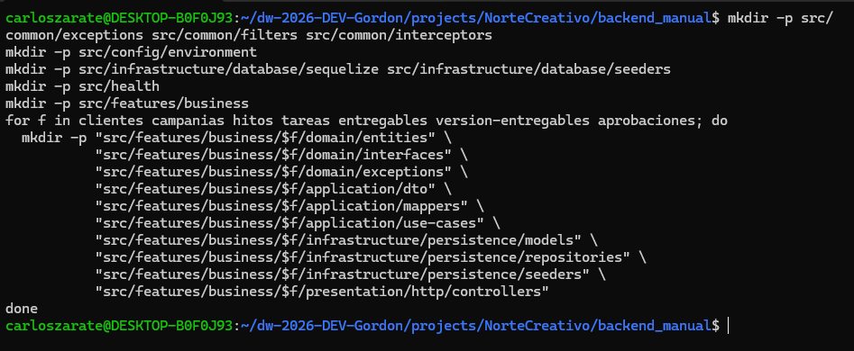
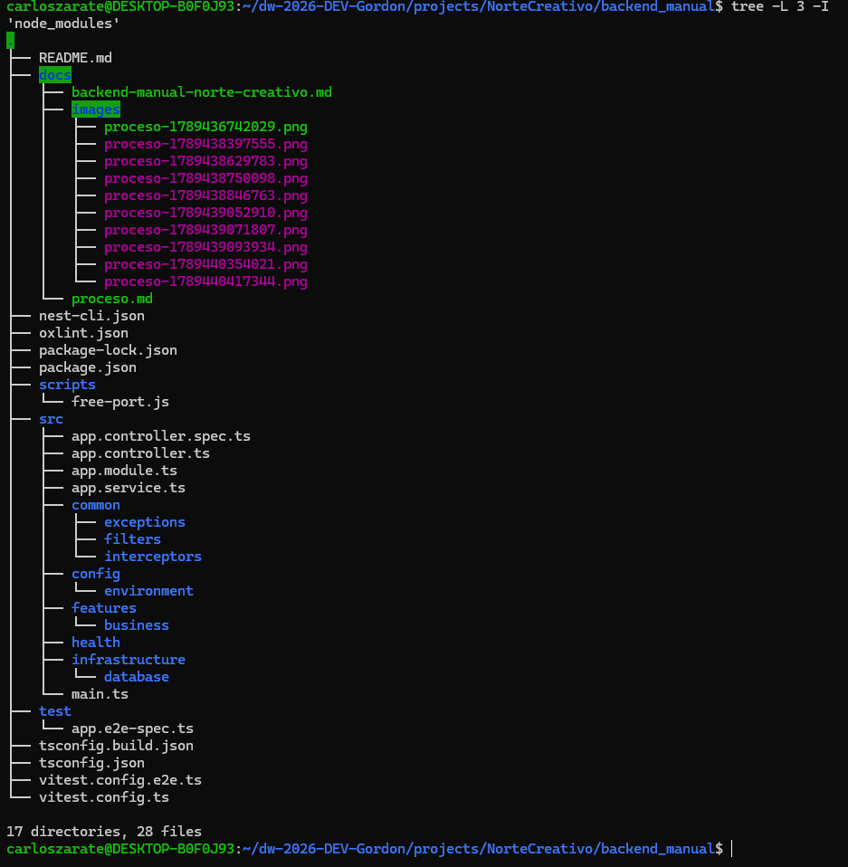

### Commit #1 - El proyecto arranca aun sin features definidas

Esta en el puerto 3000, porque en este punto esta con el main.ts generico

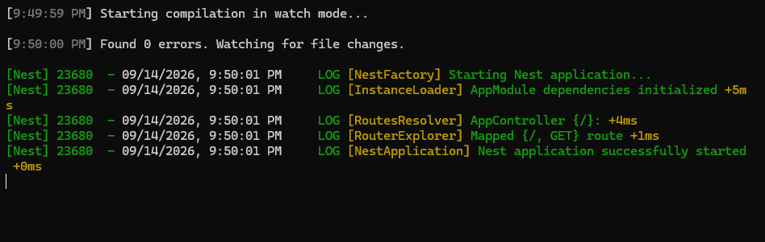
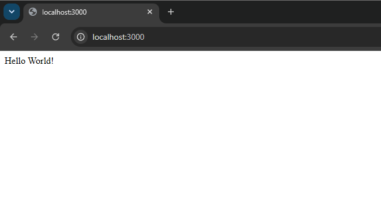
---

## SEG-02 - Entorno Sequelize y common

Segmento: configuracion validada, manejo uniforme de errores, interceptores y conexion a BD


### 02.1 Capa de configuracion config/environment

aqui creamos un sistema de vañlidacion que sera estricta, con el fin de que la app falle a drede cuando faltan datos criticos en el .env, tal como el host, ip o contraseñas de base de datos usadas, eso usa class-validator en el env y permite evitar problemas criticos que podrian terminar en procesos fantasmas en nuestros puertos entre otros.

Comando:
```bash
cat > src/config/environment/env.interface.ts <<'EOF_MANUAL'
export type DbDialect = 'mysql' | 'postgres' | 'mssql' | 'oracle';

export interface IDbBlock {
  host: string;
  port: number;
  username: string;
  password: string;
  name: string;
  connectString?: string;
}

export interface IEnvConfig {
  port: number;
  nodeEnv: string;
  dbDialect: DbDialect;
  mysql: IDbBlock;
  postgres: IDbBlock;
  mssql: IDbBlock;
  oracle: IDbBlock;
}
EOF_MANUAL
```

```bash
cat > src/config/environment/env.validation.ts <<'EOF_MANUAL'
import { plainToInstance } from 'class-transformer';
import { IsIn, IsNotEmpty, validateSync, ValidateIf } from 'class-validator';

const DIALECTS = ['mysql', 'postgres', 'mssql', 'oracle'];

export class EnvVariables {
  @IsIn(DIALECTS, {
    message: 'DB_DIALECT debe ser mysql | postgres | mssql | oracle',
  })
  DB_DIALECT!: string;

  @ValidateIf((o) => o.DB_DIALECT === 'mysql')
  @IsNotEmpty({ message: 'DB_MYSQL_HOST es requerida (DB_DIALECT=mysql)' })
  DB_MYSQL_HOST?: string;
  @ValidateIf((o) => o.DB_DIALECT === 'mysql')
  @IsNotEmpty({ message: 'DB_MYSQL_USERNAME es requerida (DB_DIALECT=mysql)' })
  DB_MYSQL_USERNAME?: string;
  @ValidateIf((o) => o.DB_DIALECT === 'mysql')
  @IsNotEmpty({ message: 'DB_MYSQL_NAME es requerida (DB_DIALECT=mysql)' })
  DB_MYSQL_NAME?: string;

  @ValidateIf((o) => o.DB_DIALECT === 'postgres')
  @IsNotEmpty({ message: 'DB_POSTGRES_HOST es requerida (DB_DIALECT=postgres)' })
  DB_POSTGRES_HOST?: string;
  @ValidateIf((o) => o.DB_DIALECT === 'postgres')
  @IsNotEmpty({ message: 'DB_POSTGRES_USERNAME es requerida (DB_DIALECT=postgres)' })
  DB_POSTGRES_USERNAME?: string;
  @ValidateIf((o) => o.DB_DIALECT === 'postgres')
  @IsNotEmpty({ message: 'DB_POSTGRES_NAME es requerida (DB_DIALECT=postgres)' })
  DB_POSTGRES_NAME?: string;

  @ValidateIf((o) => o.DB_DIALECT === 'mssql')
  @IsNotEmpty({ message: 'DB_MSSQL_HOST es requerida (DB_DIALECT=mssql)' })
  DB_MSSQL_HOST?: string;
  @ValidateIf((o) => o.DB_DIALECT === 'mssql')
  @IsNotEmpty({ message: 'DB_MSSQL_USERNAME es requerida (DB_DIALECT=mssql)' })
  DB_MSSQL_USERNAME?: string;
  @ValidateIf((o) => o.DB_DIALECT === 'mssql')
  @IsNotEmpty({ message: 'DB_MSSQL_NAME es requerida (DB_DIALECT=mssql)' })
  DB_MSSQL_NAME?: string;

  @ValidateIf((o) => o.DB_DIALECT === 'oracle')
  @IsNotEmpty({ message: 'DB_ORACLE_HOST es requerida (DB_DIALECT=oracle)' })
  DB_ORACLE_HOST?: string;
  @ValidateIf((o) => o.DB_DIALECT === 'oracle')
  @IsNotEmpty({ message: 'DB_ORACLE_USERNAME es requerida (DB_DIALECT=oracle)' })
  DB_ORACLE_USERNAME?: string;
  @ValidateIf((o) => o.DB_DIALECT === 'oracle')
  @IsNotEmpty({ message: 'DB_ORACLE_NAME es requerida (DB_DIALECT=oracle)' })
  DB_ORACLE_NAME?: string;
}

export function validateEnv(raw: Record<string, unknown>): EnvVariables {
  const config = plainToInstance(EnvVariables, raw);
  const errors = validateSync(config, { whitelist: false, forbidNonWhitelisted: false });
  if (errors.length > 0) {
    const messages = errors
      .map((e) => Object.values(e.constraints ?? {}).join('; '))
      .join(' | ');
    throw new Error(`Error de configuración: ${messages}`);
  }
  return config;
}
EOF_MANUAL
```

```bash
cat > src/config/environment/db-env.ts <<'EOF_MANUAL'
import { IDbBlock, IEnvConfig } from './env.interface.js';

export function getDbBlock(cfg: IEnvConfig): IDbBlock {
  switch (cfg.dbDialect) {
    case 'mysql':
      return cfg.mysql;
    case 'postgres':
      return cfg.postgres;
    case 'mssql':
      return cfg.mssql;
    case 'oracle':
      return cfg.oracle;
    default:
      throw new Error(`Dialecto no soportado: ${String(cfg.dbDialect)}`);
  }
}
EOF_MANUAL
```

```bash

cat > src/config/environment/env.config.ts <<'EOF_MANUAL'
import { config as loadDotenv } from 'dotenv';
import { IDbBlock, IEnvConfig, DbDialect } from './env.interface.js';
import { validateEnv } from './env.validation.js';

export const ENV_CONFIG = Symbol('ENV_CONFIG');

function toBlock(prefix: string, raw: Record<string, unknown>, defaultPort: number): IDbBlock {
  return {
    host: String(raw[`DB_${prefix}_HOST`] ?? 'localhost'),
    port: Number(raw[`DB_${prefix}_PORT`] ?? defaultPort),
    username: String(raw[`DB_${prefix}_USERNAME`] ?? ''),
    password: String(raw[`DB_${prefix}_PASSWORD`] ?? ''),
    name: String(raw[`DB_${prefix}_NAME`] ?? ''),
    connectString: raw[`DB_${prefix}_CONNECT_STRING`]
      ? String(raw[`DB_${prefix}_CONNECT_STRING`])
      : undefined,
  };
}

export function loadEnvConfig(): IEnvConfig {
  loadDotenv();
  const raw = process.env as Record<string, unknown>;
  validateEnv(raw);
  const dialect = String(raw.DB_DIALECT) as DbDialect;
  return {
    port: Number(raw.PORT ?? 3010),
    nodeEnv: String(raw.NODE_ENV ?? 'development'),
    dbDialect: dialect,
    mysql: toBlock('MYSQL', raw, 3306),
    postgres: toBlock('POSTGRES', raw, 5432),
    mssql: toBlock('MSSQL', raw, 1433),
    oracle: toBlock('ORACLE', raw, 1521),
  };
}

export const envConfig = {
  KEY: ENV_CONFIG,
};
EOF_MANUAL
```

```bash
cat > src/config/environment/environment.module.ts <<'EOF_MANUAL'
import { Global, Module } from '@nestjs/common';
import { envConfig, loadEnvConfig } from './env.config.js';

@Global()
@Module({
  providers: [
    {
      provide: envConfig.KEY,
      useFactory: () => loadEnvConfig(),
    },
  ],
  exports: [envConfig.KEY],
})
export class EnvironmentModule {}
EOF_MANUAL
```

```bash
cat > src/config/environment/index.ts <<'EOF_MANUAL'
export * from './env.interface.js';
export * from './env.validation.js';
export * from './db-env.js';
export * from './env.config.js';
export * from './environment.module.js';
EOF_MANUAL
```

Salida:
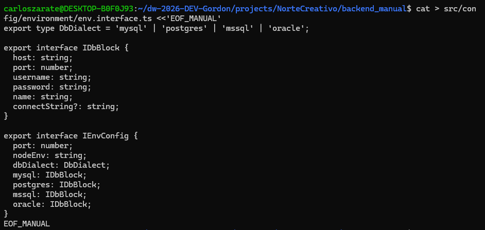
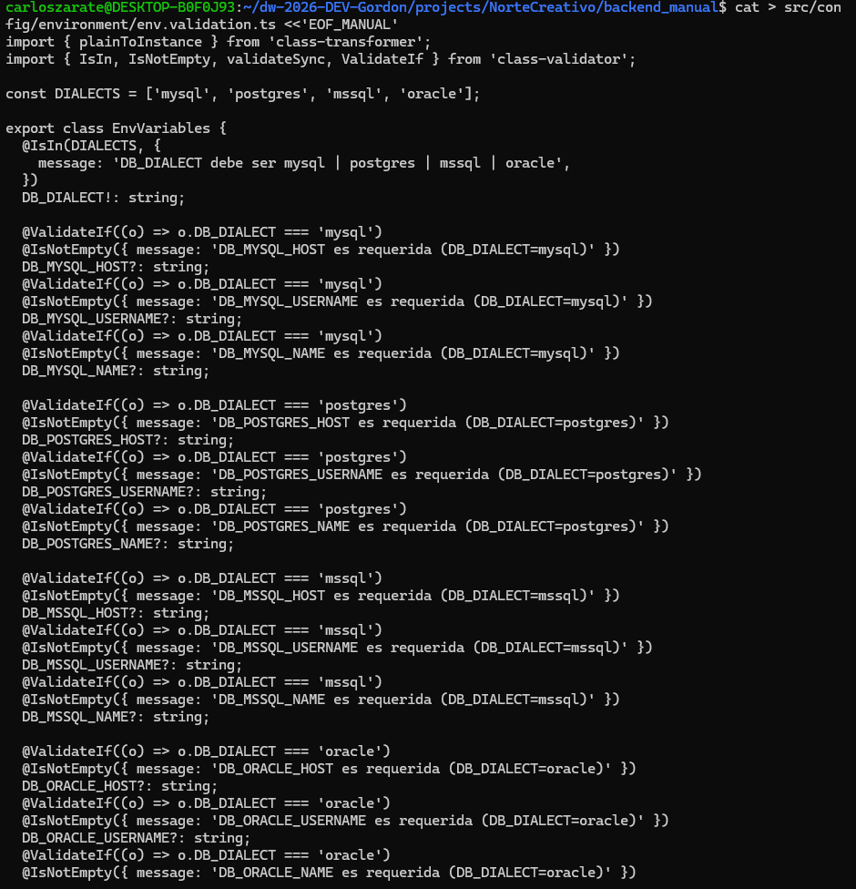
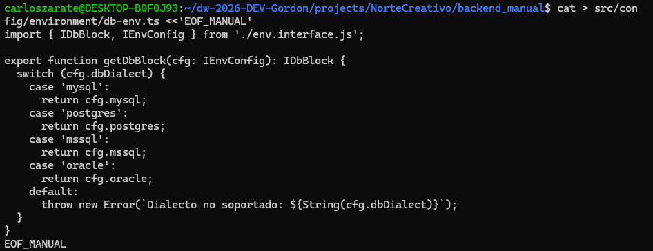
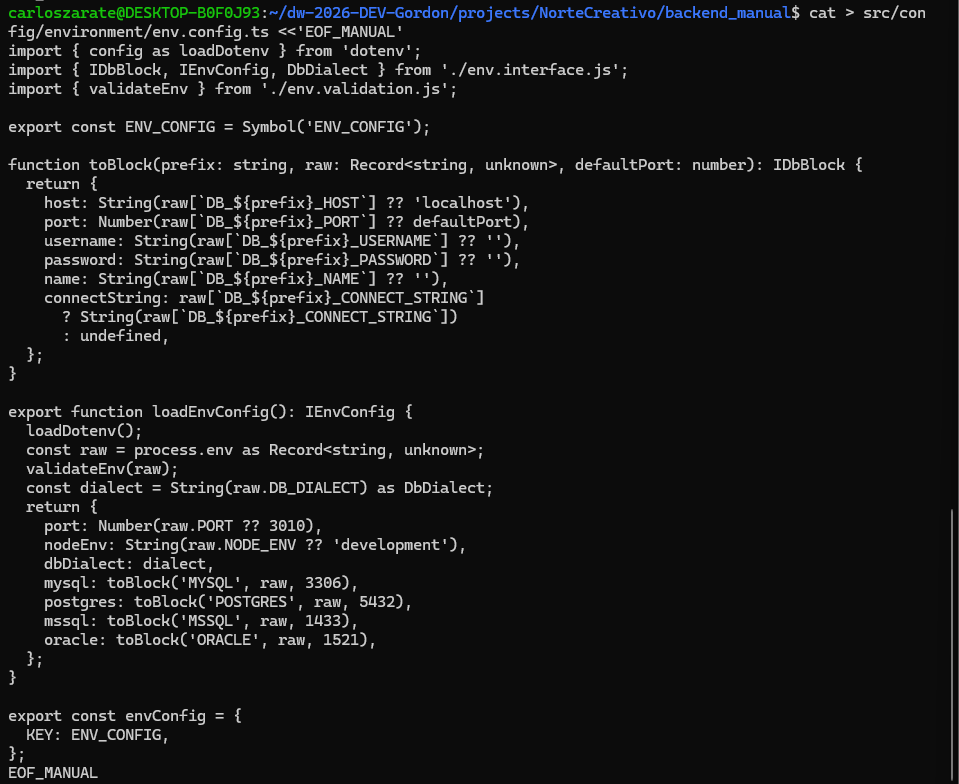
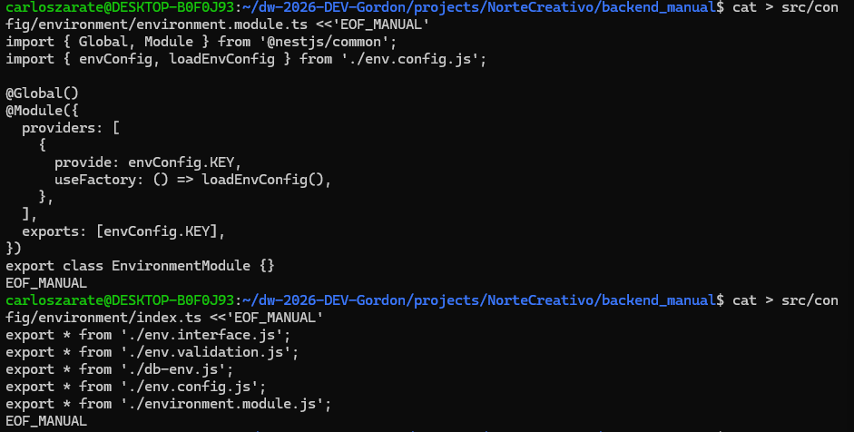


### 02.2 Excepciones common/exceptions

Establece una jerarquia clara de clases de error propias para poder lanzar errores con un significado semantico a las reglas del negocio en lugar, de los tipicos errores tecnicos genericos vistos en documentaciones

comandos: 

```bash
cat > src/common/exceptions/application.exception.ts <<'EOF_MANUAL'
export class ApplicationException extends Error {
  constructor(
    public readonly statusCode: number,
    message: string,
  ) {
    super(message);
    this.name = this.constructor.name;
  }
}
EOF_MANUAL
```

```bash
cat > src/common/exceptions/business-rule.exception.ts <<'EOF_MANUAL'
import { ApplicationException } from './application.exception.js';

export class BusinessRuleException extends ApplicationException {
  constructor(message: string) {
    super(409, message);
  }
}
EOF_MANUAL
```

```bash
cat > src/common/exceptions/domain.exception.ts <<'EOF_MANUAL'
import { ApplicationException } from './application.exception.js';

export class DomainException extends ApplicationException {
  constructor(message: string) {
    super(400, message);
  }
}
EOF_MANUAL
```

```bash
cat > src/common/exceptions/entity-not-found.exception.ts <<'EOF_MANUAL'
import { ApplicationException } from './application.exception.js';

export class EntityNotFoundException extends ApplicationException {
  constructor(message = 'Entidad no encontrada') {
    super(404, message);
  }
}
EOF_MANUAL
```

salidas:
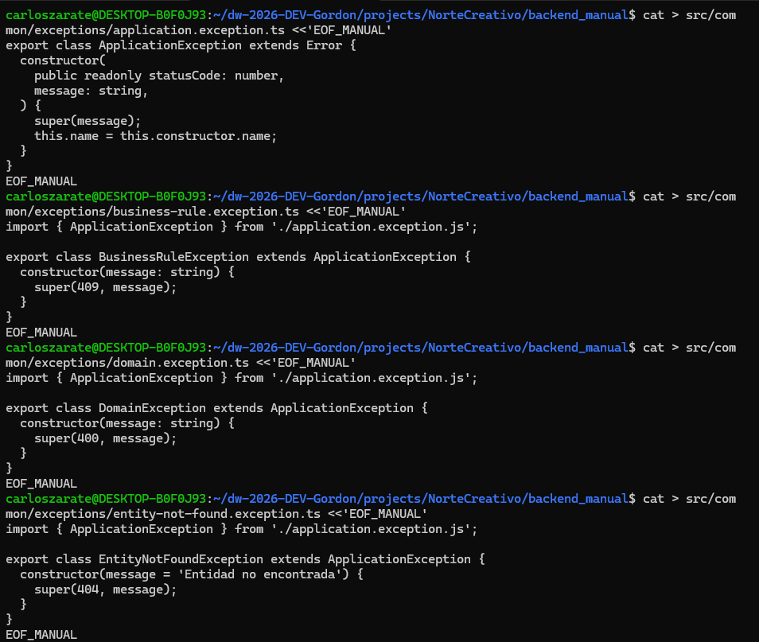

### 02.3 filtro global de errores

Este es un interceptor global que captura cualquier excepcion lanzada por la app y traduce esto en un json que pueda ser usado por el futuro frontend previsto a implementar, tiene el codigo de estado, el mensaje y la fecha del error o excepcion.

```bash
cat > src/common/filters/global-exception.filter.ts <<'EOF_MANUAL'
import {
  ArgumentsHost,
  Catch,
  ExceptionFilter,
  HttpException,
  HttpStatus,
  Logger,
} from '@nestjs/common';
import type { Request, Response } from 'express';
import { ApplicationException } from '../exceptions/application.exception.js';

@Catch()
export class GlobalExceptionFilter implements ExceptionFilter {
  private readonly logger = new Logger('GlobalExceptionFilter');

  catch(exception: unknown, host: ArgumentsHost): void {
    const ctx = host.switchToHttp();
    const res = ctx.getResponse<Response>();
    const req = ctx.getRequest<Request>();

    let status = HttpStatus.INTERNAL_SERVER_ERROR;
    let message: string | string[] = 'Error interno del servidor';

    if (exception instanceof ApplicationException) {
      status = exception.statusCode;
      message = exception.message;
    } else if (exception instanceof HttpException) {
      status = exception.getStatus();
      const body = exception.getResponse();
      if (typeof body === 'string') {
        message = body;
      } else if (body && typeof body === 'object') {
        message = (body as { message?: string | string[] }).message ?? exception.message;
      }
    } else if (exception instanceof Error) {
      message = exception.message;
    }

    const msg = Array.isArray(message) ? message.join('; ') : message;
    this.logger.error(`${req.method} ${req.url} → ${status}: ${msg}`);

    res.status(status).json({
      statusCode: status,
      message: msg,
      timestamp: new Date().toISOString(),
      path: req.url,
    });
  }
}
EOF_MANUAL
```

Salida:
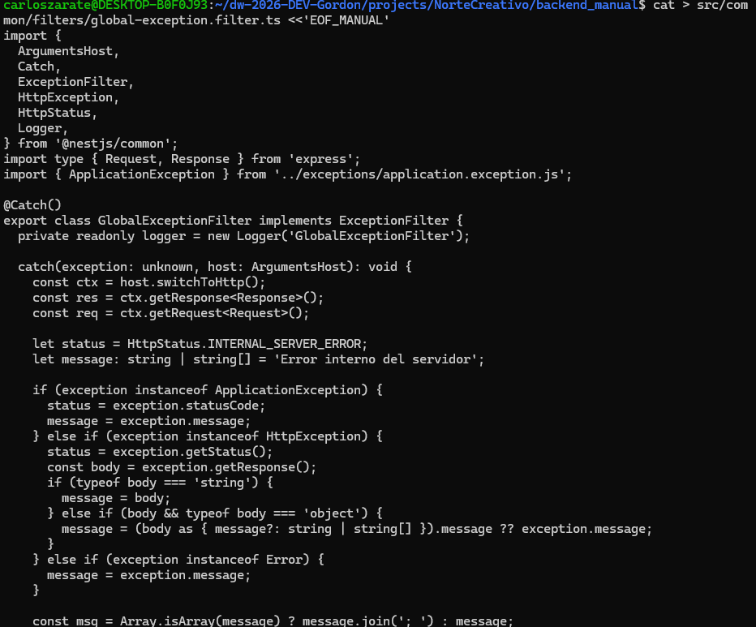

### 02.4 interceptores

comandos:

```bash
cat > src/common/interceptors/response.interceptor.ts <<'EOF_MANUAL'
import {
  CallHandler,
  ExecutionContext,
  Injectable,
  NestInterceptor,
} from '@nestjs/common';
import { Observable } from 'rxjs';
import { map } from 'rxjs/operators';
import type { Response } from 'express';

@Injectable()
export class ResponseInterceptor implements NestInterceptor {
  intercept(context: ExecutionContext, next: CallHandler): Observable<unknown> {
    const res = context.switchToHttp().getResponse<Response>();
    return next.handle().pipe(
      map((data) => ({
        statusCode: res.statusCode,
        message: 'OK',
        data: data ?? null,
        timestamp: new Date().toISOString(),
      })),
    );
  }
}
EOF_MANUAL
```

```bash
cat > src/common/interceptors/logging.interceptor.ts <<'EOF_MANUAL'
import {
  CallHandler,
  ExecutionContext,
  Injectable,
  Logger,
  NestInterceptor,
} from '@nestjs/common';
import { Observable } from 'rxjs';
import { tap } from 'rxjs/operators';
import type { Request } from 'express';

@Injectable()
export class LoggingInterceptor implements NestInterceptor {
  private readonly logger = new Logger('HTTP');

  intercept(context: ExecutionContext, next: CallHandler): Observable<unknown> {
    const req = context.switchToHttp().getRequest<Request>();
    const start = Date.now();
    return next.handle().pipe(
      tap(() => {
        const ms = Date.now() - start;
        this.logger.log(`${req.method} ${req.url} → ${ms}ms`);
      }),
    );
  }
}
EOF_MANUAL
```

```bash
cat > src/common/interceptors/timeout.interceptor.ts <<'EOF_MANUAL'
import {
  CallHandler,
  ExecutionContext,
  Injectable,
  NestInterceptor,
  RequestTimeoutException,
} from '@nestjs/common';
import { catchError, Observable, throwError, TimeoutError, timeout } from 'rxjs';

@Injectable()
export class TimeoutInterceptor implements NestInterceptor {
  intercept(_context: ExecutionContext, next: CallHandler): Observable<unknown> {
    return next.handle().pipe(
      timeout(5000),
      catchError((err) =>
        throwError(() =>
          err instanceof TimeoutError ? new RequestTimeoutException() : err,
        ),
      ),
    );
  }
}
EOF_MANUAL
```

salida:
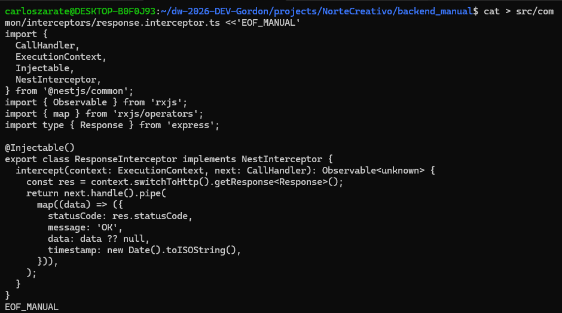
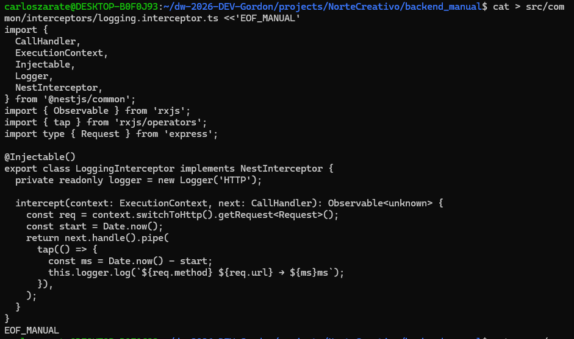
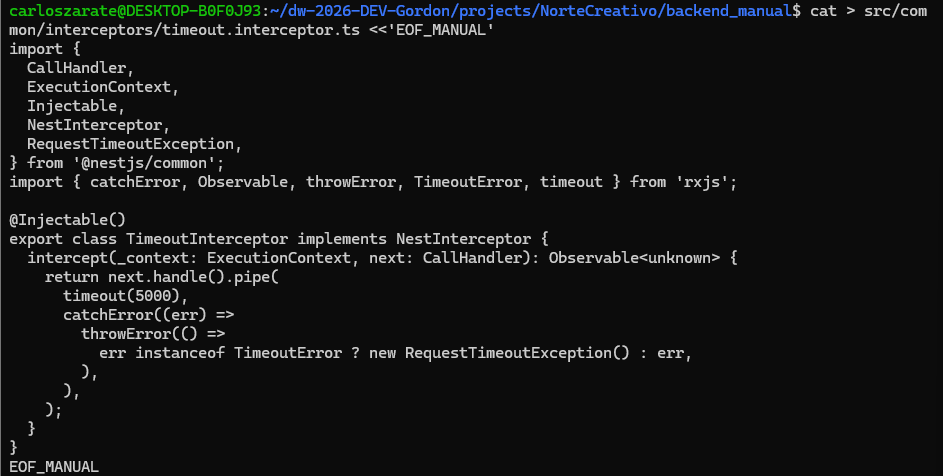

### 02.5 Persistencia Sequelize

Inicializa la fabrica de conexiones de sequalize, la lee desde las variables de entorno y empaqueta todo en un modeulo global de nestjs para asi autenticar la conexion a la BD en el momento que arranca el backend

comandos:

```bash
cat > src/infrastructure/database/sequelize/sequelize.factory.ts <<'EOF_MANUAL'
import { Sequelize } from 'sequelize-typescript';
import { getDbBlock } from '../../../config/environment/db-env.js';
import { IEnvConfig } from '../../../config/environment/env.interface.js';

// Los modelos se van agregando aquí a medida que se crea cada feature
// (SEG-03..SEG-09).

export const ALL_MODELS: any[] = [];

export function sequelizeFactory(cfg: IEnvConfig): Sequelize {
  const block = getDbBlock(cfg);
  const options: Record<string, unknown> = {
    dialect: cfg.dbDialect,
    host: block.host,
    port: block.port,
    username: block.username,
    password: block.password,
    database: block.name,
    models: ALL_MODELS,
    logging: false,
  };
  if (cfg.dbDialect === 'oracle' && block.connectString) {
    options.connectString = block.connectString;
  }
  return new Sequelize(options);
}
EOF_MANUAL
```

```bash
cat > src/infrastructure/database/sequelize/sequelize.module.ts <<'EOF_MANUAL'
import { Global, Logger, Module } from '@nestjs/common';
import { getDbBlock } from '../../../config/environment/db-env.js';
import { envConfig } from '../../../config/environment/env.config.js';
import { IEnvConfig } from '../../../config/environment/env.interface.js';
import { sequelizeFactory } from './sequelize.factory.js';

export const SEQUELIZE = 'SEQUELIZE';

@Global()
@Module({
  providers: [
    {
      provide: SEQUELIZE,
      inject: [envConfig.KEY],
      useFactory: async (cfg: IEnvConfig) => {
        const sequelize = sequelizeFactory(cfg);
        await sequelize.authenticate();
        await sequelize.sync({ alter: false });
        const block = getDbBlock(cfg);
        Logger.log(
          `Conexión exitosa a la base de datos (${cfg.dbDialect}) ${block.host}:${block.port}/${block.name}`,
          'Sequelize',
        );
        return sequelize;
      },
    },
  ],
  exports: [SEQUELIZE],
})
export class SequelizeModule {}
EOF_MANUAL
```
salida:
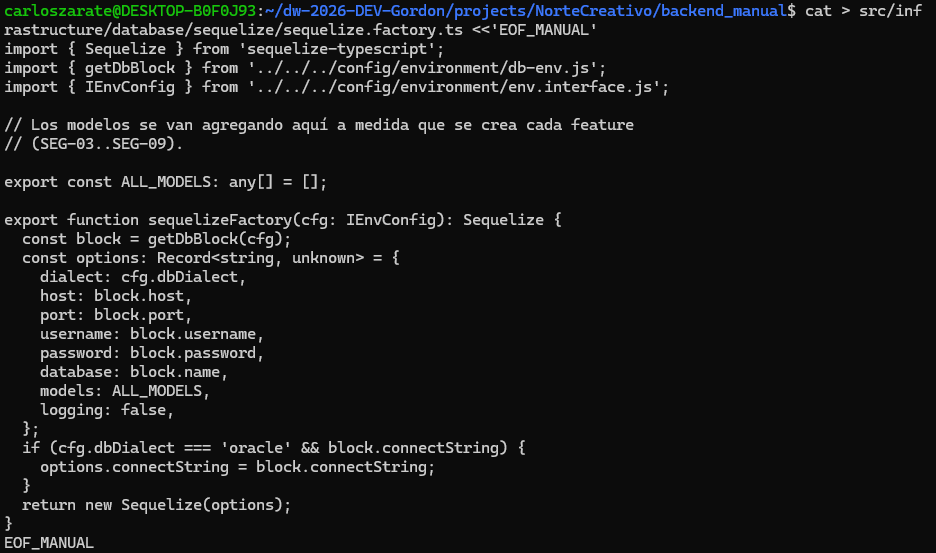


### 02.5 Health check y arranque

Tenemos un endpoint /api/health para asi veirificar el estado del backend, y que el servidor responda correctamente, se configura un archivo main.ts implementando el swagger, cors y los filtros e interceptores globales

comandos:
```bash
cat > src/health/health.controller.ts <<'EOF_MANUAL'
import { Controller, Get } from '@nestjs/common';

@Controller('health')
export class HealthController {
  @Get()
  check() {
    return { status: 'ok' };
  }
}
EOF_MANUAL
```

```bash
cat > src/main.ts <<'EOF_MANUAL'
import { ValidationPipe } from '@nestjs/common';
import { NestFactory } from '@nestjs/core';
import { DocumentBuilder, SwaggerModule } from '@nestjs/swagger';
import { AppModule } from './app.module.js';
import { GlobalExceptionFilter } from './common/filters/global-exception.filter.js';
import { LoggingInterceptor } from './common/interceptors/logging.interceptor.js';
import { ResponseInterceptor } from './common/interceptors/response.interceptor.js';
import { TimeoutInterceptor } from './common/interceptors/timeout.interceptor.js';

async function bootstrap() {
  const app = await NestFactory.create(AppModule);
  app.setGlobalPrefix('api');
  app.enableCors({ origin: 'http://localhost:4200', credentials: true });
  app.useGlobalPipes(
    new ValidationPipe({
      whitelist: true,
      forbidNonWhitelisted: true,
      transform: true,
    }),
  );
  app.useGlobalFilters(new GlobalExceptionFilter());
  app.useGlobalInterceptors(
    new ResponseInterceptor(),
    new LoggingInterceptor(),
    new TimeoutInterceptor(),
  );

  const swaggerConfig = new DocumentBuilder()
    .setTitle('Norte Creativo — Backend solo Business (manual)')
    .setDescription('API de negocio: clientes, campanias, hitos, tareas, entregables, version-entregables, aprobaciones.')
    .setVersion('1.0')
    .build();
  const document = SwaggerModule.createDocument(app, swaggerConfig);
  SwaggerModule.setup('api/docs', app, document);

  await app.listen(process.env.PORT ?? 3010);
}
await bootstrap();
EOF_MANUAL
```

```bash
cat > src/app.module.ts <<'EOF_MANUAL'
import { Module } from '@nestjs/common';
import { EnvironmentModule } from './config/environment/environment.module.js';
import { HealthController } from './health/health.controller.js';
import { SequelizeModule } from './infrastructure/database/sequelize/sequelize.module.js';

@Module({
  imports: [EnvironmentModule, SequelizeModule],
  controllers: [HealthController],
  providers: [],
})
export class AppModule {}
EOF_MANUAL
```

salidas:

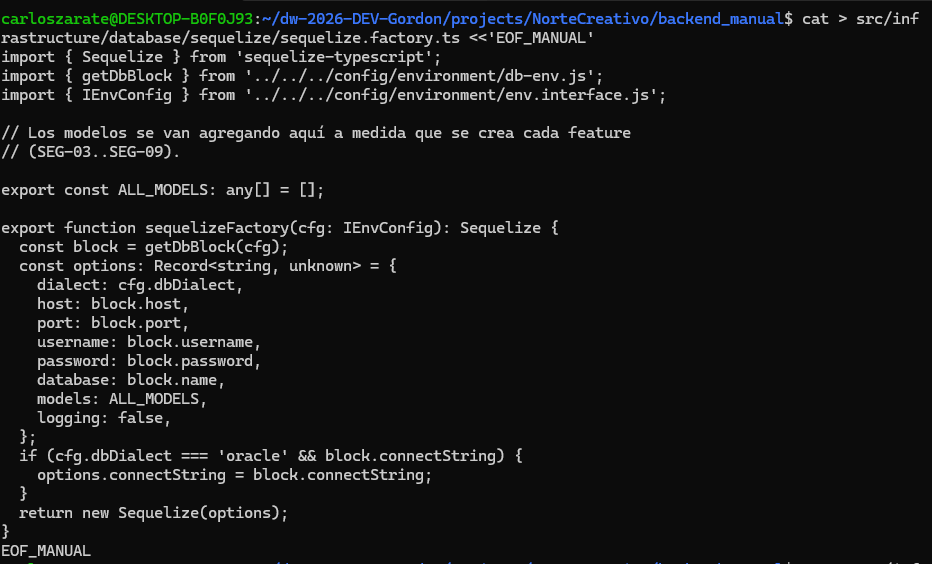
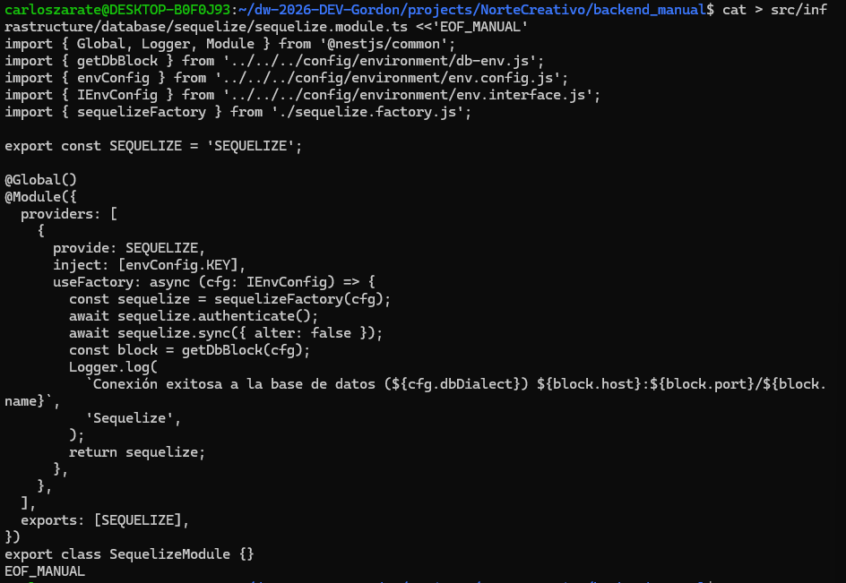

### 02.6 Health check y arranque

comandos: 

```bash
cat > src/health/health.controller.ts <<'EOF_MANUAL'
import { Controller, Get } from '@nestjs/common';

@Controller('health')
export class HealthController {
  @Get()
  check() {
    return { status: 'ok' };
  }
}
EOF_MANUAL
```

```bash
cat > src/main.ts <<'EOF_MANUAL'
import { ValidationPipe } from '@nestjs/common';
import { NestFactory } from '@nestjs/core';
import { DocumentBuilder, SwaggerModule } from '@nestjs/swagger';
import { AppModule } from './app.module.js';
import { GlobalExceptionFilter } from './common/filters/global-exception.filter.js';
import { LoggingInterceptor } from './common/interceptors/logging.interceptor.js';
import { ResponseInterceptor } from './common/interceptors/response.interceptor.js';
import { TimeoutInterceptor } from './common/interceptors/timeout.interceptor.js';

async function bootstrap() {
  const app = await NestFactory.create(AppModule);
  app.setGlobalPrefix('api');
  app.enableCors({ origin: 'http://localhost:4200', credentials: true });
  app.useGlobalPipes(
    new ValidationPipe({
      whitelist: true,
      forbidNonWhitelisted: true,
      transform: true,
    }),
  );
  app.useGlobalFilters(new GlobalExceptionFilter());
  app.useGlobalInterceptors(
    new ResponseInterceptor(),
    new LoggingInterceptor(),
    new TimeoutInterceptor(),
  );

  const swaggerConfig = new DocumentBuilder()
    .setTitle('Norte Creativo — Backend solo Business (manual)')
    .setDescription('API de negocio: clientes, campanias, hitos, tareas, entregables, version-entregables, aprobaciones.')
    .setVersion('1.0')
    .build();
  const document = SwaggerModule.createDocument(app, swaggerConfig);
  SwaggerModule.setup('api/docs', app, document);

  await app.listen(process.env.PORT ?? 3010);
}
await bootstrap();
EOF_MANUAL
```

```bash
cat > src/app.module.ts <<'EOF_MANUAL'
import { Module } from '@nestjs/common';
import { EnvironmentModule } from './config/environment/environment.module.js';
import { HealthController } from './health/health.controller.js';
import { SequelizeModule } from './infrastructure/database/sequelize/sequelize.module.js';

@Module({
  imports: [EnvironmentModule, SequelizeModule],
  controllers: [HealthController],
  providers: [],
})
export class AppModule {}
EOF_MANUAL
```

salidas:
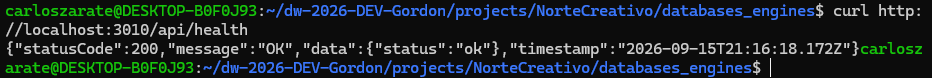
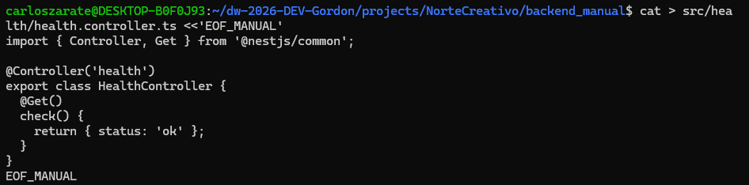
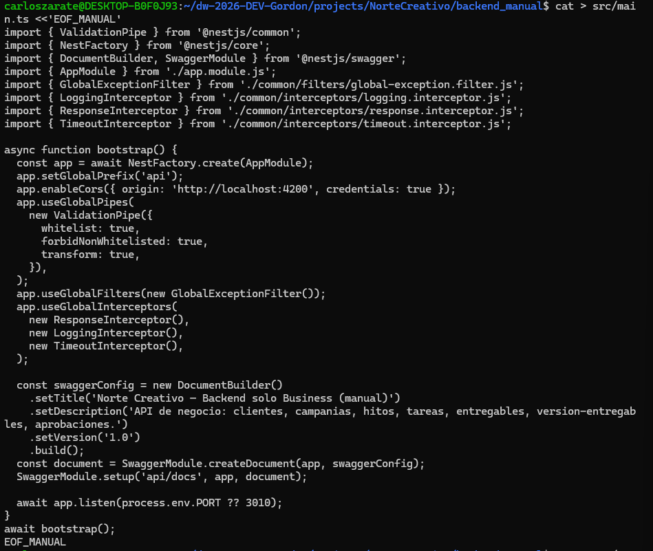
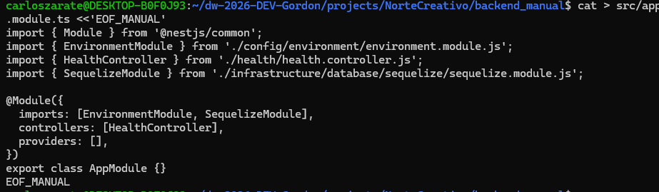

### Commit #2 - configuración, errores, interceptores y BD listos. La app arranca y conecta.

Esta en el puerto 3000, porque en este punto esta con el main.ts generico


prueba del validador con env
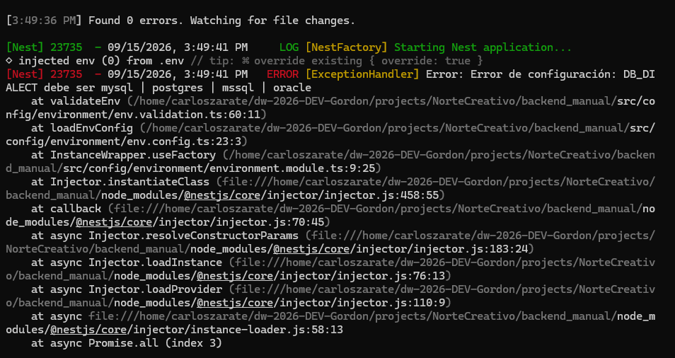

---

## SEG-03 - Feature Clientes

### 03.1 Capa de dominio

Se define el nucleo agnostico de la entidad cliente, aca con sus atributos y su constructor, establece el contrato que dictara como se guarda la informacion y se definen las excepciones exclusivas de este modulo.

Comando:
``` bash
cat > src/features/business/clientes/domain/entities/cliente.entity.ts <<'EOF_MANUAL'
export type ClienteEstado = 'active' | 'inactive';

export interface ClienteProps {
  id?: number | null;
  tipoDocumento: string;
  numeroDocumento: string;
  nombre: string;
  telefono?: string | null;
  email?: string | null;
  estado?: ClienteEstado;
}

export class Cliente {
  readonly id: number | null;
  readonly tipoDocumento: string;
  readonly numeroDocumento: string;
  readonly nombre: string;
  readonly telefono: string | null;
  readonly email: string | null;
  readonly estado: ClienteEstado;

  constructor(props: ClienteProps) {
    this.id = props.id ?? null;
    this.tipoDocumento = props.tipoDocumento;
    this.numeroDocumento = props.numeroDocumento;
    this.nombre = props.nombre;
    this.telefono = props.telefono ?? null;
    this.email = props.email ?? null;
    this.estado = props.estado ?? 'active';
  }
}
EOF_MANUAL
```
``` bash
cat > src/features/business/clientes/domain/interfaces/cliente.repository.ts <<'EOF_MANUAL'
import { Cliente } from '../entities/cliente.entity.js';

export const CLIENTE_REPOSITORY = 'IClienteRepository';

export interface IClienteRepository {
  create(cliente: Cliente): Promise<Cliente>;
  findAll(page: number, limit: number): Promise<{ items: Cliente[]; total: number }>;
  findById(id: number): Promise<Cliente | null>;
  findByNumeroDocumento(numeroDocumento: string): Promise<Cliente | null>;
  count(): Promise<number>;
}
EOF_MANUAL
```
``` bash
cat > src/features/business/clientes/domain/exceptions/cliente-not-found.exception.ts <<'EOF_MANUAL'
import { EntityNotFoundException } from '../../../../../common/exceptions/entity-not-found.exception.js';

export class ClienteNotFoundException extends EntityNotFoundException {
  constructor(id: number) {
    super(`Cliente con id ${id} no encontrado`);
  }
}
EOF_MANUAL
```
``` bash
cat > src/features/business/clientes/domain/exceptions/documento-ya-existe.exception.ts <<'EOF_MANUAL'
import { BusinessRuleException } from '../../../../../common/exceptions/business-rule.exception.js';

export class DocumentoYaExisteException extends BusinessRuleException {
  constructor(numeroDocumento: string) {
    super(`Ya existe un cliente con el documento ${numeroDocumento}`);
  }
}
EOF_MANUAL
```

Salidas
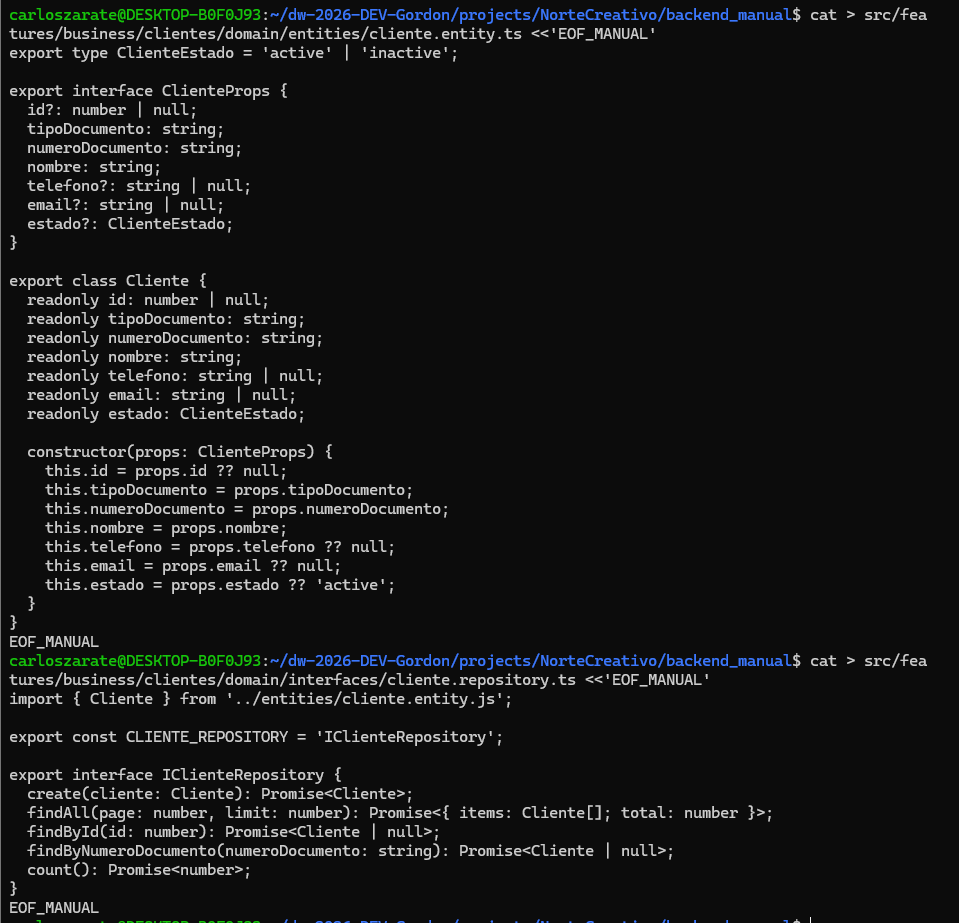
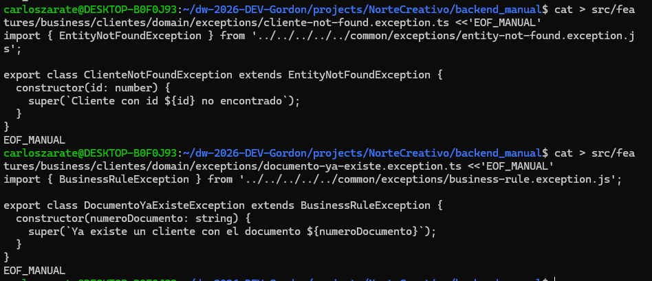

### 03.2 Capa de aplicacion

se implementan aca los dtos para validar que los datos que el usuario da tenga el formato correcto, crea los mappers para traducir los datos a entidades internas.

Comandos:
``` bash
cat > src/features/business/clientes/application/dto/create-cliente.dto.ts <<'EOF_MANUAL'
import { ApiProperty, ApiPropertyOptional } from '@nestjs/swagger';
import { IsEmail, IsNotEmpty, IsOptional, IsString, MaxLength } from 'class-validator';

export class CreateClienteDto {
  @ApiProperty({ example: 'NIT' })
  @IsString()
  @IsNotEmpty({ message: 'tipoDocumento es requerido' })
  @MaxLength(20)
  tipoDocumento!: string;

  @ApiProperty({ example: '900123456-7' })
  @IsString()
  @IsNotEmpty({ message: 'numeroDocumento es requerido' })
  @MaxLength(30)
  numeroDocumento!: string;

  @ApiProperty({ example: 'Postobón S.A.' })
  @IsString()
  @IsNotEmpty({ message: 'nombre es requerido' })
  @MaxLength(150)
  nombre!: string;

  @ApiPropertyOptional({ example: '3001234567' })
  @IsOptional()
  @IsString()
  @MaxLength(30)
  telefono?: string;

  @ApiPropertyOptional({ example: 'contacto@postobon.com' })
  @IsOptional()
  @IsEmail({}, { message: 'email debe ser un correo válido' })
  @MaxLength(150)
  email?: string;
}
EOF_MANUAL
```

``` bash
cat > src/features/business/clientes/application/mappers/cliente.mapper.ts <<'EOF_MANUAL'
import { Cliente } from '../../domain/entities/cliente.entity.js';
import { CreateClienteDto } from '../dto/create-cliente.dto.js';

export class ClienteMapper {
  static toEntity(dto: CreateClienteDto): Cliente {
    return new Cliente({
      tipoDocumento: dto.tipoDocumento,
      numeroDocumento: dto.numeroDocumento,
      nombre: dto.nombre,
      telefono: dto.telefono ?? null,
      email: dto.email ?? null,
      estado: 'active',
    });
  }

  static toResponse(cliente: Cliente) {
    return {
      id: cliente.id,
      tipoDocumento: cliente.tipoDocumento,
      numeroDocumento: cliente.numeroDocumento,
      nombre: cliente.nombre,
      telefono: cliente.telefono,
      email: cliente.email,
      estado: cliente.estado,
    };
  }
}
EOF_MANUAL
```

``` bash
cat > src/features/business/clientes/application/use-cases/create-cliente.use-case.ts <<'EOF_MANUAL'
import { Inject, Injectable } from '@nestjs/common';
import { DocumentoYaExisteException } from '../../domain/exceptions/documento-ya-existe.exception.js';
import { CLIENTE_REPOSITORY } from '../../domain/interfaces/cliente.repository.js';
import type { IClienteRepository } from '../../domain/interfaces/cliente.repository.js';
import { CreateClienteDto } from '../dto/create-cliente.dto.js';
import { ClienteMapper } from '../mappers/cliente.mapper.js';
import type { Cliente } from '../../domain/entities/cliente.entity.js';

@Injectable()
export class CreateClienteUseCase {
  constructor(
    @Inject(CLIENTE_REPOSITORY) private readonly clienteRepository: IClienteRepository,
  ) {}

  async execute(dto: CreateClienteDto): Promise<Cliente> {
    const existing = await this.clienteRepository.findByNumeroDocumento(dto.numeroDocumento);
    if (existing) {
      throw new DocumentoYaExisteException(dto.numeroDocumento);
    }
    return this.clienteRepository.create(ClienteMapper.toEntity(dto));
  }
}
EOF_MANUAL
```

``` bash
cat > src/features/business/clientes/application/use-cases/get-cliente-by-id.use-case.ts <<'EOF_MANUAL'
import { Inject, Injectable } from '@nestjs/common';
import { ClienteNotFoundException } from '../../domain/exceptions/cliente-not-found.exception.js';
import { CLIENTE_REPOSITORY } from '../../domain/interfaces/cliente.repository.js';
import type { IClienteRepository } from '../../domain/interfaces/cliente.repository.js';
import type { Cliente } from '../../domain/entities/cliente.entity.js';

@Injectable()
export class GetClienteByIdUseCase {
  constructor(
    @Inject(CLIENTE_REPOSITORY) private readonly clienteRepository: IClienteRepository,
  ) {}

  async execute(id: number): Promise<Cliente> {
    const cliente = await this.clienteRepository.findById(id);
    if (!cliente) {
      throw new ClienteNotFoundException(id);
    }
    return cliente;
  }
}
EOF_MANUAL
```

``` bash
cat > src/features/business/clientes/application/use-cases/list-clientes.use-case.ts <<'EOF_MANUAL'
import { Inject, Injectable } from '@nestjs/common';
import { CLIENTE_REPOSITORY } from '../../domain/interfaces/cliente.repository.js';
import type { IClienteRepository } from '../../domain/interfaces/cliente.repository.js';
import { ClienteMapper } from '../mappers/cliente.mapper.js';

@Injectable()
export class ListClientesUseCase {
  constructor(
    @Inject(CLIENTE_REPOSITORY) private readonly clienteRepository: IClienteRepository,
  ) {}

  async execute(page: number, limit: number) {
    const { items, total } = await this.clienteRepository.findAll(page, limit);
    return {
      items: items.map(ClienteMapper.toResponse),
      meta: { page, limit, total, totalPages: Math.ceil(total / limit) },
    };
  }
}
EOF_MANUAL
```

Salidas:

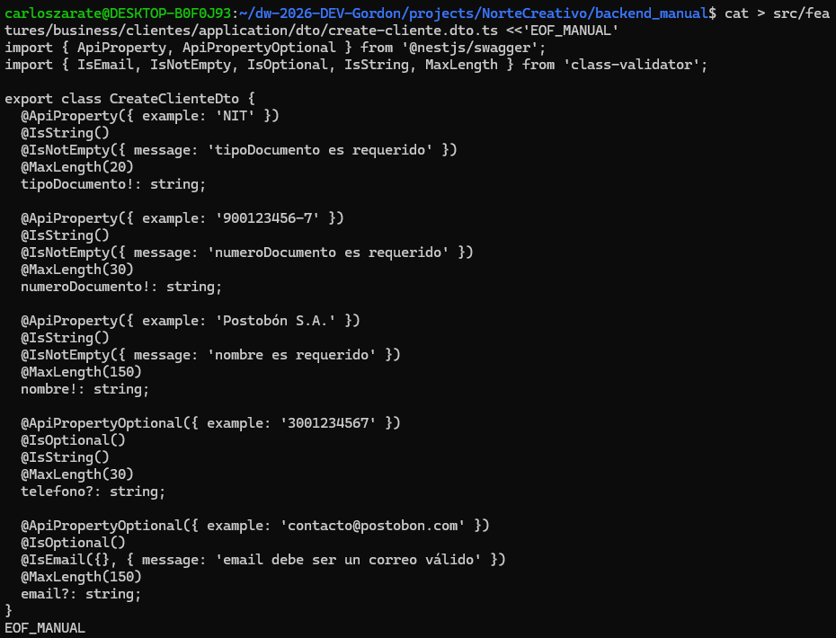
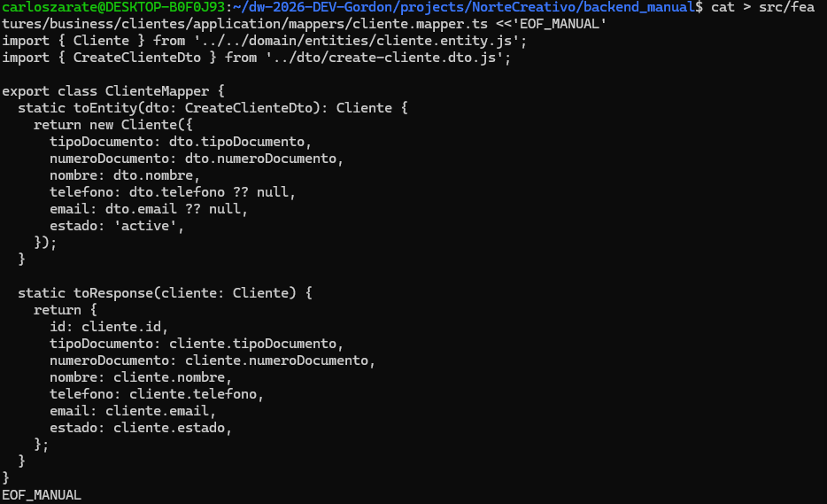
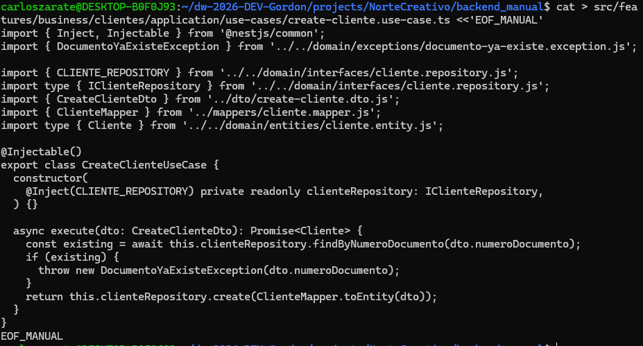
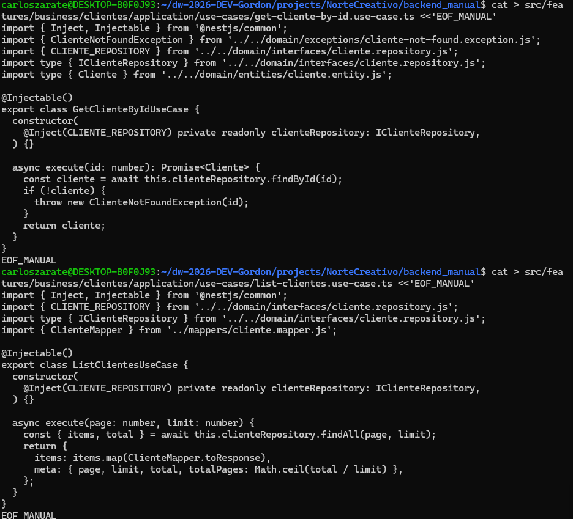

### 03.3 Capa de insfraestructura

Comandos
``` bash
cat > src/features/business/clientes/infrastructure/persistence/models/cliente.model.ts <<'EOF_MANUAL'
import { Column, DataType, Model, Table } from 'sequelize-typescript';

@Table({ tableName: 'clientes', timestamps: true })
export class ClienteModel extends Model {
  @Column({ type: DataType.INTEGER.UNSIGNED, autoIncrement: true, primaryKey: true })
  declare id: number;

  @Column({ type: DataType.STRING(20), allowNull: false })
  declare tipoDocumento: string;

  @Column({ type: DataType.STRING(30), allowNull: false, unique: true })
  declare numeroDocumento: string;

  @Column({ type: DataType.STRING(150), allowNull: false })
  declare nombre: string;

  @Column({ type: DataType.STRING(30), allowNull: true })
  declare telefono: string | null;

  @Column({ type: DataType.STRING(150), allowNull: true })
  declare email: string | null;

  @Column({ type: DataType.STRING(20), allowNull: false, defaultValue: 'active' })
  declare estado: string;
}
EOF_MANUAL
```

Registrar el modelo en sequelize.factory.ts 

``` bash
import { ClienteModel } from '../../../features/business/clientes/infrastructure/persistence/models/cliente.model.js';

export const ALL_MODELS: any[] = [
  ClienteModel,
];
```

``` bash
cat > src/features/business/clientes/infrastructure/persistence/repositories/cliente.repository.ts <<'EOF_MANUAL'
import { Inject, Injectable } from '@nestjs/common';
import { Sequelize } from 'sequelize-typescript';
import { SEQUELIZE } from '../../../../../../infrastructure/database/sequelize/sequelize.module.js';
import { Cliente } from '../../../domain/entities/cliente.entity.js';
import type { ClienteEstado } from '../../../domain/entities/cliente.entity.js';
import { IClienteRepository } from '../../../domain/interfaces/cliente.repository.js';
import { ClienteModel } from '../models/cliente.model.js';

@Injectable()
export class ClienteRepository implements IClienteRepository {
  constructor(@Inject(SEQUELIZE) private readonly sequelize: Sequelize) {}

  private get repo() {
    return this.sequelize.getRepository(ClienteModel);
  }

  async create(cliente: Cliente): Promise<Cliente> {
    const created = await this.repo.create({
      tipoDocumento: cliente.tipoDocumento,
      numeroDocumento: cliente.numeroDocumento,
      nombre: cliente.nombre,
      telefono: cliente.telefono,
      email: cliente.email,
      estado: cliente.estado,
    });
    return this.toDomain(created);
  }

  async findAll(page: number, limit: number) {
    const { rows, count } = await this.repo.findAndCountAll({
      offset: (page - 1) * limit,
      limit,
      order: [['id', 'ASC']],
    });
    return { items: rows.map((r) => this.toDomain(r)), total: count };
  }

  async findById(id: number): Promise<Cliente | null> {
    const found = await this.repo.findByPk(id);
    return found ? this.toDomain(found) : null;
  }

  async findByNumeroDocumento(numeroDocumento: string): Promise<Cliente | null> {
    const found = await this.repo.findOne({ where: { numeroDocumento } });
    return found ? this.toDomain(found) : null;
  }

  async count(): Promise<number> {
    return this.repo.count();
  }

  private toDomain(m: ClienteModel): Cliente {
    return new Cliente({
      id: m.id,
      tipoDocumento: m.tipoDocumento,
      numeroDocumento: m.numeroDocumento,
      nombre: m.nombre,
      telefono: m.telefono ?? null,
      email: m.email ?? null,
      estado: (m.estado as ClienteEstado) ?? 'active',
    });
  }
}
EOF_MANUAL
```

``` bash
cat > src/features/business/clientes/infrastructure/persistence/seeders/cliente.seeder.ts <<'EOF_MANUAL'
import { Inject, Injectable, Logger } from "@nestjs/common";
import { Cliente } from '../../../domain/entities/cliente.entity.js';
import { CLIENTE_REPOSITORY } from '../../../domain/interfaces/cliente.repository.js';
import type { IClienteRepository } from '../../../domain/interfaces/cliente.repository.js';

@Injectable()
export class ClienteSeeder {
  private readonly logger = new Logger(ClienteSeeder.name);

  constructor(
    @Inject(CLIENTE_REPOSITORY) private readonly clienteRepository: IClienteRepository,
  ) {}

  async seed(): Promise<void> {
    const numeroDocumento = '900123456-7';
    const existing = await this.clienteRepository.findByNumeroDocumento(numeroDocumento);
    if (existing) {
      this.logger.log('Seeder clientes: ya existía el cliente demo (idempotente)');
      return;
    }
    await this.clienteRepository.create(
      new Cliente({
        tipoDocumento: 'NIT',
        numeroDocumento,
        nombre: 'Postobón S.A.',
        telefono: '3001234567',
        email: 'contacto@postobon.com',
        estado: 'active',
      }),
    );
    this.logger.log('Seeder clientes: cliente demo creado');
  }
}
EOF_MANUAL
```

salidas:
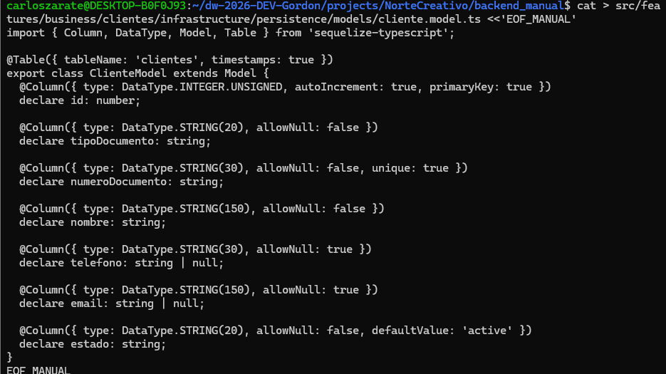
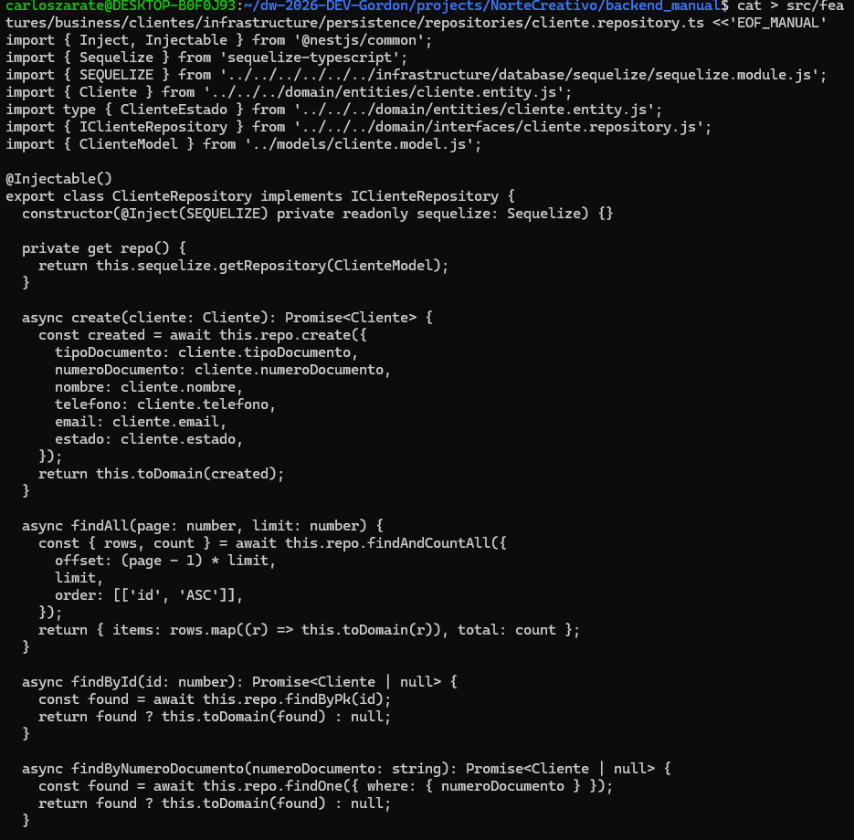
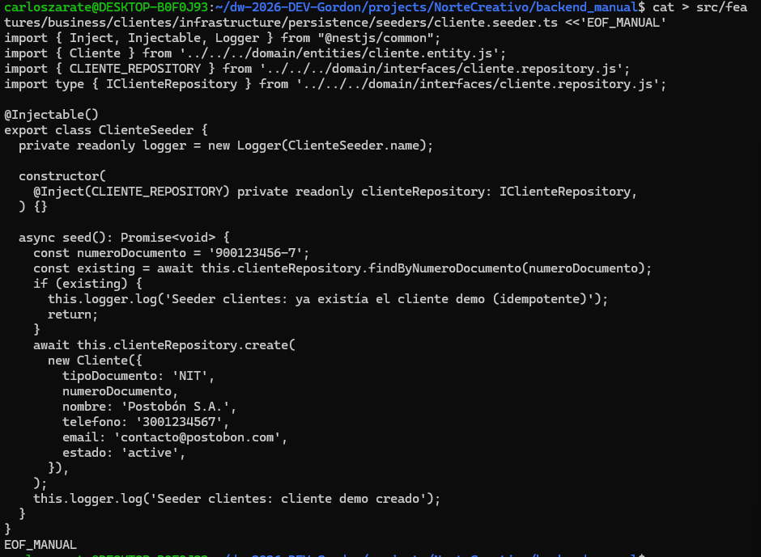
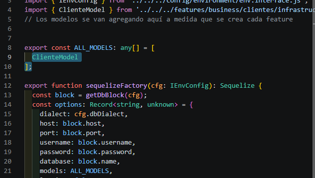

### 03.4 Capa de presentacion

comandos:
``` bash
cat > src/features/business/clientes/presentation/http/controllers/clientes.controller.ts <<'EOF_MANUAL'
import {
  Body,
  Controller,
  Get,
  HttpCode,
  Param,
  ParseIntPipe,
  Post,
  Query,
} from '@nestjs/common';
import { ApiOperation, ApiTags } from '@nestjs/swagger';
import { CreateClienteDto } from '../../../application/dto/create-cliente.dto.js';
import { ClienteMapper } from '../../../application/mappers/cliente.mapper.js';
import { CreateClienteUseCase } from '../../../application/use-cases/create-cliente.use-case.js';
import { GetClienteByIdUseCase } from '../../../application/use-cases/get-cliente-by-id.use-case.js';
import { ListClientesUseCase } from '../../../application/use-cases/list-clientes.use-case.js';

@ApiTags('clientes')
@Controller('clientes')
export class ClientesController {
  constructor(
    private readonly createCliente: CreateClienteUseCase,
    private readonly listClientes: ListClientesUseCase,
    private readonly getCliente: GetClienteByIdUseCase,
  ) {}

  @Post()
  @HttpCode(201)
  @ApiOperation({ summary: 'Crear cliente' })
  async create(@Body() dto: CreateClienteDto) {
    const cliente = await this.createCliente.execute(dto);
    return ClienteMapper.toResponse(cliente);
  }

  @Get()
  @ApiOperation({ summary: 'Listar clientes (paginado)' })
  async list(@Query('page') page = '1', @Query('limit') limit = '10') {
    return this.listClientes.execute(Number(page), Number(limit));
  }

  @Get(':id')
  @ApiOperation({ summary: 'Obtener cliente por id' })
  async findOne(@Param('id', ParseIntPipe) id: number) {
    const cliente = await this.getCliente.execute(id);
    return ClienteMapper.toResponse(cliente);
  }
}
EOF_MANUAL
```
Salida:
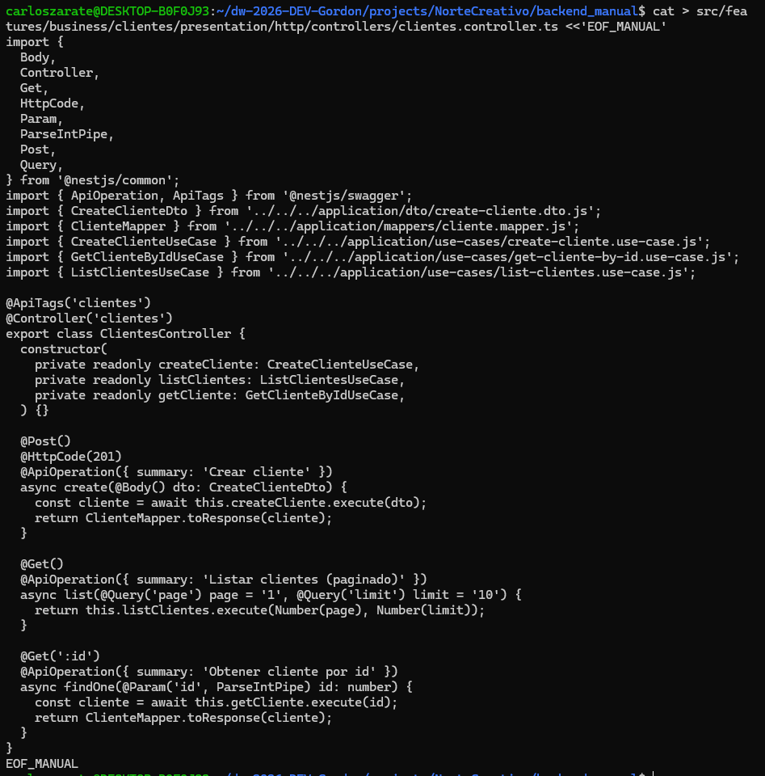

### 03.5 Modulo de la feature

Comandos:
``` bash
cat > src/features/business/clientes/clientes.module.ts <<'EOF_MANUAL'
import { Module } from '@nestjs/common';
import { CreateClienteUseCase } from './application/use-cases/create-cliente.use-case.js';
import { GetClienteByIdUseCase } from './application/use-cases/get-cliente-by-id.use-case.js';
import { ListClientesUseCase } from './application/use-cases/list-clientes.use-case.js';
import { CLIENTE_REPOSITORY } from './domain/interfaces/cliente.repository.js';
import { ClienteRepository } from './infrastructure/persistence/repositories/cliente.repository.js';
import { ClienteSeeder } from './infrastructure/persistence/seeders/cliente.seeder.js';
import { ClientesController } from './presentation/http/controllers/clientes.controller.js';

@Module({
  controllers: [ClientesController],
  providers: [
    CreateClienteUseCase,
    ListClientesUseCase,
    GetClienteByIdUseCase,
    ClienteSeeder,
    { provide: CLIENTE_REPOSITORY, useClass: ClienteRepository },
  ],
  exports: [CLIENTE_REPOSITORY, ClienteSeeder],
})
export class ClientesModule {}
EOF_MANUAL
```
Salida:
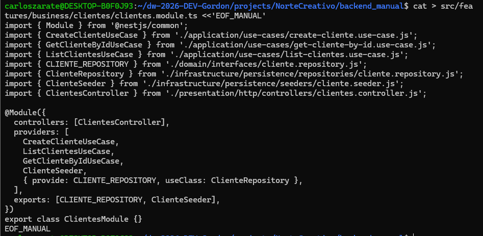

## Commit #3 - Feature clientes completada, y soluciones a errores varios en el manejo de la base de datos, un unico compose para manipular los 4 motores, asi como una pequeña documentacion añadida

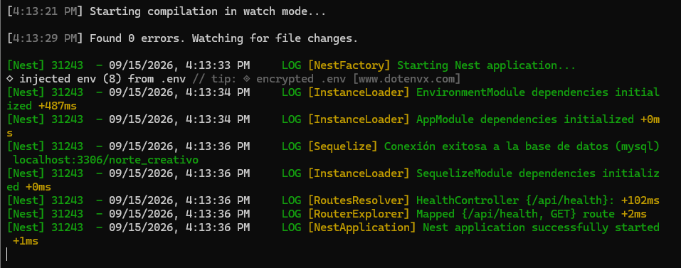